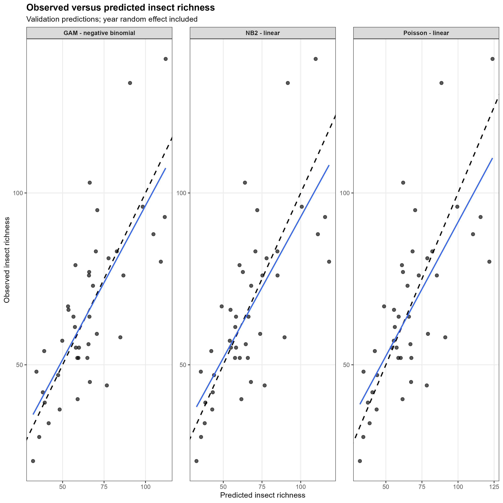
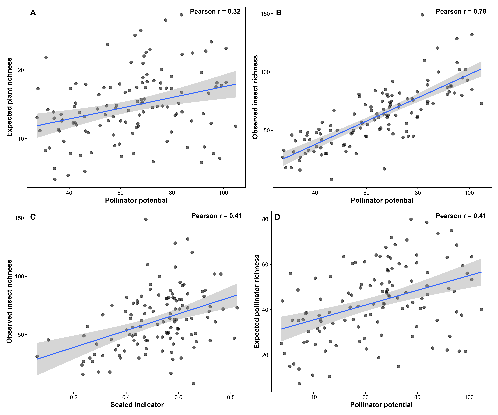
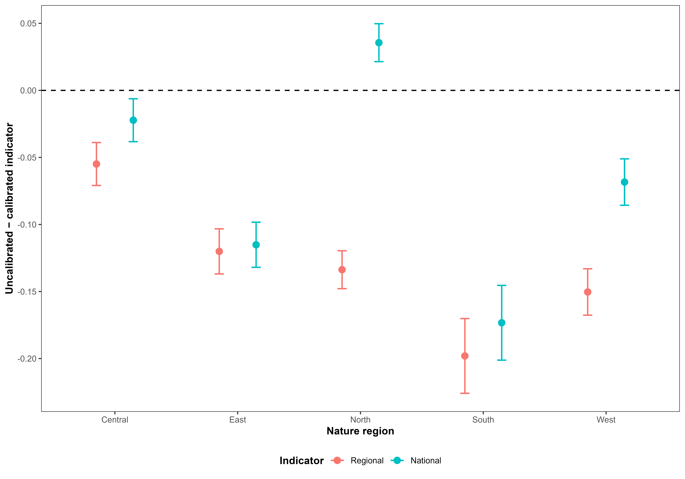

<!--# This is a template for how to document the indicator analyses. Make sure also to not change the order, or modify, the headers, unless you really need to. This is because it easier to read if all the indicators are presented using the same layout. If there is one header where you don't have anything to write, just leave the header as is, and don't write anything below it. If you are providing code, be careful to annotate and comment on every step in the analysis. Before starting it is recommended to fill in as much as you can in the metadata file. This file will populate the initial table in your output.-->

<!--# Load all you dependencies here -->

```{r setup}
#| include: false
#| cache: false
library(knitr)
library(tidyverse)
library(kableExtra)
library(here)
library(anybadger)
library(yaml)
library(tibble)
library(conflicted)
# weird workarounds for cache issues
conflicts_prefer(dplyr::filter)
conflicts_prefer(dplyr::lag)
conflicts_prefer(dplyr::select)
pull<-dplyr::pull

knitr::opts_chunk$set(echo = TRUE)
```

<!--# The following parts are autogenerated. Do not edit. -->


```{r source}
#| echo: false
#| cache: false
source(here::here("_common.R"))
```

```{r reviewers}
#| echo: false
#| results: asis

if (!is.null(yaml_data$codeReviewers)) {
  reviewers <- purrr::map_chr(yaml_data$codeReviewers, "name")
  
  htmltools::HTML(paste0(
    '<div id="title-block-header" class="quarto-title-block default">
       <div class="quarto-title-meta">
         <div>
           <div class="quarto-title-meta-heading">Reviewed by</div>
           <div class="quarto-title-meta-contents">',
    paste(reviewers, collapse = "; "),
    '</div>
         </div>
       </div>
     </div>',
    sep = ""
  ))
}
```

::: {layout-ncol="6"}

```{r statusBadge}
#| echo: false
status_badge(as.character(st))
```

```{r versionBadge}
#| echo: false
version_badge(my_version_number = as.character(version[[1]]))
```

```{r dataBadge}
#| echo: false
data_badge(as.character(badges[[1]]))
```

```{r codeBadge}
#| echo: false
code_badge(as.character(badges[[2]]))
```

```{r openScienceBadge}
#| echo: false
open_science_badge(as.character(badges[[3]]))
```

```{r licenseBadge}
#| echo: false
# The following inserts a badge specifying the GPL GNU version 3 license. ecRxiv recommends using this license, but you can decide to use another. Contact ecRxiv for help in insert a badge for a different license
license_badge()
```


::: 
 

> **Recommended citation**: `r paste(auth, " ", year, ". ", name, " (ID(s): ", folder_name, ") ", "v. ", version, ". ecRxiv: ", url, sep="")`


::: {.callout-tip collapse="true"}
## Metadata
```{r tbl-meta2}
#| tbl-cap: 'Indicator metadata'
#| echo: false
#| warning: false
meta |>
  dplyr::filter(Variable %in% c(
    "Indicator ID",
    "Indicator Name",
    "verbatimName",
    "Continent",
    "Country",
    "Ecosystem Condition Typology Class", 
    "Realm",
    "Biome",
    "Ecosystem",
    "verbatimEcosystem",
    "Year added", 
    "Last update",
    "Version",
    "Version comment",
    "Normalised",
    "Spatial aggregation pathway",
    "Precision")) |>   
  kable()

```
:::

::: {.callout-tip collapse="true"}

## Log

<!--# Update this logg with short messages for each update -->
- 18.08.2026 - Original PR
- 24.08.2026 - First draft of the indicator documentation completed
- 09.09.2026 - Revision of first draft with comments and validation 
:::


<hr />

<!--# Document you work below.  -->

## 1. Summary

<!--# 
With a maximum of 300 words, describe the indicator in general terms as you would to a non-expert. Think of this as a kind of common language summary. Follow the four numbers sub-headers below. under point 2, it is possible under  include a bullet point list of the specific steps in the workflow. 
 -->

1. **Background and rationale**:
<!-- What does the metric represent? Why is this relevant for describing ecosystem condition in this ecosystem?
What are the main anthropogenic impact factors? -->

The pollinator potential indicator describes the potential condition of terrestrial pollinator communities in open lowland areas. It combines the predicted occurrence of pollinating insects with the availability of the plant hosts they interact with, thereby capturing an important ecological relationship underlying pollinator communities. The indicator is relevant because pollinators contribute to ecosystem functioning and depend on suitable plant resources [@kral2021meta; @orford2016modest; @loy2022effects]. 

2. **Methods**:
<!-- What kind of data is used? How is the data customized (modified, estimated, integrated) to fit its purpose as an indicator? -->

The indicator integrates spatial predictions of plant hosts ($50$ plant species) and pollinator ($1134$ species) occurrence obtained from from the Global Biodiversity Infrastructure Facility ([GBIF](www.gbif.org) ) with information on plant–pollinator interactions (obtained from @rasmussen2021evaluating and @robinson2023hosts). The workflow consists of:

- Obtaining spatial predictions of plant hosts and pollinating insects (hereafter called "pollinators") occurrence probabilities,
- Linking pollinators to their interacting plant species using a plant–pollinator interaction matrix,
- Weighting pollinator occurrence probabilities by the occurrence probabilities of their interacting plants,
- Summing interaction-supported probabilities across pollinator species to estimate expected pollinator richness ,
- Calibrating the expected pollinator richness with detected/observed richness from survey and monitoring data (referred to as pollinator potential), 
- Establishing minimum and maximum reference values from reference locations representing relatively stable ecosystem conditions, and
- Scaling the resulting indicator to a 0–1 range, using either region-specific or common reference values.


3. **Interpretation**:
<!-- Add a very short description of how the indicator values should be interpreted. Here's an example for a bumblebee indicator: An indicator value of 1 signifies an intact bumblebee community. Values decreasing toward zero reflect negative ecological change, specifically the decline of species expected to be present. This metric does not account for potentially positive changes, such as increases in species' abundance or the arrival of new species. Tip: Add text on the line directly following the subheader, and don't introduce blank lines. This way the whole paragraph renders as a block quote. -->

An indicator value of $1$ represents the upper reference level of pollinator potential, whereas values approaching $0$ indicate lower pollinator potential relative to the reference condition. The indicator reflects the potential occurrence of pollinators and their plant resources rather than directly measuring population abundance or demographic performance.

4. **Results and development needs**:
<!-- Briefly, what does the indicator say about the ecosystem condition. What is the current status of  the metric (can it be used or is it still in development), and what immediate tasks remain to improve the indicator or to make the indicator operational -->

The indicator provides a spatial measure of pollinator potential that accounts for plant–pollinator relationships and can be compared among regions. This indicator can be used but further work needs to be done to propagate uncertainty from the underlying species distribution models and interaction data into the final indicator. 

## 2. About the underlying data

<!--# Give a general introduction the datasets you have used, and provide more specific details in the sub-chapters.  -->

The pollinator potential indicator is based on pollinating insects and their plant-host occurrence data integrated from multiple biodiversity datasets and modelled to estimate their occurrence probability across Norway. The modelling framework, as explained by @perrin2026addressing, combines heterogeneous occurrence information with environmental covariates to generate spatially explicit estimates of occurrence probabilities using the integrated species distribution modelling framework. The analyses were restricted to observations from 2012 onwards to provide a consistent contemporary temporal basis for the indicator.

Here, we also access data from biodiversity programs including the Overvåking av semi-naturlig eng (ASO) survey[@asoDataset], Ano [@anoDataOccurrence], Norwegian Insect Monitoring Program [@norwegianInsectMonitoring] from GBIF to validate the indicators. 

### 2.1 Spatial and temporal resolution and extent

<!--# Describe the temporal and spatial resolution and extent of the data used -->

The underlying biodiversity data comprise spatially referenced species occurrence records covering Norway. Records from 2012 onwards were retained for model fitting to ensure temporal consistency with the environmental covariates and the period used for indicator estimation. Because the occurrence data originate from heterogeneous monitoring and observation programmes, sampling frequency and temporal coverage vary among species and locations. Spatial resolution is determined by the geographic precision of individual observations and, at the prediction stage, by the resolution of the environmental covariates. The environmental predictors used in the species distribution models are available at a spatial resolution of 1 km², and predicted occurrence probabilities for plant and pollinator species were therefore initially generated at this resolution. Details of the environmental covariates and their spatial resolution are provided in @perrin2026addressing.

A 1 km² prediction grid may, however, obscure fine-scale habitat heterogeneity within open lowland areas, where suitable vegetation and pollinator habitat can occur as relatively small or spatially fragmented patches. We therefore downscale and calibrate the indicator estimates from @perrin2026addressing by integrating information on vegetation types and elevation available at 50 m resolution. Specifically, the 1 km² model predictions are combined with fine-resolution habitat information to distinguish areas within each prediction cell that are more likely to represent suitable open lowland conditions. This approach reduces the potential bias associated with spatial aggregation and ensures that fine-scale habitat heterogeneity is retained when deriving the final indicator. The resulting indicator is therefore reported at a 50 m spatial resolution, providing a finer representation of the spatial distribution and configuration of open lowland habitats than the original 1 km² model predictions.

The assessment encompasses both natural and culturally influenced semi-natural habitats. Cultural habitats are ecosystems whose structure and ecological characteristics have been shaped and maintained through long-term, traditional human land use and management. In open lowland landscapes, continued management is often required to maintain these habitats and prevent succession towards alternative vegetation states. The spatial extent of open lowland areas is delineated using classes 6 (permantly herbaceous) and 7 (periodically herbaceous) from @eea2025_clcplus_backbone, which define the geographical domain within which the indicator is estimated.

### 2.2 Sampling design

<!-- How was the data sampled? Describe potential sampling biases -->

The underlying occurrence data used for the models by @perrin2026addressing were compiled from several biodiversity programs (including citizen science and structured surveys) rather than from a single standardized sampling design. Consequently, sampling intensity is spatially and taxonomically heterogeneous and may reflect differences in observer effort, accessibility, geographic coverage, and monitoring activity. These characteristics can introduce spatial and temporal sampling biases into the occurrence data. The sampling bias was accounted for in @perrin2026addressing by using a bias-corrected modelling framework that incorporates environmental covariates and spatially explicit sampling effort to generate more reliable occurrence predictions. The resulting modelled occurrence probabilities are therefore less sensitive to the underlying sampling biases than the raw occurrence data.

The validation data were all from structured surveys, including the Overvåking av semi-naturlig eng (ASO) survey [@asoDataset], Ano [@anoDataOccurrence], and the Norwegian Insect Monitoring Program [@norwegianInsectMonitoring]. These surveys were designed to provide representative coverage of open lowland habitats and were conducted using standardized sampling protocols. The validation data are therefore less affected by sampling biases than the underlying occurrence data used for model fitting.


### 2.3 Original units

<!--# What are the original units for the most relevant  variables in the data-->

The primary biological observations are species occurrence records, with geographic coordinates representing the observation locations. For insects, the response variable used to construct the indicator is species richness, expressed as the number of insect species estimated or observed at a location. The modelled richness values are subsequently transformed into a scaled indicator using regional reference levels, including $X_0$ and $X_{100}$, to provide a standardized measure of ecological condition.

### 2.4 Instructions for citing, using and accessing data

<!--# Is the data openly available? If not, how can one access it? What are the key references to the datasets?   -->

The biodiversity occurrence data used in the analysis were obtained through GBIF. The relevant GBIF occurrence downloads should be cited using their download DOIs:

  - Insects: @hotspotInsectOccurrence
  - Plants: @hotspotPlantOccurrence

The data are therefore traceable through the corresponding GBIF download records. The hotspot maps and the modelling framework should additionally be cited according to the relevant underlying scientific publication or report.

### 2.5 Additional comments about the dataset

<!--# Optional. Text here -->

The insect indicator is derived from a modelling framework that relates insect occurrence and richness to environmental conditions. The model uses environmental covariates to generate spatially explicit predictions of insect richness, which are subsequently compared with regional reference conditions. Separate regional and national scaling approaches are used to account for geographic variation in reference richness. The indicator can also be calculated with and without interaction terms among environmental covariates, allowing the contribution of interactions to the resulting indicator to be evaluated.


## 3. Indicator properties

### 3.1 Ecosystem Condition Typology Class (ECT)

<!--# Describe the rationale for assigning the indicator to the ECT class. See https://oneecosystem.pensoft.net/article/58218/
This doesnt need to be very long. Maybe just a single sentence. -->

The indicator is assigned to the biotic composition and interactions component of ecosystem condition because it represents the potential occurrence and interaction-supported richness of pollinators and their plant resources relative to a reference condition.

### 3.1.1 Other condition typologies

<!--# Optional: Add text about other standards or typologies, such as alternative national condition typologies, and how the indicator relates to these -->

The indicator is primarily related to species composition and ecological interactions, and can therefore complement condition typologies that assess biodiversity, species composition, or ecological functioning. No alternative national condition typology has currently been formally assigned.

### 3.2 Ecosystem condition characteristic

<!--# 

A short (one to three word) tag or name for the ecosystem condition characteristic represented in the indicator. See 10.3897/oneeco.6.e58218 for information on what these characteristics might be.

Examples: 'intact hydrology'; 'near-natural species composition'; 'soil stability'; sustainable trophic interactions'. 

The term 'characteristic' is used in a similar way  to the term 'criteria' in Multiple Criteria Decision Making.  

-->

**Need help with this**

### 3.3 Collinearities with other indicators

<!--# Describe known collinearities with other metrics (indicators or variables) that could become problematic if they were also included in the same Ecosystem Condition Assessment as the indicator described here. -->

The pollinator potential indicator is expected to be correlated with indicators based directly on pollinator species richness, plant species richness, habitat suitability, and land-cover or habitat extent, because these variables contribute to the underlying predicted occurrence probabilities. It may also be correlated with indicators based on plant–pollinator community composition. Care should therefore be taken when combining these metrics in a multivariate ecosystem condition assessment to avoid giving disproportionate weight to the same underlying biodiversity signal.

### 3.4 Impact factors

<!--# Describe the main natural and anthropogenic factors that affecst the metric -->

The indicator responds to interacting climatic, land-use, and habitat pressures that influence the condition and availability of open lowland habitats and their plant and pollinator communities.

Key anthropogenic pressures include land-use change, agricultural intensification, habitat loss and fragmentation, urbanisation, infrastructure development, and changes in vegetation management. These pressures can reduce habitat availability and quality, alter plant community composition, and reduce the availability of floral resources and host plants for pollinators. Pesticide exposure and other chemical pressures may additionally affect pollinator survival and reproduction.

Climate change, including changes in temperature, precipitation, seasonality, snow cover, and climatic extremes, can directly affect plant and pollinator phenology, survival, reproduction, and distribution, as well as indirectly modify habitat conditions and resource availability.

Natural gradients in topography, elevation, soil properties, water availability, and vegetation determine baseline habitat suitability and mediate the response of plant and pollinator communities to these pressures. The indicator therefore reflects both the direct effects of environmental change and their indirect effects through altered habitat quality and resource availability.

### 3.5 Spatial aggregation

<!-- Describe in word the same aggregation pathway presented in the top yaml (the metadata). If you have scaled against the reference value, it is especially important to know if you did any avergaing or summations etc. beforehand. An example text for a rather simple case could be: "The variable is scaled at the initial polygon level and the point estimate is a area-weighted arithmetic mean of all polygins. There is no transformation, and truncation is not needed as the indicator becomes naturally bound between 0 and 1".  -->

Pollinator occurrence probabilities are first combined with the predicted occurrence probabilities of their interacting plant species to produce an interaction-supported probability for each pollinator species at each raster cell. These probabilities are then summed across pollinator species to obtain cell-level pollinator potential. We then calibrate these cell-level values using observed pollinator richness from survey and monitoring data. The resulting calibrated pollinator potential are scaled to 0–1 using reference minimum and maximum values. For the regional indicator, scaling is performed using reference levels specific to each of the five nature regions; for the national indicator, common reference levels are applied across all regions. Values less than 0 were truncated to 0, and values greater than 1 were truncated to 1, resulting in a final indicator value bounded between 0 and 1.

## 4. Reference condition and levels

### 4.1 Reference condition

<!--# Define the reference condition (or refer to where it is defined). Note the distinction between reference condition and reference levels 10.3897/oneeco.5.e58216  -->

The reference condition represents the ecological state of relatively well-preserved and stable semi-natural meadows and grasslands used as reference sites. These sites are identified from polygons classified as being in good condition in the [**Natur i Norge** (NIN)](https://artsdatabanken.no/naturtyper/natur-i-norge) mapping system. The spatial distribution of these reference sites is used to characterise the expected plant–pollinator system under relatively favourable conditions.

To account for regional differences in environmental conditions and species composition, reference sites are stratified into five biogeographic regions: Central, East, North, South, and West. The reference condition therefore represents the range of pollinator potential expected under relatively favourable and stable conditions within each region, rather than an assumed historical or pristine baseline.


### 4.2 Reference levels

<!--# 

If relevant (i.e. if you have normalised a variable), describe the reference levels used to normalise the variable. 

Use the terminology where X~0~ refers to the reference level (the variable value) denoting the worst possible condition; X~100~denotes the optimum or best possible condition; and X~*n*~, where in is between 0 and 100, denotes any other anchoring points linking the variable scale to the indicator scale (e.g. the threshold value between good and bad condition X~60^). 

Why was the current option chosen and how were the reference levels quantified? If the reference values are calculated as part of the analyses further down, please repeat the main information here.

 -->

The indicator is normalised using the distribution of pollinator potential at the reference locations. For each nature region, the minimum and maximum observed richness values among the reference locations define the lower and upper reference levels:
$$
I = \frac{X - X_0}{X_{100} - X_0}
$$
where $I$ is the normalised indicator value, $X$ is the cell-level pollinator potential, $X_0$ is the minimum reference level (worst condition), and $X_{100}$ is the maximum reference level (best condition). 

The study region was divided into five nature regions: Central, East, North, South, and West, similar to the classification used by [NaturIndex](https://www.naturindeks.no/Ecosystems/aapent_lavland). We estimate normalised indicator values for each region using the respective reference levels, which we refer to as **regional indicators**. The regional approach accounts for differences in baseline pollinator potential among Norway's biogeographic regions.

Additionally, we also estimate indicator values for the entire country using common reference levels are applied across all regions and we refer to it as the **national indicator**. For the regional indicator, these reference levels are calculated separately for each nature region, while for the national indicator, common reference levels are applied across all regions. This provides a common national scale and allows spatial differences among regions to be retained rather than being normalised away.

#### 4.2.1 Spatial resolution and validity

<!--# 

Describe the spatial resolution of the reference levels. E.g. is it defined as a fixed value for all areas, or does it vary. Also, at what spatial scale are the reference levels valid? For example, if the reference levels have a regional resolution (varies between regions), it might mean that it is only valid and correct to use for normalising local variable values that are first aggregated to regional scale. However, sometimes the reference levels are insensitive to this and can be used to scale variables at the local (e.g. plot) scale. 

 -->

 The reference levels have regional resolution for the regional indicator and are therefore intended to scale cell-level pollinator potential according to the reference range of the corresponding nature region. The regional reference levels are valid for locations within their respective nature regions. The national reference levels provide a common national scaling and can be applied across the entire study area.

Because the reference levels are estimated from a finite set of reference locations, they represent the observed reference range rather than the theoretical minimum and maximum possible pollinator potential. Predicted values can therefore exceed the reference range before truncation; such values are constrained to 0–1 in the final indicator.

## 5. Uncertainties
### 5.1 General uncertainties
<!--# Describe the main reasons why you might not trust 100% the final value to represent the given ecosystem characteristic for the give ecosystem type. What aspects of this condition metric are most sensitive to subjective decitions? Is the spatial sampling sufficient? Does the choice of modeling framework affect the values? Is the metric relevant do describe ecosystem condition for the give ecosystem type?  -->

Several sources of uncertainty affect the indicator. First, uncertainty in the underlying plant and pollinator occurrence models propagates into the interaction-supported pollinator potential. The indicator also depends on the completeness and accuracy of the plant–pollinator interaction matrix. Interactions that are not documented may be incorrectly treated as absent, potentially affecting the estimated support available to pollinators.

The indicator is also sensitive to the selection and spatial distribution of reference locations. The reference sites may not capture the full spatial range of stable ecosystem conditions within each region, meaning that predicted values can exceed the observed reference maximum. Regional differences in the number and spatial distribution of reference locations may further affect the estimated reference ranges.

Finally, the indicator represents potential occurrence and interaction support, rather than directly measured abundance, demographic performance, or realised pollination rates. Consequently, high pollinator potential does not necessarily imply high pollinator population size or pollination service delivery.

### 5.2 Reported uncertainties
<!-- Describe the nature of the errors you (hopefully) provide alongside the point estimate for the condition metric. It is especially important to clarify if the errors are inferential (referring to the uncertainty of the point estimate) or descriptive (referreing to the data itself). Here' an example text: "What we report as uncertainties in @tbl-finalTable are inferential and refer to the uncertainty around the point estimates. It does not directly describe variation in the data itself. 
However, the variation in the mean is defined by the spatial variation only, and quartiles are obtained by bootstrapping the set of localities within a region, and calculating the indicator for each of 9999 such samples".   -->

The current indicator is summarised by the mean pollinator potential and its standard deviation (SD), together with the corresponding scaled indicator value. The mean represents the average pollinator potential across the assessment area, while the SD describes the spatial variability of pollinator potential around this mean. The SD should therefore be interpreted as a measure of spatial heterogeneity, rather than as statistical uncertainty in the indicator estimate.

Uncertainty associated with the plant and pollinator prediction models, the interaction matrix, and the reference levels is not currently propagated into a formal uncertainty interval for the final indicator. Developing a comprehensive uncertainty propagation framework, incorporating uncertainty in the underlying species distribution predictions, interaction strengths, and reference levels, is therefore an important next step for improving the reliability and interpretability of the indicator.


## 6. References

::: {#refs}
:::

<!--# You can add references manually or use a citation manager and add intext citations as with crossreferencing and hyperlinks. See https://quarto.org/docs/authoring/footnotes-and-citations.html -->

## 7. Import and prepare datasets

<!--# All the data import and preparation should be done in this chapter, before the analysis chapter. As a minimum, add code for importing data, and describe or show the data structure. You may also explain certain variables, what they represent, and their distributions -->


### 7.1. Spatial mask

```{r spatialMask}
#| eval: false

if(useCLCForLowlandBoundary){
  
  if(!file.exists(file.path(
    resultFolder,
    "polygons",
    "openlowland_mask_50m.tif"
  ))){
    project_dir <- "C:/Users/KWAKU~1.ADJ/ONEDRI~1/222608~1"
    CLCplus10m <- rast(file.path(project_dir, "CLC+/104035/Results/CLCplus_2018_010m/CLCplus_2018_010m/CLCplus_2018_010m.tif"))
    #CLCplus10m[CLCplus10m == 254] <- NA
    
    openlowland_binary <- ifel(
      CLCplus10m %in% c(6, 7),
      1,
      NA
    )
    
    openlowland_50m <- project(
      openlowland_binary,
      allCalibrationRaster[[1]],
      method = "near",
      filename = file.path(
        resultFolder,
        "polygons",
        "openlowland_mask_50m.tif"
      ),
      overwrite = TRUE
    )
    
  }
  
  openlowland_binary <- terra::rast(file.path(
    resultFolder,
    "polygons",
    "openlowland_mask_50m.tif"
  ))
  
}


if(!useCLCForLowlandBoundary){
  openlowland_mask_file <- file.path(
    "C:/terra_tmp",
    paste0(
      "openlowland_mask_",
      openlowland_threshold,
      "pct.tif"
    )
  )
  
  
  if (!file.exists(openlowland_mask_file)) {
    
    ## ----------------------------------------------------------------
    ## Load open-lowland percentage raster
    ## ----------------------------------------------------------------
    
    openlowland_boundary <- terra::rast(
      file.path(
        resultFolder,
        "openlow_pct_NO.tif"
      )
    )
    
    
    ## ----------------------------------------------------------------
    ## Project to the plant/insect prediction grid
    ## ----------------------------------------------------------------
    
    openlowland_projected <- terra::project(
      openlowland_boundary,
      plants,
      method = "bilinear"
    )
    
    
    ## ----------------------------------------------------------------
    ## Apply threshold
    ## ----------------------------------------------------------------
    
    openlowland_mask <-
      openlowland_projected >= openlowland_threshold
    
    
    ## ----------------------------------------------------------------
    ## Save mask
    ## ----------------------------------------------------------------
    
    terra::writeRaster(
      openlowland_mask,
      openlowland_mask_file,
      overwrite = FALSE
    )
    
  } else {
    
    ## ----------------------------------------------------------------
    ## Load existing mask
    ## ----------------------------------------------------------------
    
    openlowland_mask <- terra::rast(
      openlowland_mask_file
    )
  }
  
  
  openlowland_binary <- terra::ifel(
    openlowland_mask == 1,
    1,
    NA
  )
}


## --------------------------------------------------------
## Save open-lowland mask plot
## --------------------------------------------------------

plot_file <- file.path(
  resultFolder, "figures",
  "openlowland_mask"
)

## PDF
pdf(
  paste0(plot_file, ".pdf"),
  width = 8,
  height = 7
)

terra::plot(
  openlowland_binary,
  col = "black",
  legend = FALSE,
  axes = TRUE,
  main = "Open-lowland area"
)

dev.off()


## PNG
png(
  filename = paste0(plot_file, ".png"),
  width = 8,
  height = 7,
  units = "in",
  res = 600
)

terra::plot(
  openlowland_binary,
  col = "#000000",
  alpha = 1,
  legend = FALSE,
  axes = TRUE,
  main = "Open-lowland area"
)

dev.off()
```

We created a spatial mask to delineate the open-lowland ecosystem area in Norway (see @fig-opnlowlandMask), which constitutes the relevant Ecosystem Asset (EA) domain for the indicator. The mask was generated using land-cover data and ecological criteria to identify areas that are representative of open lowland habitats, such as semi-natural grasslands, meadows, and other open habitats. The mask is applied to the raster grid to restrict the analysis to the defined EA domain, ensuring that indicator values are calculated only for locations within the relevant ecosystem type.

```{r fig-opnlowlandMask}
#| fig-cap: 'The open-lowland ecosystem area in Norway.'
#| fig-width: 100
#| echo: false
#| warning: false
knitr::include_graphics("../img/openlowland_mask.png")
```


### 7.2. Regional classification

The EA domain were assigned to five biogeographic (nature) regions based on the spatial distribution of Norwegian county boundaries. County polygons were obtained from the Norwegian administrative-unit dataset and grouped into South, East, West, Central, and North regions according to predefined county classifications. The resulting county groups were dissolved to create five spatially contiguous regional units. Each reference location was then assigned to the corresponding nature region based on its spatial location. These regional classifications were used to derive region-specific reference levels and indicator values, allowing the reference condition to vary among the five nature regions.

```{r regionalClassification}
#| eval: false

# ==============================================================================
#  DEFINE BIOGEOGRAPHIC CLASSIFICATION REGIONS
# ==============================================================================

## ------------------------------------------------------------------
## Path to Norwegian county geodatabase
## ------------------------------------------------------------------

gdb <- "path/to/norwegian_county_geodatabase.gdb"


## ------------------------------------------------------------------
## Read county polygons
## ------------------------------------------------------------------

counties <- sf::st_read(
  gdb,
  layer = "fylke"
)


## ------------------------------------------------------------------
## Assign counties to nature regions
## ------------------------------------------------------------------

nature_regions <- counties %>%
  
  dplyr::mutate(
    
    fylkesnummer = as.character(
      fylkesnummer
    ),
    
    nature_region = dplyr::case_when(
      
      ## South
      fylkesnummer %in% c(
        "40",
        "42"
      ) ~ "South",
      
      ## East
      fylkesnummer %in% c(
        "31",
        "32",
        "03",
        "39",
        "33",
        "34"
      ) ~ "East",
      
      ## West
      fylkesnummer %in% c(
        "46",
        "11"
      ) ~ "West",
      
      ## Central
      fylkesnummer %in% c(
        "50",
        "15"
      ) ~ "Central",
      
      ## North
      fylkesnummer %in% c(
        "18",
        "55",
        "56"
      ) ~ "North",
      
      TRUE ~ NA_character_
    )
  ) %>%
  
  dplyr::filter(
    !is.na(nature_region)
  ) %>%
  
  dplyr::group_by(
    nature_region
  ) %>%
  
  dplyr::summarise(
    .groups = "drop"
  )


```


```{r fig-natureRegions}
#| fig-cap: 'The classification of nature regions in Norway used in this study. The classification were done as follows: South (counties 40 and 42), East (counties 31, 32, 03, 39, 33, and 34), West (counties 46 and 11), Central (counties 50 and 15), and North (counties 18, 55, and 56).'
#| fig-width: 100
#| echo: false
#| warning: false
knitr::include_graphics("../img/nature_regions.png")
```

### 7.3 Pollinator and plant occurrence predictions

<!--# Import and prepare the first dataset for analysis. Change the header from Dataset A to the name of the actual dataset. -->

We obtained spatial predictions of pollinator and plant host occurrence prbabilities from the Hotspot project [@perrin2026addressing]. The predictions were generated using integrated species distribution models (ISDMs) that combine occurrence records from the Global Biodiversity Information Facility (GBIF) with environmental covariates. The resulting raster layers provide cell-level probabilities of occurrence for each pollinator and plant species across the study area. Refer to the Hotspot project documentation for details on the modeling approach, covariates used, and model validation [@perrin2026addressing].

```{r}
#| eval: false

# resultFolder should be where the output from the Hotspot project is stored. 
#This folder should contain the raster files for pollinator and plant occurrence probabilities.

resultFolder <- "path/to/hotspot/output"
# ==============================================================================
# LOAD SPECIES DISTRIBUTION RASTERS
# ==============================================================================

## ------------------------------------------------------------------
## Insect occurrence probabilities
## ------------------------------------------------------------------

insects <- terra::rast(
  file.path(
    resultFolder,
    "insectProbabilities.tiff"
  )
)


## ------------------------------------------------------------------
## Plant occurrence probabilities
## ------------------------------------------------------------------

plants <- terra::rast(
  file.path(
    resultFolder,
    "plantProbabilities.tiff"
  )
)

## ========================================================
## Expected plant species richness
## ========================================================

plant_expected_richness <- terra::app(
  plants,
  fun = sum,
  na.rm = TRUE,
  cores = 1,
  filename = file.path(
    resultFolder,
    "plant_expected_richness.tif"
  ),
  overwrite = TRUE
)

names(plant_expected_richness) <-
  "plant_expected_richness"

```

### 7.4. Interrraction matrix

<!--# Repeat the process for each dataset -->

We compiled plant–pollinator interaction data for hoverflies [@rasmussen2021evaluating], butterflies and wild bees [@robinson2023hosts]. These data were used to construct plant–pollinator interaction networks with the *frame2webs* function from the *_bipartite_* R package [@dormann2008introducing]. Because the available data contained relatively few pollinator species within individual genera, interactions were aggregated at the pollinator genus level. The resulting interaction matrix records the presence or absence of a documented interaction between each pollinator genus and plant host species, with $1$ indicating a documented interaction and $0$ indicating no documented interaction. The resulting matrix was then used to link predicted pollinator occurrence with the predicted occurrence of their potential plant hosts.

```{r}
#| eval: false

# Interraction web
# Import and format the pollinator datasets
if(!file.exists(paste0(dataFolder, "/interractionsData/interractionMatrix.csv"))){
  FinalSelectionOfLepidopteraAndBeesAndHoverflies <- allPollinatorsDataset(dataFolder, 
                                                                           print = FALSE)
  Bio1Traits <- readr::read_csv("Data/pollinatorDataFolder/bioTraits.csv")%>%
    mutate(
      simpleScientificName = coalesce(
        str_extract(acceptedScientificName, "^[A-Za-z]+\\s+[a-z]+")        # Extract binomial name
      )
    )%>%
    mutate(genus = simpleScientificName)%>%
    separate(genus, into = c("genus", "other"), sep = " ")
  
  rr <- data.frame(scientificName = unique(FinalSelectionOfLepidopteraAndBeesAndHoverflies$ValidSpeciesName),
                   acceptedScientificName = sapply(unique(FinalSelectionOfLepidopteraAndBeesAndHoverflies$ValidSpeciesName), function(x) findGBIFName(x)))
  
  InteractionsInIdealMeadow <-  FinalSelectionOfLepidopteraAndBeesAndHoverflies%>%
    group_by(PlantGenus, ValidSpeciesName)%>%
    dplyr::distinct( )%>%
    ungroup() %>%
    mutate(genus = ValidSpeciesName)%>%
    separate(genus, into = c("genus", "other"), sep = " ")%>%
    select(PlantGenus, Taxon, genus)%>%
    dplyr::mutate(Taxon = ifelse(Taxon == "Butterfly", "Butterflies", Taxon))
  
  otherPollinatorSp <- unique(Bio1Traits$genus[!Bio1Traits$genus %in% InteractionsInIdealMeadow$genus])  
  otherPollinatorSp <- otherPollinatorSp[!is.na(otherPollinatorSp)]

  
  countries <- ne_countries(scale = "medium", returnclass = "sf")
  
  # Filter Europe
  scand <- countries[countries$name %in% c("Norway", "Sweden"), ]
  poly <- st_transform(scand, 4326)
  bbox <- st_bbox(poly)
  
  # Pollinator interactions (example: bees)
interactions <-  lapply(otherPollinatorSp, function(x){
  interactions <- rglobi::get_interactions_by_taxa(
    sourcetaxon = x,
    interactiontype = "pollinates",
    bbox = bbox
  )


 ret <-  interactions %>%
    select(source_taxon_name, target_taxon_name, study_citation, study_source_citation)
 
 return(ret)
  })

# Keep only those with at least one row
interactions1 <- interactions[sapply(interactions, nrow) > 0] %>%
  do.call("rbind", .) %>%
  dplyr::select(source_taxon_name, target_taxon_name) %>%
  separate(source_taxon_name, into = c("genus", "other"), sep = " ") %>%
  separate(target_taxon_name, into = c("PlantGenus", "otherSp"), sep = " ") %>%
  filter(PlantGenus %in% InteractionsInIdealMeadow$PlantGenus) %>%
  dplyr::left_join(., 
                   Bio1Traits %>% select(genus, Taxon),
                   by = "genus",
                   keep = FALSE) %>%
  dplyr::select(colnames(InteractionsInIdealMeadow))
  
allInterractions <- bind_rows(InteractionsInIdealMeadow,
                              interactions1)

  
  # FInd out the species in the aso data that match up to the specific genus
  if(!exists("asoDatasf")) asoDatasf <- readRDS(file = paste0(dataFolder, "/plantDataFolder/formattedData/asoData.RDS"))
  
  # Merge the asoData genus to the species data
  asoDatasf <- asoDatasf %>%
    mutate(
      simpleScientificName = coalesce(
        str_extract(acceptedScientificName, "^[A-Za-z]+\\s+[a-z]+")
      ),
      genus   = str_extract(simpleScientificName, "^[A-Za-z]+"),
      otherSp = str_extract(simpleScientificName, "(?<=\\s)[a-z]+")
    ) %>%
    st_drop_geometry() %>%
    distinct(simpleScientificName, genus)
  
  interractionData <- merge(allInterractions, 
                            as.data.frame(asoDatasf[, c("simpleScientificName", "genus")])[, 1:2],
                            by.x = "PlantGenus",
                            by.y = "genus")%>%
    group_by(genus, Taxon)%>%
    distinct()
  
  # save the interractions in ideal meadow
  write.csv(interractionData, 
            paste0(dataFolder, "/interractionsData/interractionDataAlt.csv"))
  
  # Create the plant pollinator for network
  PlantPollinatorsForNetwork <- interractionData[c("genus","simpleScientificName")]
  names(PlantPollinatorsForNetwork)[1:2] <- c("higher","lower")
  PlantPollinatorsForNetwork$freq <- 1
  PlantPollinatorsForNetwork$webID <- 1
  dfForWeb <- PlantPollinatorsForNetwork[c("lower","higher","webID","freq")]
  
  # Create webs from dataframe
  WebReady <- bipartite::frame2webs(dfForWeb, varnames = c("lower", "higher", "webID", "freq"))
  
  # save for later use
  save(WebReady,
       file = paste0(dataFolder, "/interractionsData/webPlotAlt.RData"))
  
  if(modelPlots){
    plotweb(WebReady[[1]])
  }
  
  
  # Calculte the interraction matrix
  interractionMatrix <- as.data.frame(WebReady[[1]]) 
  interractionMatrix$species <- rownames(interractionMatrix)
  rownames(interractionMatrix) <- NULL
  # save the results
  write.csv(interractionMatrix, 
            paste0(dataFolder, "/interractionsData/interractionMatrixAlt.csv"))
  
} else {
  load(paste0(dataFolder,"/interractionsData/webPlotAlt.RData"))
  interractionMatrix <- readr::read_csv(paste0(dataFolder,"/interractionsData/interractionMatrixAlt.csv"))
  
  if(modelPlots){
    plotweb(WebReady[[1]])
  }
}

interractionProb <- interractionMatrix %>%
  dplyr::mutate(species = interractionMatrix$species)%>%
  mutate(
    simpleScientificName = coalesce(       #redList$species[match(acceptedScientificName, redList$GBIFName)],  # Match redList species
      str_extract(species, "^[A-Za-z]+\\s+[a-z]+")        # Extract binomial name     
    ),
    # Replace space with underscore in simpleScientificName
    species = gsub("-", "", gsub("","", gsub(" ", "_", simpleScientificName)))
  )

```


### 7.4. Calibration datasets

As we have already mentioned, the pollinators and plant-host predictions at $1 \times 1$ km resolution may not capture the habitat heterogeneity and landscape features that influence pollinator occurrence at finer scales. To address this, we calibrated the pollinator potential using land-cover data from the CORINE Land Cover (CLC) dataset. We load the Corine Land Cover (CLC) at 100 m [@EEA2019CLC2018] and Corine Land Cover Plus (CLC+) at 10 m [@eea2025_clcplus_backbone] resolution. For each of the datasets, we calculate the proportion of each land-cover class within each 1km grid cell of the pollinator and plant-host predictions. Next, we harmonise the CLC classes to the CLC+ backbone classification and aggregate the CLC100 class frequencies to the CLC+ classes. We then calculate the differences in class proportions between CLC+ and CLC for common classes, standardise the landscape heterogeneity variables, and combine all covariates for modelling. 

```{r}
#| eval: false

################################################################################
# CLC calibration / downscaling covariates (saved in the Rscript: 00A_get_CLC_raster.R)
#
# This script:
#
#   1. Loads CLC100 and CLC+10 1-km class-frequency rasters.
#   2. Loads landscape heterogeneity rasters for both map products.
#   3. Harmonises CLC100 classes to the CLC+ backbone classification.
#   4. Aggregates CLC100 class frequencies to the CLC+ classes.
#   5. Calculates CLC+10 - CLC100 differences for common classes.
#   6. Standardises landscape heterogeneity variables.
#   7. Standardises the CLC class-difference variables.
#   8. Calculates the difference in standardised landscape heterogeneity.
#   9. Combines all modelling covariates.
#  10. Writes the final raster to disk.
#
# Interpretation of CLC difference variables:
#
#   CLC_diffs = CLC+10 - CLC100
#
#   Positive values:
#       CLC+10 has a greater proportion of the class.
#
#   Negative values:
#       CLC100 has a greater proportion of the class.
#
# The differences are subsequently standardised for modelling.
################################################################################


## ============================================================================
## 1. Packages
## ============================================================================


if(!file.exists(file.path(
  resultFolder,
  "polygons",
  "CLC_calibration_downscaling_covariates_scaled.tif"
))){
## ============================================================================
## 2. Project directory
##
## Use the Windows short path to avoid problems with the Norwegian "å" in
## "åpent" when accessed through R on Windows/OneDrive.
## ============================================================================

project_dir <- "path/to/CLC data"


## ============================================================================
## 3. Input files
## ============================================================================

CLC100_file <- file.path(
  project_dir,
  "r CLC100 1km class freq.tif"
)

CLCplus10_file <- file.path(
  project_dir,
  "r CLC10m 1km class freq.tif"
)

CLC100_heterogeneity_file <- file.path(
  project_dir,
  "r CLC100 1km Landscape.heterogeneity.tif"
)

CLCplus_heterogeneity_file <- file.path(
  project_dir,
  "r CLC10Plus 1km Landscape.heterogeneity.tif"
)


## ============================================================================
## 4. Check input files
## ============================================================================

input_files <- c(
  CLC100_file,
  CLCplus10_file,
  CLC100_heterogeneity_file,
  CLCplus_heterogeneity_file
)

missing_files <- input_files[!file.exists(input_files)]

if (length(missing_files) > 0L) {
  stop(
    "The following input files could not be found:\n",
    paste(missing_files, collapse = "\n")
  )
}


## ============================================================================
## 5. Load rasters
## ============================================================================

r.CLC100 <- terra::rast(CLC100_file)

r.CLC10 <- terra::rast(CLCplus10_file)

CLC_heterogeneity <- terra::rast(
  CLC100_heterogeneity_file
)

CLCplus_heterogeneity <- terra::rast(
  CLCplus_heterogeneity_file
)


## ============================================================================
## 6. Name landscape heterogeneity layers
## ============================================================================

names(CLC_heterogeneity) <- "CLC_heterogeneity"

names(CLCplus_heterogeneity) <- "CLCplus_heterogeneity"


## ============================================================================
## 7. Inspect input rasters
## ============================================================================

print(r.CLC100)
print(r.CLC10)

print(CLC_heterogeneity)
print(CLCplus_heterogeneity)


## ============================================================================
## 8. Check raster geometry
##
## CLC100 and CLC+10 must be on the same grid because their class frequencies
## are compared pixel-by-pixel.
## ============================================================================

if (!terra::compareGeom(
  r.CLC100,
  r.CLC10,
  stopOnError = FALSE
)) {
  
  stop(
    "CLC100 and CLC+10 rasters do not have identical geometry. ",
    "Check CRS, extent, resolution and origin before calculating differences."
  )
}


## ============================================================================
## 9. Check landscape heterogeneity geometry
## ============================================================================

if (!terra::compareGeom(
  CLC_heterogeneity,
  CLCplus_heterogeneity,
  stopOnError = FALSE
)) {
  
  stop(
    "CLC100 and CLC+10 landscape heterogeneity rasters do not have ",
    "identical geometry."
  )
}


## ============================================================================
## 10. CLC100 -> CLC+ crosswalk
##
## CLC100 classes are mapped to the corresponding CLC+ backbone class.
##
## CLC+ backbone:
##
##   1  Sealed
##   2  Woody - needle leaved trees
##   3  Woody - Broadleaved deciduous trees
##   4  Woody - Broadleaved evergreen trees
##   5  Low-growing woody plants
##   6  Permanent herbaceous
##   7  Periodically herbaceous
##   8  Lichens and mosses
##   9  Non- and sparsely-vegetated
##   10 Water
##   11 Snow and ice
##
## CLC100 mixed forest (25) is not assigned because there is no defensible
## allocation among the CLC+ forest classes in the current crosswalk.
## ============================================================================

CLC100_to_CLCplus <- c(
  
  ## --------------------------------------------------------------------------
  ## Sealed
  ## --------------------------------------------------------------------------
  
  `1` = 1,
  `2` = 1,
  `3` = 1,
  `4` = 1,
  `5` = 1,
  `6` = 1,
  
  
  ## --------------------------------------------------------------------------
  ## Non- and sparsely-vegetated
  ## --------------------------------------------------------------------------
  
  `7` = 9,
  `8` = 9,
  `9` = 9,
  
  
  ## --------------------------------------------------------------------------
  ## Permanent herbaceous
  ## --------------------------------------------------------------------------
  
  `10` = 6,
  `11` = 6,
  `18` = 6,
  
  
  ## --------------------------------------------------------------------------
  ## Periodically herbaceous
  ## --------------------------------------------------------------------------
  
  `12` = 7,
  `20` = 7,
  
  
  ## --------------------------------------------------------------------------
  ## Agriculture / herbaceous vegetation
  ## --------------------------------------------------------------------------
  
  `21` = 6,
  
  
  ## --------------------------------------------------------------------------
  ## Forest
  ## --------------------------------------------------------------------------
  
  `23` = 3,
  `24` = 2,
  
  ## Mixed forest deliberately left unassigned
  `25` = NA,
  
  
  ## --------------------------------------------------------------------------
  ## Permanent herbaceous
  ## --------------------------------------------------------------------------
  
  `26` = 6,
  
  
  ## --------------------------------------------------------------------------
  ## Low-growing woody plants
  ## --------------------------------------------------------------------------
  
  `27` = 5,
  `29` = 5,
  
  
  ## --------------------------------------------------------------------------
  ## Non- and sparsely-vegetated
  ## --------------------------------------------------------------------------
  
  `30` = 9,
  `31` = 9,
  `32` = 9,
  `33` = 9,
  
  
  ## --------------------------------------------------------------------------
  ## Snow and ice
  ## --------------------------------------------------------------------------
  
  `34` = 11,
  
  
  ## --------------------------------------------------------------------------
  ## Permanent herbaceous
  ## --------------------------------------------------------------------------
  
  `35` = 6,
  `36` = 6,
  
  
  ## --------------------------------------------------------------------------
  ## Non- and sparsely-vegetated
  ## --------------------------------------------------------------------------
  
  `39` = 9,
  
  
  ## --------------------------------------------------------------------------
  ## Water
  ## --------------------------------------------------------------------------
  
  `40` = 10,
  `41` = 10,
  `43` = 10,
  `44` = 10
)


## ============================================================================
## 11. Extract CLC100 class numbers
## ============================================================================

CLC100_classes <- as.integer(
  sub(
    "^CLC100_",
    "",
    names(r.CLC100)
  )
)


## ============================================================================
## 12. Translate CLC100 classes to CLC+ classes
## ============================================================================

CLCplus_classes_from_CLC100 <- unname(
  CLC100_to_CLCplus[
    as.character(CLC100_classes)
  ]
)


## ============================================================================
## 13. Identify CLC100 layers that can be harmonised
## ============================================================================

keep <- !is.na(
  CLCplus_classes_from_CLC100
)

target_classes <- sort(
  unique(
    CLCplus_classes_from_CLC100[keep]
  )
)


## ============================================================================
## 14. Aggregate CLC100 frequencies to the CLC+ backbone
##
## Because the input raster contains class frequencies within each 1-km cell,
## aggregation is performed by summing the frequencies of all CLC100 classes
## belonging to the same CLC+ class.
## ============================================================================

r.CLC100.to.CLCplus <- terra::tapp(
  r.CLC100[[which(keep)]],
  index = CLCplus_classes_from_CLC100[keep],
  fun = sum,
  na.rm = TRUE
)


## ============================================================================
## 15. Name aggregated CLC100 layers
## ============================================================================

names(r.CLC100.to.CLCplus) <- paste0(
  "CLCplus_",
  target_classes
)


## ============================================================================
## 16. Extract CLC+10 class numbers
## ============================================================================

CLC10_classes <- as.integer(
  sub(
    "^CLCPlus10_",
    "",
    names(r.CLC10)
  )
)


## ============================================================================
## 17. Identify common CLC+ classes
##
## Only classes represented in both:
##
##   - CLC+10
##   - harmonised CLC100
##
## can be directly compared.
## ============================================================================

common_classes <- intersect(
  CLC10_classes,
  target_classes
)


if (length(common_classes) == 0L) {
  
  stop(
    "No common CLC+ classes were found between CLC+10 and the ",
    "harmonised CLC100 raster."
  )
}


## ============================================================================
## 18. Match layer positions
## ============================================================================

CLC10_idx <- match(
  common_classes,
  CLC10_classes
)

CLC100_idx <- match(
  common_classes,
  target_classes
)


## ============================================================================
## 19. Calculate CLC class differences
##
## Difference = CLC+10 - CLC100
## ============================================================================

CLC_diffs <- (
  r.CLC10[[CLC10_idx]] -
    r.CLC100.to.CLCplus[[CLC100_idx]]
)


## ============================================================================
## 20. Name raw difference layers
## ============================================================================

names(CLC_diffs) <- paste0(
  "CLC_",
  common_classes,
  "_diff"
)


## ============================================================================
## 21. Function for raster standardisation
##
## Each raster layer is transformed as:
##
##              x - mean(x)
##      z = -------------------
##              sd(x)
##
## This makes each modelling covariate approximately mean = 0 and SD = 1.
## ============================================================================

scale_raster <- function(x) {
  
  ## Calculate mean for each layer
  raster_mean <- terra::global(
    x,
    fun = "mean",
    na.rm = TRUE
  )[, 1]
  
  
  ## Calculate standard deviation for each layer
  raster_sd <- terra::global(
    x,
    fun = "sd",
    na.rm = TRUE
  )[, 1]
  
  
  ## Check for layers with zero variance
  if (any(
    is.na(raster_sd) |
    raster_sd == 0
  )) {
    
    bad_layers <- names(x)[
      is.na(raster_sd) |
        raster_sd == 0
    ]
    
    stop(
      "Cannot standardise raster layer(s) with zero/undefined SD: ",
      paste(bad_layers, collapse = ", ")
    )
  }
  
  
  ## Standardise each layer
  x_scaled <- (x - raster_mean) / raster_sd
  
  
  ## Preserve original layer names
  names(x_scaled) <- names(x)
  
  
  return(x_scaled)
}


## ============================================================================
## 22. Scale CLC100 landscape heterogeneity
## ============================================================================

CLC_heterogeneity_scaled <- scale_raster(
  CLC_heterogeneity
)

names(CLC_heterogeneity_scaled) <- (
  "CLC_heterogeneity_scaled"
)


## ============================================================================
## 23. Scale CLC+10 landscape heterogeneity
## ============================================================================

CLCplus_heterogeneity_scaled <- scale_raster(
  CLCplus_heterogeneity
)

names(CLCplus_heterogeneity_scaled) <- (
  "CLCplus_heterogeneity_scaled"
)


## ============================================================================
## 24. Calculate difference in standardised landscape heterogeneity
##
## This represents the difference between the two map products after
## standardising their respective heterogeneity measures.
## ============================================================================

landscape_heterogeneity_difference <- (
  CLCplus_heterogeneity_scaled -
    CLC_heterogeneity_scaled
)

names(
  landscape_heterogeneity_difference
) <- "landscape_heterogeneity_difference"


## ============================================================================
## 25. Scale CLC class differences
##
## The raw CLC differences remain available as `CLC_diffs`.
##
## For modelling, however, each difference is standardised to mean = 0 and
## SD = 1.
## ============================================================================

CLC_diffs_scaled <- scale_raster(
  CLC_diffs
)


## ============================================================================
## 26. Rename scaled CLC difference layers
## ============================================================================

names(CLC_diffs_scaled) <- paste0(
  names(CLC_diffs),
  "_scaled"
)


## ============================================================================
## 27. Combine all modelling covariates
##
## Final layers:
##
##   1. CLC100 landscape heterogeneity
##   2. CLC+10 landscape heterogeneity
##   3. Difference in landscape heterogeneity
##   4+. Standardised CLC class differences
## ============================================================================

allCalibrationRaster <- c(
  CLC_heterogeneity_scaled,
  CLCplus_heterogeneity_scaled,
  landscape_heterogeneity_difference,
  CLC_diffs_scaled
)

allCalibrationRaster_withoutScale <- c(
  CLC_heterogeneity,
  CLCplus_heterogeneity,
  landscape_heterogeneity_difference,
  CLC_diffs
)


## ============================================================================
## 28. Check final raster
## ============================================================================

print(allCalibrationRaster)

print(
  names(allCalibrationRaster)
)


## ============================================================================
## 29. Check dimensions and geometry
## ============================================================================

cat("\nNumber of modelling covariates:", nlyr(allCalibrationRaster), "\n")

cat(
  "Rows:",
  nrow(allCalibrationRaster),
  "\n"
)

cat(
  "Columns:",
  ncol(allCalibrationRaster),
  "\n"
)

cat(
  "Resolution:",
  paste(res(allCalibrationRaster), collapse = " x "),
  "\n"
)

cat(
  "CRS:\n",
  crs(allCalibrationRaster),
  "\n"
)


## ============================================================================
## 30. Check summary statistics
##
## This provides a quick check that the scaled variables have approximately
## mean = 0 and SD = 1.
## ============================================================================

calibration_summary <- data.frame(
  variable = names(allCalibrationRaster),
  mean = terra::global(
    allCalibrationRaster,
    "mean",
    na.rm = TRUE
  )[, 1],
  sd = terra::global(
    allCalibrationRaster,
    "sd",
    na.rm = TRUE
  )[, 1],
  min = terra::global(
    allCalibrationRaster,
    "min",
    na.rm = TRUE
  )[, 1],
  max = terra::global(
    allCalibrationRaster,
    "max",
    na.rm = TRUE
  )[, 1]
)

print(calibration_summary)


## ============================================================================
## 31. Output file
## ============================================================================

output_file <- file.path(
  resultFolder,
  "polygons",
  "CLC_calibration_downscaling_covariates_scaled.tif"
)


## ============================================================================
## 32. Write final modelling raster
## ============================================================================

target_crs <- "EPSG:25833"

allCalibrationRaster_25833 <- terra::project(
  allCalibrationRaster,
  target_crs,
  method = "bilinear"
)

allCalibrationRaster_withoutScale_25833 <- terra::project(
  allCalibrationRaster_withoutScale,
  target_crs,
  method = "bilinear"
)

terra::writeRaster(
  allCalibrationRaster_25833,
  output_file,
  overwrite = TRUE
)

terra::writeRaster(
  allCalibrationRaster_withoutScale_25833,
  file.path(
    resultFolder,
    "polygons",
    "CLC_calibration_downscaling_covariates.tif"
  ),
  overwrite = TRUE
)


## ============================================================================
## 33. Confirm output
## ============================================================================

cat(
  "\nFinal calibration/downscaling raster written to:\n",
  output_file,
  "\n"
)

cat(
  "\nFile exists:",
  file.exists(output_file),
  "\n"
)


## ============================================================================
## 34. Optional: save the raw CLC differences separately
##
## This is useful because the raw differences retain their direct ecological
## interpretation and can be used for maps/reporting.
## ============================================================================

raw_difference_file <- file.path(
  resultFolder,
  "polygons",
  "CLC_class_differences_raw.tif"
)

terra::writeRaster(
  CLC_diffs,
  raw_difference_file,
  overwrite = TRUE
)


## ============================================================================
## 35. Optional: save the harmonised CLC100 raster
##
## This allows the intermediate harmonisation product to be inspected later.
## ============================================================================

harmonised_CLC100_file <- file.path(
  resultFolder,
  "polygons",
  "CLC100_harmonised_to_CLCplus.tif"
)

terra::writeRaster(
  r.CLC100.to.CLCplus,
  harmonised_CLC100_file,
  overwrite = TRUE
)


## ============================================================================
## 36. Final objects available in the R session
##
## allCalibrationRaster
##     Final standardised modelling covariates.
##
## CLC_diffs
##     Raw CLC+10 - CLC100 class differences.
##
## CLC_diffs_scaled
##     Standardised CLC class differences used for modelling.
##
## r.CLC100.to.CLCplus
##     CLC100 class frequencies harmonised to the CLC+ backbone.
##
## calibration_summary
##     Summary statistics for the final modelling covariates.
## ============================================================================
} else {
  allCalibrationRaster <- terra::rast(file.path(
    resultFolder,
    "polygons",
    "CLC_calibration_downscaling_covariates_scaled.tif"
    #"CLC_calibration_downscaling_covariates.tif"
  ))
}


```

Additionally, we obtained a 50-m digital terrain model (DTM) from the Norwegian Mapping Authority (Kartverket) and calculated the difference between the 10-m and 1-km elevation rasters. The elevation difference is important for capturing local topographic variation that may influence pollinator occurrence.

```{r}
#| eval: false

if(!file.exists(file.path(
  resultFolder,
  "elevation_UTM33_difference_10m_1km.tif"
))){

if(!file.existsfile.path(
  resultFolder,
  "DTM50_UTM33_merged.tif"
)){
nin_gdb <- "path/to/gdb/DTM50_UTM33.gdb"
zip_files <- list.files(
  nin_gdb,
  pattern = "\\.tif$",
  full.names = TRUE,
  ignore.case = TRUE
)


tmp_dtm <- file.path(
  "C:/terra_tmp",
  "dtm50_UTM33_tiles"
)

dir.create(
  tmp_dtm,
  recursive = TRUE,
  showWarnings = FALSE
)

tmp_dtm

dtm50_vrt <- file.path(
  tmp_dtm,
  "DTM50_UTM33_mosaic.vrt"
)

dtm50 <- terra::vrt(
  zip_files,
  filename = dtm50_vrt,
  overwrite = TRUE
)

dtm50

# ------------------------------------------------
# 7. Optional: write physical GeoTIFF
# ------------------------------------------------

dtm_merged <- terra::writeRaster(
  dtm50,
  filename = file.path(
    resultFolder,
    "DTM50_UTM33_merged.tif"
  ),
  overwrite = TRUE,
  wopt = list(
    datatype = "FLT4S",
    gdal = c("COMPRESS=LZW")
  )
)
}


dtm_merged <- terra::rast(file.path(
  resultFolder,
  "DTM50_UTM33_merged.tif"
))

# 1. Aggregate 50-m DTM to 1-km mean
dtm_1km <- aggregate(
  dtm_merged,
  fact = 20,
  fun = mean,
  na.rm = TRUE
)

# 2. Put the 1-km mean onto the 50-m grid
dtm_1km_50m <- resample(
  dtm_1km,
  dtm_merged,
  method = "near"
)

# 3. Calculate elevation difference
elevation_difference <- dtm_merged - dtm_1km_50m

writeRaster(
  elevation_difference,
  filename = file.path(
    resultFolder,
    "elevation_UTM33_difference_10m_1km.tif"
  ),
  overwrite = TRUE,
  wopt = list(
    datatype = "FLT4S",
    gdal = "COMPRESS=LZW"
  )
)

}

elevation_difference <- terra::rast(file.path(
  resultFolder,
  "elevation_UTM33_difference_10m_1km.tif"
))
```


We put together all the CLC raster and elevation rasters together for the calibration of the pollinator potential. The rasters were resampled to a 50 m resolution and combined into a single raster stack. The elevation raster was additionally scaled to have a mean of 0 and standard deviation of 1, which is important for the calibration model to ensure that all covariates are on a comparable scale.

```{r}
#| eval: false

if(!file.exists(file.path(
  resultFolder,
  "polygons",
  "calibration_preds_50m.tif"
))){
source("00A_get_CLC_raster.R")

source("01_codeForEnvAgency/00C_get_elevation_raster.R")


# Create a 50 m template
template_50m <- rast(
  extent = ext(allCalibrationRaster),
  resolution = 50,
  crs = crs(allCalibrationRaster)
)

# Resample all layers to 50 m
allCalibrationRaster_50m <- resample(
  allCalibrationRaster,
  template_50m,
  method = "bilinear"
)

plot(allCalibrationRaster_50m)

elevation_difference_50m <- resample(
  elevation_difference,
  template_50m,
  method = "bilinear"
)

elevation_difference_50m_25833 <- project(
  elevation_difference_50m,
  allCalibrationRaster_50m,
  method = "bilinear"
)

 elevation_difference_50m_scaled <- elevation_difference_50m_25833 %>%
   scale()


all_calibration_pred <- c(allCalibrationRaster_50m,
                          elevation_difference_50m_scaled)

writeRaster(
  all_calibration_pred,
  filename = file.path(
    resultFolder,
    "polygons",
    "calibration_preds_50m_scaled.tif"
  ),
  overwrite = TRUE,
  wopt = list(
    datatype = "FLT4S",
    gdal = "COMPRESS=LZW"
  )
)

}

allCalibrationRaster <- terra::rast(file.path(
  resultFolder,
  "polygons",
  "calibration_preds_50m_scaled.tif"
))

names(allCalibrationRaster)[13] <- "elevation"

```

Following the [tutorial](https://github.com/NINAnor/national_insect_monitoring/blob/main/GBIF_export/NorIns_GBIF_export.qmd) on obtaining and processing the Norwegian Insect Monitoring data, we downloaded the data from GBIF and processed it to extract the relevant information for our analysis. The data includes number of species detected (species richness), identifications, sampling traps, locality sampling, and year locality information. 

```{r}
#| eval: false

if(!file.exists(file.path(
  resultFolder, "polygons",
  paste0("ninaInsect_monitoring_with_richness_for_",var_of_interest,".shp")
))){

if(!file.exists("out/nationalInsectMonitoring.csv")){
# Check the data formatting here: 
#https://github.com/NINAnor/national_insect_monitoring/blob/main/GBIF_export/NorIns_GBIF_export.qmd

suppressPackageStartupMessages({
  require(tidyverse)
  require(tidyjson)
  require(xml2)
})


dataset_id <- "19fe96b0-0cf3-4a2e-90a5-7c1c19ac94ee" ##From the webpage URL
# Suggested citation: Take the citation as from downloaded from GBIF website, replace "via GBIF.org" by endpoint url. 
tmp <- tempfile()
download.file(paste0("http://api.gbif.org/v1/dataset/",dataset_id,"/document"),tmp) # get medatadata from gbif api
meta <- read_xml(tmp) %>% as_list() # create list from xml schema
gbif_citation <- meta$eml$additionalMetadata$metadata$gbif$citation[[1]] # extract citation


dataset_url <-  paste0("http://api.gbif.org/v1/dataset/",dataset_id,"/endpoint")
dataset <- RJSONIO::fromJSON(dataset_url)
endpoint_url <- dataset[[1]]$url # extracting URL from API call result

dir.create(
  "GBIF_data",
  showWarnings = FALSE,
  recursive = TRUE
)

options(timeout = 600)  # 10 minutes

download.file(
  url = endpoint_url,
  destfile = "GBIF_data/gbif_download.zip",
  mode = "wb",
  method = "libcurl"
)

unzip("GBIF_data/gbif_download.zip",
      exdir = "GBIF_data")


event_raw <- read_delim("GBIF_data/event.txt", 
                        delim = "\t",
                        locale = locale(encoding = "UTF-8"),
                        progress = FALSE,
                        show_col_types = FALSE,
                        guess_max = 10000
)

occurrence_raw <- read_delim("GBIF_data/occurrence.txt", 
                             delim = "\t",
                             locale = locale(encoding = "UTF-8"),
                             progress = FALSE,
                             show_col_types = FALSE,
                             guess_max = 10000
)


identifications_raw <- event_raw %>% 
  filter(samplingProtocol == "Level_1")

sampling_trap_raw <- event_raw %>% 
  filter(samplingProtocol == "Level_2")

locality_sampling_raw <- event_raw %>% 
  filter(samplingProtocol == "Level_3")

year_locality_raw <- event_raw %>% 
  filter(samplingProtocol == "Level_4")


identifications <- identifications_raw %>% 
  #collect() %>% 
  select(-dynamicProperties)

tempDynamic <- identifications_raw %>% 
  #head() %>% 
  select(dyn = dynamicProperties) %>% 
  #collect() %>% 
  unlist() %>% 
  spread_all()  %>% 
  as_tibble() %>% 
  select(-document.id)

identifications <- identifications %>% 
  left_join(tempDynamic,
            by = c("id" = "id"))

if(!nrow(identifications) == nrow(identifications_raw) & nrow(identifications) == nrow(tempDynamic)) stop("Identification rows don't match!")


identifications <- identifications %>% 
  select(identification_id = eventID,
         sampling_trap_id = parentEventID,
         identification_name,
         identification_comment,
         read_abundance,
         ekstraksjonsdato,
         ekstraksjonskit,
         ekstraksjonskommentar)

sampling_trap <- sampling_trap_raw %>% 
  mutate(trap_name = stringr::str_split_i(locationRemarks, ": ", 2)) %>% 
  select(-dynamicProperties) 

tempDynamic <- sampling_trap_raw %>% 
  select(dyn = dynamicProperties) %>% 
  unlist() %>% 
  spread_all()  %>% 
  as_tibble() %>% 
  select(-document.id)

sampling_trap <- sampling_trap %>% 
  left_join(tempDynamic,
            by = c("id" = "id"))

if(!nrow(sampling_trap) == nrow(sampling_trap_raw) & nrow(sampling_trap) == nrow(tempDynamic)) stop("Sampling trap rows don't match!")

sampling_trap <- sampling_trap %>% 
  select(sampling_trap_id = eventID,
         locality_sampling_id = parentEventID,
         trap_name,
         sample_size_value = sampleSizeValue,
         sample_size_unit = sampleSizeUnit,
         trap_type,
         trap_model,
         liquid_name,
         ethanol_prc_at_lab,
         net_wet_weight,
         point_latitude = decimalLatitude,
         point_longitude = decimalLongitude,
         point_wkt = footprintWKT,
         coord_unc_in_meters = coordinateUncertaintyInMeters,
         coordinate_system = geodeticDatum)


locality_sampling <- locality_sampling_raw %>% 
  mutate(sampling_event = stringr::str_split_i(locationRemarks, ": ", 2)) %>% 
  select(-dynamicProperties) 

tempDynamic <- locality_sampling_raw %>% 
  select(dyn = dynamicProperties) %>% 
  unlist() %>% 
  spread_all()  %>% 
  as_tibble() %>% 
  select(-document.id)

locality_sampling <- locality_sampling %>% 
  left_join(tempDynamic,
            by = c("id" = "id"))

if(!nrow(locality_sampling) == nrow(locality_sampling_raw) & nrow(locality_sampling) == nrow(tempDynamic)) stop("Locality sampling rows don't match!")


locality_sampling <- locality_sampling %>% 
  separate(eventTime, 
           c("start_time", "end_time"), 
           sep = "/") %>% 
  mutate(start_time = as.POSIXct(start_time),
         end_time = as.POSIXct(end_time))

locality_sampling %>% 
  select(start_time,
         end_time)


locality_sampling <- locality_sampling %>% 
  select(locality_sampling_id = eventID,
         year_locality_id = parentEventID,
         sampling_event,
         sample_size_value = sampleSizeValue,
         sample_size_unit = sampleSizeUnit,
         start_time,
         end_time,
         sampling_min_temp,
         sampling_max_temp,
         sampling_avg_temp)

year_locality <- year_locality_raw %>% 
  select(locality_vernacular_name = locality,
         everything()) %>% 
  select(-dynamicProperties)

tempDynamic <- year_locality_raw %>% 
  select(dyn = dynamicProperties) %>% 
  unlist() %>% 
  spread_all()  %>% 
  as_tibble() %>% 
  select(-document.id)


year_locality <- year_locality %>% 
  left_join(tempDynamic,
            by = c("id" = "id"))

if(!nrow(year_locality) == nrow(year_locality_raw) & nrow(year_locality) == nrow(tempDynamic)) stop("Year locality rows don't match!")

year_locality <- year_locality %>% 
  separate(eventTime, 
           c("start_time", "end_time"), 
           sep = "/") %>% 
  mutate(season_start_time = as.POSIXct(start_time),
         season_end_time = as.POSIXct(end_time)) %>%  
  mutate(ssbid = as.character(ssbid)) 

year_locality %>% 
  select(start_time,
         end_time)

year_locality <- year_locality %>% 
  select(year_locality_id = eventID,
         season_sample_size_value = sampleSizeValue,
         season_sample_size_unit = sampleSizeUnit,
         season_start_time,
         season_end_time,
         locality,
         year,
         habitat_type,
         region_name,
         ssbid,
         ano_flate_id,
         no_herb_spec,
         avg_prc_cov_herb_species,
         no_tree_spec,
         dom_tree_spec,
         avg_dom_tree_age,
         centroid_latitude = decimalLatitude,
         centroid_longitude = decimalLongitude,
         polygon_wkt = footprintWKT,
         coordinate_system = geodeticDatum
  )

occurrence <- occurrence_raw %>% 
  select(occurrence_id = occurrenceID,
         identification_id = eventID,
         quantity = organismQuantity,
         quantity_type = organismQuantityType,
         scientific_name = scientificName,
         vernacular_name = vernacularName,
         scientific_name_id = taxonID,
         class,
         order,
         family,
         genus,
         specific_epithet = specificEpithet)


system("mkdir -p 'out'")

write_csv(occurrence,
          file = "out/occurrence.csv")
write_csv(identifications,
          file = "out/identifications.csv")
write_csv(sampling_trap,
          file = "out/sampling_trap.csv")
write_csv(locality_sampling,
          file = "out/locality_sampling.csv")
write_csv(year_locality,
          file = "out/year_locality.csv")

spec_join <- occurrence %>% 
  left_join(identifications,
            by = c("identification_id" = "identification_id")) %>% 
  left_join(sampling_trap,
            by = c("sampling_trap_id" = "sampling_trap_id")) %>% 
  left_join(locality_sampling,
            by = c("locality_sampling_id" = "locality_sampling_id")) %>%
  left_join(year_locality,
            by = c("year_locality_id" = "year_locality_id")) %>% 
  #filter(trap_type == "Malaise") %>% 
  mutate(julian_day = lubridate::yday(end_time),
         year = forcats::as_factor(year))

write_csv(spec_join,
          file = "out/nationalInsectMonitoring.csv")

nationalInsectMonitoring <- spec_join
} else {
  nationalInsectMonitoring <- readr::read_csv(
    "out/nationalInsectMonitoring.csv",
    show_col_types = FALSE
  )
}

insectData <- nationalInsectMonitoring %>%
  sf::st_as_sf(
    coords = c(
      "point_longitude",
      "point_latitude"
    ),
    crs = 4326
  ) %>%
  st_transform(
    crs
  ) %>%
  mutate(
    simpleScientificName = coalesce(
      str_extract(
        scientific_name,
        "^[A-Za-z]+\\s+[a-z]+"
      )
    )
  )


## ========================================================
## 2. Insect species represented in the SDM
## ========================================================


## ========================================================
## 3. Keep only ASO records for species in plants
## ========================================================

nina_insects <- insectData %>%
  mutate(
    insect_name = gsub(
      " ",
      "_",
      simpleScientificName
    )
  ) %>%
  filter(
    insect_name %in% species_names
  )

## --------------------------------------------------------
## 1. Filter semi-natural records
## --------------------------------------------------------

nina_seminat <- nina_insects %>%
  dplyr::filter(
    habitat_type == "Semi-nat"
  )


## --------------------------------------------------------
## 2. Calculate species richness
## --------------------------------------------------------

richness <- nina_seminat %>%
  sf::st_drop_geometry() %>%
  dplyr::group_by(
    locality,#_sampling_id
    year
  ) %>%
  dplyr::summarise(
    insect_richness = n_distinct(scientific_name),
    
    mean_sampling_min_temp = mean(
      sampling_min_temp,
      na.rm = TRUE
    ),
    
    mean_sampling_max_temp = mean(
      sampling_max_temp,
      na.rm = TRUE
    ),
    
    mean_weight = mean(
      net_wet_weight,
      na.rm = TRUE
    ),
    
    sampling_duration_hours = as.numeric(
      difftime(
        max(end_time, na.rm = TRUE),
        min(start_time, na.rm = TRUE),
        units = "hours"
      )
    ),
    
    .groups = "drop"
  )


# richness <- nina_seminat %>%
#   sf::st_drop_geometry() %>%
#   dplyr::group_by(
#     locality_sampling_id
#   ) %>%
#   dplyr::summarise(
#     insect_richness = n_distinct(scientific_name),
#     mean_sampling_min_temp = mean(
#       sampling_min_temp,
#       na.rm = TRUE
#     ),
#     mean_sampling_max_temp = mean(
#       sampling_max_temp,
#       na.rm = TRUE
#     ),
#     mean_weight = mean(net_wet_weight,
#                        na.rm = TRUE),
#     # season_sample_size_value = mean(season_sample_size_value,
#     #                                 na.rm = TRUE),
#     .groups = "drop"
#   )


## --------------------------------------------------------
## 3. Keep ONE spatial record per locality
## --------------------------------------------------------

locations <- nina_seminat %>%
  dplyr::select(
    locality,#_sampling_id,
    geometry
  ) %>%
  dplyr::distinct(
    locality,#_sampling_id,
    .keep_all = TRUE
  )


## --------------------------------------------------------
## 4. Join richness to the spatial locations
## --------------------------------------------------------

national_monitoring_insect_richness <- locations %>%
  dplyr::left_join(
    richness,
    by = "locality"#"locality_sampling_id"
  ) %>%
  dplyr::mutate(
    dataset = "national_insect_monitoring"
  )

library(ggplot2)

ggplot(
  national_monitoring_insect_richness
) +
  geom_sf(
    aes(
      colour = insect_richness
    ),
    size = 1.5,
    alpha = 0.7
  ) +
  scale_colour_viridis_c(
    name = "Insect richness"
  ) +
  labs(
    title = "Observed insect richness",
    subtitle = "National insect monitoring"
  ) +
  theme_bw()


## ========================================================
## Result
## ========================================================

shapefile_path <- file.path(
  resultFolder, "polygons",
  paste0("ninaInsect_monitoring_with_richness_for_",var_of_interest,".shp")
)

national_monitoring_insect_richness_shp <- 
  national_monitoring_insect_richness %>%
  dplyr::rename(
    local = locality, #_sampling_id,
    insct_r = insect_richness,
    min_temp = mean_sampling_min_temp,
    max_temp = mean_sampling_max_temp,
    weight = mean_weight,
    samp_dur = sampling_duration_hours
  )

sf::st_write(
  national_monitoring_insect_richness_shp,
  shapefile_path,
  delete_layer = TRUE,
  quiet = FALSE
)

national_monitoring_insect_richness <- sf::st_read(
  file.path(
    resultFolder, "polygons",
    paste0("ninaInsect_monitoring_with_richness_for_",var_of_interest,".shp")
  ),
  quiet = TRUE
)

} else {
  national_monitoring_insect_richness <- sf::st_read(
    file.path(
      resultFolder, "polygons",
      paste0("ninaInsect_monitoring_with_richness_for_",var_of_interest,".shp")
    ),
    quiet = TRUE
  )
}


```


```{r fig-nationalInsectMap}
#| fig-cap: "Spatial distribution of insect richness at national monitoring sites."
#| echo: false
#| warning: false
#| message: false


library(sf)
library(dplyr)
library(leaflet)
library(viridis)
library(htmltools)


# -------------------------------------------------------------------------------
# Prepare data
# -------------------------------------------------------------------------------

  national_monitoring_insect_richness <- sf::st_read( "../data/ninaInsect_monitoring_with_richness_for_all.shp",
    quiet = TRUE
  )

insect_map <- national_monitoring_insect_richness %>%
  st_transform(4326)

# Explicitly extract longitude and latitude
coords <- st_coordinates(insect_map)

insect_map <- insect_map %>%
  mutate(
    longitude = coords[, 1],
    latitude  = coords[, 2]
  )


# ==============================================================================
# 2. Colour palette
# ==============================================================================

pal <- colorNumeric(
  palette = "viridis",
  domain = insect_map$insct_r,
  na.color = "transparent"
)


# ==============================================================================
# 3. Hover and popup information
# ==============================================================================

insect_map <- insect_map %>%
  mutate(
    
    # Information shown when hovering over a point
    hover = paste0(
      "<strong>",
      local,
      "</strong><br>",
      "Insect richness: ",
      ifelse(is.na(insct_r), "NA", insct_r),
      "<br>",
      "Year: ",
      ifelse(is.na(year), "NA", year)
    ),
    
    
    # Information shown when clicking a point
    popup = paste0(
      
      "<div style='font-size:14px; line-height:1.5;'>",
      
      "<strong style='font-size:16px;'>",
      local,
      "</strong>",
      
      "<hr>",
      
      "<strong>Insect richness:</strong> ",
      ifelse(is.na(insct_r), "NA", insct_r),
      
      "<br>",
      
      "<strong>Year:</strong> ",
      ifelse(is.na(year), "NA", year),
      
      "<br>",
      
      "<strong>Minimum temperature:</strong> ",
      ifelse(
        is.na(min_temp),
        "NA",
        paste0(round(min_temp, 2), " °C")
      ),
      
      "<br>",
      
      "<strong>Maximum temperature:</strong> ",
      ifelse(
        is.na(max_temp),
        "NA",
        paste0(round(max_temp, 2), " °C")
      ),
      
      "<br>",
      
      "<strong>Sampling duration:</strong> ",
      ifelse(is.na(samp_dur), "NA", samp_dur),
      
      "<br>",
      
      "<strong>Weight:</strong> ",
      ifelse(is.na(weight), "NA", round(weight, 2)),
      
      "<br>",
      
      "<strong>Dataset:</strong> ",
      ifelse(is.na(dataset), "NA", dataset),
      
      "</div>"
    )
  )


# ==============================================================================
# 4. Map extent
# ==============================================================================

xmin <- min(insect_map$longitude, na.rm = TRUE)
xmax <- max(insect_map$longitude, na.rm = TRUE)
ymin <- min(insect_map$latitude, na.rm = TRUE)
ymax <- max(insect_map$latitude, na.rm = TRUE)


# ==============================================================================
# 5. Create interactive map
# ==============================================================================

  insect_map <- leaflet::leaflet(
  elementId = "insect-monitoring-map",
  options = leaflet::leafletOptions(
    preferCanvas = TRUE
  )
) %>%
  
  # --------------------------------------------------------------------------
  # OpenStreetMap basemap
  #
  # No API key required
  # --------------------------------------------------------------------------
  
  addTiles(
    group = "OpenStreetMap"
  ) %>%
  
  
  # --------------------------------------------------------------------------
  # Monitoring points
  # --------------------------------------------------------------------------
  
  addCircleMarkers(
    
    lng = insect_map$longitude,
    lat = insect_map$latitude,
    
    radius = 7,
    
    stroke = TRUE,
    weight = 1,
    color = "#333333",
    
    fillColor = pal(insect_map$insct_r),
    fillOpacity = 0.85,
    
    # Hover information
    label = lapply(
      insect_map$hover,
      HTML
    ),
    
    labelOptions = labelOptions(
      direction = "auto",
      textsize = "13px",
      style = list(
        "font-weight" = "normal",
        "padding" = "6px 8px"
      )
    ),
    
    # Click information
    popup = lapply(
      insect_map$popup,
      HTML
    )
  ) %>%
  
  
  # --------------------------------------------------------------------------
  # Legend
  # --------------------------------------------------------------------------
  
  addLegend(
    position = "bottomright",
    pal = pal,
    values = insect_map$insct_r,
    title = "Insect richness",
    opacity = 1
  ) %>%
  
  
  # --------------------------------------------------------------------------
  # Fit map to monitoring points
  # --------------------------------------------------------------------------
  
  fitBounds(
    lng1 = xmin,
    lat1 = ymin,
    lng2 = xmax,
    lat2 = ymax
  )

  insect_map
```


### 7.5. Reference locations

We extracted reference locations from the [**Natur i Norge** (NiN)](https://artsdatabanken.no/naturtyper/natur-i-norge) polygons with good conditions for semi-natural grasslands. We assume that these semi-natural meadows represent relatively stable ecosystem conditions for pollinator communities and their plant resources. This is because these semi-natural meadows are typically managed or protected areas where ecological processes are less disturbed and thus biodiversity-rich habitats in Norway. The reference locations (diplayed in @fig-referenceLocations) are used to establish the observed minimum and maximum values of interaction-supported pollinator potential, which define the lower and upper reference levels for normalising the indicator.

```{r}
#| eval: false

## ==================================
## Define NiN polygons as reference locations
## ==================================
if(!file.exists(file.path(
  resultFolder, "polygons",
  "good_seminatural_grassland_nin.shp"
))){
nin_gdb <- "path/to/nin.gdb"

nin_polygons <- sf::st_read(
  nin_gdb,
  layer = "naturtyper_nin_omr",
  quiet = FALSE
)

names(nin_polygons)[5] <- "area_name"
names(nin_polygons)[7] <- "main_ecosystem"
names(nin_polygons)[9] <- "mapping_year"

reference_naturtyper <- c(
  "Naturbeitemark",
  "Slåttemark",
  "Semi-naturlig eng"
)

good_seminatural_grassland <- nin_polygons %>%
  dplyr::filter(
    main_ecosystem == "semi-naturligMark",
    tilstand == "god",
    naturtype %in% reference_naturtyper
  ) %>%
  dplyr::select(
    naturtype,
    naturtypeKode
  )


ref_locs <- good_seminatural_grassland
## --------------------------------------------------------
## Save as Shapefile
## --------------------------------------------------------

shapefile_path <- file.path(
  resultFolder, "polygons",
  "good_seminatural_grassland_nin.shp"
)

sf::st_write(
  good_seminatural_grassland,
  shapefile_path,
  delete_layer = TRUE,
  quiet = FALSE
)

p <- ggplot() +
  geom_sf(
    data = good_seminatural_grassland,
    aes(fill = naturtype),
    colour = "black",
    linewidth = 0.2
  ) +
  labs(
    fill = "Nature type"#,
    #title = "Good-condition semi-natural ecosystems"
  ) +
  theme_bw() +
  theme(
    panel.grid = element_blank(),
    legend.position = "right"
  )

## --------------------------------------------------------
## Save plot
## --------------------------------------------------------

plot_file <- file.path(
  resultFolder, "figures",
  "good_seminatural_grassland_nin"
)

## PDF
ggsave(
  filename = paste0(plot_file, ".pdf"),
  plot = p,
  width = 10,
  height = 8,
  units = "in"
)

## PNG
ggsave(
  filename = paste0(plot_file, ".png"),
  plot = p,
  width = 10,
  height = 8,
  units = "in",
  dpi = 300
)
} else {
  ref_locs <- sf::st_read(
    file.path(
      resultFolder, "polygons",
      "good_seminatural_grassland_nin.shp"
    ),
    quiet = TRUE
  )
}

```


```{r fig-referenceLocations}
#| fig-cap: 'The reference polygons of semi-natural grasslands in good condition from the Natur i Norge (NiN) database.'
#| fig-width: 100
#| echo: false
#| warning: false

# ==============================================================================
# Interactive map of seminatural grassland reference locations
# ==============================================================================

library(sf)
library(dplyr)
library(leaflet)
library(htmltools)

# ==============================================================================
# 1. Read reference locations
# ==============================================================================

ref_locs <- sf::st_read(
  "../data/good_seminatural_grassland_nin.shp",
  quiet = TRUE
)


# ==============================================================================
# 2. Prepare geometry for Leaflet
# ==============================================================================

ref_locs_map <- ref_locs %>%
  
  # Simplification is only for visualization
  st_simplify(
    dTolerance = 20,
    preserveTopology = TRUE
  ) %>%
  
  # Leaflet uses WGS84
  st_transform(4326)


# ==============================================================================
# 3. Habitat types
# ==============================================================================

habitat_types <- sort(
  unique(
    ref_locs_map$natrtyp[
      !is.na(ref_locs_map$natrtyp)
    ]
  )
)


# ==============================================================================
# 4. Colour palette
# ==============================================================================
habitat_palette <- colorFactor(
  palette = c(
    "#FFB000",  # bright yellow-orange
    "#E31A1C",  # vivid red
    "#8E44AD" # vivid purple
  ),
  domain = habitat_types,
  na.color = "#BDBDBD"
)


# ==============================================================================
# 5. Create hover and popup information
# ==============================================================================

ref_locs_map <- ref_locs_map %>%
  mutate(
    
    hover = paste0(
      "<strong>",
      ifelse(
        is.na(natrtyp),
        "Unknown habitat",
        natrtyp
      ),
      "</strong><br>",
      "Nature type code: ",
      ifelse(
        is.na(ntrtypK),
        "NA",
        ntrtypK
      )
    ),
    
    popup = paste0(
      "<strong>Nature type:</strong> ",
      ifelse(
        is.na(natrtyp),
        "NA",
        natrtyp
      ),
      "<br>",
      "<strong>Nature type code:</strong> ",
      ifelse(
        is.na(ntrtypK),
        "NA",
        ntrtypK
      )
    )
  )


# ==============================================================================
# 6. Map extent
# ==============================================================================

map_bbox <- st_bbox(ref_locs_map)


# ==============================================================================
# 7. Create map
# ==============================================================================

ref_map <- leaflet(
  
  width = "100%",
  height = 700,
  
  options = leafletOptions(
    preferCanvas = TRUE
  )
  
) %>%
  
  # --------------------------------------------------------------------------
  # Basemap
  # --------------------------------------------------------------------------
  
  addTiles(
    group = "OpenStreetMap"
  ) %>%
  
  
  # --------------------------------------------------------------------------
  # ALL polygons in one layer
  # --------------------------------------------------------------------------
  
 addPolygons(
  
  data = ref_locs_map,
  
  # Bright habitat colours
  fillColor = ~habitat_palette(natrtyp),
  fillOpacity = 0.80,
  
  # Dark outline to make polygons stand out
  color = "#222222",
  weight = 1.5,
  opacity = 1,
  
  smoothFactor = 0.5,
  
  # Hover
  label = lapply(
    ref_locs_map$hover,
    HTML
  ),
  
  labelOptions = labelOptions(
    direction = "auto",
    textsize = "13px",
    style = list(
      "font-weight" = "normal",
      "padding" = "6px 8px"
    )
  ),
  
  # Click popup
  popup = lapply(
    ref_locs_map$popup,
    HTML
  )
) %>%
  
  
  # --------------------------------------------------------------------------
  # Legend
  # --------------------------------------------------------------------------
  
  addLegend(
    position = "bottomright",
    pal = habitat_palette,
    values = habitat_types,
    title = "Nature type",
    opacity = 0.8
  ) #%>%
  
  
  # --------------------------------------------------------------------------
  # Map extent
  # --------------------------------------------------------------------------
  
  #fitBounds(
  #  lng1 = map_bbox["xmin"],
  #  lat1 = map_bbox["ymin"],
  #  lng2 = map_bbox["xmax"],
  #  lat2 = map_bbox["ymax"]
 # )


ref_map
```


### 7.6. Evaluation of plant-host availability on the indicator

We also obtained sampling event datasets from GBIF to evaluate the effect of plant-host availability on pollinator indicator values. Specifically, we try to answer the questions: 

  - Do predicted plant occurrence probabilities match the observed plant richness in the field? and 
  - Do locations with higher plant-host richness support higher pollinator indicator values than locations with lower plant-host richness?
  
To address these questions, we used two area representative datasets: the Overvåking av semi-naturlig eng (ASO) survey dataset [@asoDataset], which contains plant occurrence records from semi-natural meadows and the Ano dataset [@anoDataOccurrence], which includes plant occurrence records from agricultural landscapes. We present the ASO and ANO sampling locations in @fig-plantEvaluationLocs, along the observed/detected plant-host richness across the study area. 

```{r}
#| eval: false

## -----------------------
## ASO and ANO data locations
## -----------------------

source("01_codeForEnvAgency/04_process_ASO_data.R")
source("01_codeForEnvAgency/04_process_ANO_data.R")
```

```{r fig-plantEvaluationLocs}
#| fig-cap: 'The ASO and ANO sampling locations used to evaluate the effect of plant-host availability on pollinator indicator values. The ASO dataset represents semi-natural meadows, while the ANO dataset represents agricultural landscapes that are within the study area. The background map shows the observed/detected plant-host richness out the 50 plant species under consideration.'
#| fig-width: 100
#| echo: false
#| warning: false

  aso_plant_richness <-  sf::st_read(
    "../data/aso_location_with_richness.shp",
    quiet = TRUE
  )

ano_plant_richness <- sf::st_read(
  "../data/ano_location_with_richness.shp",
  quiet = TRUE
)

evaluation_locs <- bind_rows(aso_plant_richness,
                             ano_plant_richness)

dataset_colours <- c(
  "ASO" = "#0072B2",
  "ANO" = "#D55E00"
)

# ==============================================================================
# Interactive map of plant richness evaluation locations
# ==============================================================================

library(sf)
library(dplyr)
library(leaflet)
library(viridis)
library(htmltools)

# ==============================================================================
# 1. Prepare data
# ==============================================================================

evaluation_map <- evaluation_locs %>%
  st_transform(4326)

# Extract longitude and latitude
coords <- st_coordinates(evaluation_map)

evaluation_map <- evaluation_map %>%
  mutate(
    longitude = coords[, 1],
    latitude  = coords[, 2]
  )


# ==============================================================================
# 2. Colour palette
# ==============================================================================

plant_palette <- colorNumeric(
  palette = "viridis",
  domain = evaluation_map$plnt_rc,
  na.color = "transparent"
)


# ==============================================================================
# 3. Hover and popup information
# ==============================================================================

evaluation_map <- evaluation_map %>%
  mutate(
    
    # --------------------------------------------------------------------------
    # Hover label
    # --------------------------------------------------------------------------
    
    hover = paste0(
      "<strong>",
      "Plant richness: ",
      ifelse(
        is.na(plnt_rc),
        "NA",
        plnt_rc
      ),
      "</strong><br>",
      "Dataset: ",
      ifelse(
        is.na(dataset),
        "NA",
        dataset
      )
    ),
    
    
    # --------------------------------------------------------------------------
    # Popup
    # --------------------------------------------------------------------------
    
    popup = paste0(
      
      "<div style='font-size:14px; line-height:1.5;'>",
      
      "<strong style='font-size:16px;'>",
      "Plant evaluation location",
      "</strong>",
      
      "<hr>",
      
      "<strong>Plant richness:</strong> ",
      ifelse(
        is.na(plnt_rc),
        "NA",
        plnt_rc
      ),
      
      "<br>",
      
      "<strong>Dataset:</strong> ",
      ifelse(
        is.na(dataset),
        "NA",
        dataset
      ),
      
      "<br>",
      
      "<strong>Longitude:</strong> ",
      round(longitude, 4),
      
      "<br>",
      
      "<strong>Latitude:</strong> ",
      round(latitude, 4),
      
      "</div>"
    )
  )


# ==============================================================================
# 4. Map extent
# ==============================================================================

map_bbox <- st_bbox(evaluation_map)


# ==============================================================================
# 5. Create interactive map
# ==============================================================================

evaluation_leaflet <- leaflet(
  
  width = "100%",
  height = 700,
  
  elementId = "plant-evaluation-map",
  
  options = leafletOptions(
    preferCanvas = TRUE
  )
  
) %>%
  
  # --------------------------------------------------------------------------
  # OpenStreetMap basemap
  # --------------------------------------------------------------------------
  
  addTiles(
    group = "OpenStreetMap"
  ) %>%
  
  
  # --------------------------------------------------------------------------
  # Evaluation locations
  # --------------------------------------------------------------------------
  
  addCircleMarkers(
    
    data = evaluation_map,
    
    lng = ~longitude,
    lat = ~latitude,
    
    radius = 5,
    
    stroke = TRUE,
    weight = 1,
    color = "#222222",
    
    fillColor = ~plant_palette(plnt_rc),
    fillOpacity = 0.85,
    
    label = lapply(
      evaluation_map$hover,
      HTML
    ),
    
    labelOptions = labelOptions(
      direction = "auto",
      textsize = "13px",
      style = list(
        "font-weight" = "normal",
        "padding" = "6px 8px"
      )
    ),
    
    popup = lapply(
      evaluation_map$popup,
      HTML
    )
  ) %>%
  
  
  # --------------------------------------------------------------------------
  # Legend
  # --------------------------------------------------------------------------
  
  addLegend(
    position = "bottomright",
    pal = plant_palette,
    values = evaluation_map$plnt_rc,
    title = "Plant richness",
    opacity = 1
  ) #%>%
  
  
  # --------------------------------------------------------------------------
  # Fit map to evaluation locations
  # --------------------------------------------------------------------------
  
 # fitBounds(
  #  lng1 = map_bbox["xmin"],
 #   lat1 = map_bbox["ymin"],
  #  lng2 = map_bbox["xmax"],
 #   lat2 = map_bbox["ymax"]
 # )


# ==============================================================================
# 6. Display map
# ==============================================================================

evaluation_leaflet

```


### 7.7. Validation of pollinator potential against observed pollinator richness

Additionally, we also obtained pollinator occurrence records from GBIF to evaluate how well the indicator captures the observed distribution of pollinators in relation to plant-host availability. We used the Norwegian Insect Monitoring Scheme (NINA) dataset [@norwegianInsectMonitoring] which conducts a general monitoring of terrestrial insects in Norway since 2020, on behalf of the [Norwegian Environmental Agency](https://www.miljodirektoratet.no/). We aim to answer the questions: 

  - Do indicator values differ between with and wothout plant host interractions? 
  - Do pollinator potential match the observed/detected pollinator richness in the field?

See @fig-nationalInsectMap for the NINA sampling locations, along with the observed/detected pollinator richness across the study area.

## 8. Spatial units

<!--# Describe the spatial units that you rely on in your analyses. Highlight the spatial units (the resolution) that the indicator values should be interpreted at. Potential spatial delineation data (maksing layers etc.) should be introduced under chapert 7. We recommend using the SEEA EA terminology of Basic Spatial Units (BSU), Ecosystem Asses (EA) and Ecosystem Accounting Area (EAA). -->

The indicator is calculated using a regular $50 \times 50$ km raster grid, with each grid cell representing a Basic Spatial Unit (BSU). Plant and pollinator occurrence probabilities are estimated for each BSU, and interaction-supported pollinator potential is calculated at the same spatial resolution. The BSU is therefore the primary spatial unit at which the indicator values are interpreted.

The Ecosystem Accounting Area (EAA) is Norway, within which the indicator is assessed. The analysis is restricted to the defined open-lowland ecosystem area, which constitutes the relevant Ecosystem Asset (EA) domain for the indicator. The open-lowland area is delineated using the spatial mask described in Chapter 7.

For the regional version of the indicator, each BSU within the Ecosystem Asset domain is assigned to one of five nature regions: Central, East, North, South, and West. These regions are used to establish region-specific reference levels for scaling the indicator. They are therefore reference and scaling units rather than the primary spatial units of indicator calculation.

Thus, the spatial hierarchy is:

  - Ecosystem Accounting Area (EAA): Norway
  - Ecosystem Asset (EA): Open-lowland ecosystems
  - Basic Spatial Units (BSUs): $50m \times 50m$ raster cells

The final indicator should consequently be interpreted primarily at the 50 m x 50 m BSU level, while the nature regions provide the spatial framework for regional reference conditions.

## 9. Analyses

<!--# 

Use this header for documenting the analyses. Put code in separate code chunks, and annotate the code in between using normal text (i.e. between the chunks, and try to avoid too many hashed out comments inside the code chunks). Add subheaders as needed. 

Code folding is activated, meaning the code will be hidden by default in the html (one can click to expand it).

Caching is also activated (from the top YAML), meaning that rendering to html will be quicker the second time you do it. This will create a folder inside you project folder (called INDICATORID_cache). Sometimes caching created problems because some operations are not rerun when they should be rerun. Try deleting the cash folder and try again.

-->

### 9.1. Estimate weighted pollinator occurrence probabilities

After preparing the datasets and defining the reference levels, we calculated the plant support for each pollinator species based on the interaction matrix using our written function `calculate_interaction_indicator()`. The plant support represents the weighted mean occurrence probability of the associated plant hosts for each pollinator species. We then combined the plant support with the predicted pollinator occurrence probabilities to derive the interaction-supported pollinator potential.

```{r plant-support-calculation}
#| eval: false

calculate_interaction_indicator <- function(
    insects,
    plants,
    interactionMatrix,
    eps = 0
) {
  
  ## --------------------------------------------------
  ## 1. Extract insect genus
  ## --------------------------------------------------
  
  insect_genus <- sub("_.*$", "", names(insects))
  
  
  ## --------------------------------------------------
  ## 2. Build interaction matrix
  ##    rows = plants
  ##    columns = insect genera
  ## --------------------------------------------------
  
  M <- as.matrix(
    interactionMatrix[
      ,
      !names(interactionMatrix) %in% c("...1", "species"),
      drop = FALSE
    ]
  )
  
  rownames(M) <- interactionMatrix$species
  
  
  ## --------------------------------------------------
  ## 3. Match plant raster names to interaction matrix
  ## --------------------------------------------------
  
  plant_names <- gsub("_", " ", names(plants))
  
  M_plant <- M[
    plant_names,
    ,
    drop = FALSE
  ]
  
  
  ## --------------------------------------------------
  ## 4. Match insect species to interaction genera
  ## --------------------------------------------------
  
  M_index <- match(
    insect_genus,
    colnames(M_plant)
  )
  
  matched <- !is.na(M_index)
  
  
  ## --------------------------------------------------
  ## 5. Build expanded interaction matrix
  ##
  ## rows    = 50 plant species
  ## columns = insect species
  ##
  ## Known genera:
  ##     retain 0/1 interaction values
  ##
  ## Unknown genera:
  ##     assign eps to all plant interactions
  ## --------------------------------------------------
  
  M_insects <- matrix(
    eps,
    nrow = nrow(M_plant),
    ncol = nlyr(insects),
    dimnames = list(
      rownames(M_plant),
      names(insects)
    )
  )
  
  if (any(matched)) {
    
    M_insects[, matched] <-
      M_plant[, M_index[matched], drop = FALSE]
    
  }
  
  
  ## --------------------------------------------------
  ## 6. Calculate interaction-supported plant
  ##    occurrence for each insect
  ##
  ##    For each cell:
  ##
  ##    numerator =
  ##       sum(
  ##         plant_probability *
  ##         interaction_coefficient
  ##       )
  ##
  ##    denominator =
  ##       sum(interaction_coefficient)
  ##
  ##    plant_support =
  ##       numerator / denominator
  ##
  ##    This gives the weighted mean occurrence
  ##    probability of the insect's associated plants.
  ## --------------------------------------------------
  
  interaction_weights <- colSums(M_insects)
  
  plant_support_insects <- terra::lapp(
    plants,
    fun = function(...) {
      
      plant_values <- cbind(...)
      
      weighted_sum <-
        plant_values %*% M_insects
      
      weighted_mean <-
        sweep(
          weighted_sum,
          2,
          interaction_weights,
          "/"
        )
      
      weighted_mean
      
    },
    cores = 1,
    filename = "C:/terra_tmp/plant_support_insects.tif",
    overwrite = TRUE
  )
  
  names(plant_support_insects) <- names(insects)
  
  
  ## --------------------------------------------------
  ## 7. Interaction-supported insect probability
  ##
  ##    insect occurrence probability *
  ##    mean occurrence probability of
  ##    associated plants
  ## --------------------------------------------------
  
  insect_values <-
    insects * plant_support_insects
  
  
  ## --------------------------------------------------
  ## 8. Return results
  ## --------------------------------------------------
  
  list(
    insect_values = insect_values,
    plant_support = plant_support_insects,
    insect_genus = insect_genus,
    matched = matched,
    n_matched = sum(matched),
    n_unmatched = sum(!matched),
    eps = eps,
    interaction_matrix = M_insects
  )
}

weighted_insects_probability <- calculate_interaction_indicator(
  insects = insects,
  plants = plants,
  interactionMatrix = interractionMatrix,
  eps = 0
)
```


### 9.2. Caliberated pollinator potential

We then define two functions that calculate the pollinator potential indicator values. One function predicts the calibrated pollinator potential from the observed richness fron the norIns survey, while the other function calculates the scaled pollinator potential based on the reference levels derived from the NiN reference locations. 

#### 9.2.1. Fitting calibrated model

The `fit_predict_insect_calibration()` function fits the calibration model to the observed insect richness data and predicts spatial insect richness across the study area. The workflow includes fits three candidate models to the observed richness:

  - Model 1: Linear regression with a log link function with calibration variables and nature regions and a random effect for year;
  - Model 2: Generalized linear mixed model (GLMM) with a log link function with calibration variables and nature regions and a random effect for year; and
  - Model 3: Generalized additive model (GAM) with a log link function and a smooth term for calibration variables and year and nature region random effects.

  The data is split into two: $80\%$ of each nature region for training and the remaining $20\%$ for validation. The best model is selected based on the lowest RMSE and highest R-squared values. The selected model is then used to predict spatial insect richness across the study area.

```{r fit-calibrated-model}
#| eval: false

################################################################################
# Fit insect calibration models and predict spatial insect richness
#
# Workflow
# --------
# 1. Validate inputs
# 2. Project the insect-richness predictor
# 3. Create the nature-region raster
# 4. Build the calibration predictor raster
# 5. Extract predictors at insect monitoring locations
# 6. Build the modelling dataset
# 7. Create a stratified train/validation split
# 8. Scale predictors using TRAINING data only
# 9. Fit candidate models
# 10. Validate and select the best model
# 11. Scale the spatial prediction raster using training parameters
# 12. Predict spatial insect richness
# 13. Return model, predictions and diagnostics
#
# Important:
#   - insct_r is NOT scaled
#   - nature_region is NOT scaled
#   - year is NOT used as a spatial prediction predictor
#   - the year random effect is excluded from spatial predictions
################################################################################


fit_predict_insect_calibration <- function(
    observed_richness,
    allCalibrationRaster,
   # plant_expected_richness,
    richness,
    nature_regions,
    calibration_vars,
    clc_vars,
    study_region,
    output_folder = NULL,
   scaleCovs = FALSE,
    cores = 1,
    overwrite = TRUE,
    seed = 12345,
    checks = FALSE
) {
  
  
  ################################################################################
  # 1. INPUT CHECKS
  ################################################################################
  
  stopifnot(
    inherits(observed_richness, "sf"),
    inherits(allCalibrationRaster, "SpatRaster"),
    #inherits(plant_expected_richness, "SpatRaster"),
    inherits(richness, "SpatRaster"),
    inherits(nature_regions, "sf")
  )
  
  if (!"insct_r" %in% names(observed_richness)) {
    
    stop(
      "'observed_richness' must contain the response variable 'insct_r'."
    )
  }
  
  if (!"nature_region" %in% names(nature_regions)) {
    
    stop(
      "'nature_regions' must contain 'nature_region'."
    )
  }
  
  if (is.null(output_folder)) {
    
    validation_dir <- NULL
    
  } else {
    
    dir.create(
      output_folder,
      recursive = TRUE,
      showWarnings = FALSE
    )
    
    validation_dir <- file.path(
      output_folder,
      "validation_output"
    )
    
    dir.create(
      validation_dir,
      recursive = TRUE,
      showWarnings = FALSE
    )
  }
  
  
  ################################################################################
  # 2. PROJECT INSECT-RICHNESS PREDICTOR
  #
  # The richness raster is projected to the same CRS, resolution and grid as
  # the calibration raster.
  #
  # bilinear interpolation is appropriate because insect_richness is continuous.
  ################################################################################
  
  richness_output <- if (!is.null(output_folder)) {
    file.path(
      output_folder,
      "richness_prediction_projected.tif"
    )
  } else {
    NULL
  }
  
  
  if (
    !is.null(richness_output) &&
    file.exists(richness_output) 
  ) {
    
    richness_prediction <- terra::rast(
      richness_output
    )
    
  } else {
    
    richness_prediction <- terra::project(
      richness,
      allCalibrationRaster[[1]],
      method = "bilinear",
      filename = richness_output,
      overwrite = overwrite
    )
  }
  
  
  names(
    richness_prediction
  ) <- "insect_richness"
  
  
  ################################################################################
  # 3. CREATE NATURE-REGION RASTER
  #
  # Region IDs are explicitly defined from the factor levels:
  #
  #   1 = Central
  #   2 = East
  #   3 = North
  #   4 = South
  #   5 = West
  #
  # This raster is aligned directly to the calibration raster.
  ################################################################################
  
  region_levels <- levels(
    factor(
      nature_regions$nature_region
    )
  )
  
  # Make sure the factor order is explicit.
  #
  # This prevents alphabetical/factor-order changes from silently changing
  # the region IDs.
  region_levels <- c(
    "Central",
    "East",
    "North",
    "South",
    "West"
  )
  
  nature_regions_raster_crs <- sf::st_transform(
    nature_regions,
    terra::crs(allCalibrationRaster)
  ) |>
    dplyr::mutate(
      nature_region = factor(
        nature_region,
        levels = region_levels
      ),
      nature_region_id = as.integer(
        nature_region
      )
    )
  
  
  if (
    anyNA(
      nature_regions_raster_crs$nature_region_id
    )
  ) {
    
    stop(
      "Some nature-region values could not be matched to region_levels."
    )
  }
  
  
  nature_region_raster <- terra::rasterize(
    terra::vect(
      nature_regions_raster_crs
    ),
    allCalibrationRaster[[1]],
    field = "nature_region_id"
  )
  
  names(
    nature_region_raster
  ) <- "nature_region"
  
  
  # Attach categorical labels for documentation and downstream use.
  
  region_levels_df <- data.frame(
    ID = seq_along(region_levels),
    nature_region = region_levels
  )
  
  nature_region_raster <- terra::as.factor(
    nature_region_raster
  )
  
  levels(
    nature_region_raster
  ) <- region_levels_df
  
  
  ################################################################################
  # 4. BUILD CALIBRATION PREDICTOR RASTER
  #
  # Only variables actually used by the candidate models are retained.
  ################################################################################
  
  clc_prediction_raster <- allCalibrationRaster[[
    c(
      clc_vars,
      "landscape_heterogeneity_difference"
    )
  ]]
  
  
  calibration_prediction_raster <- c(
    clc_prediction_raster,
    richness_prediction
  )
  
  
  names(
    calibration_prediction_raster
  ) <- c(
    clc_vars,
    "landscape_heterogeneity_difference",
    "insect_richness"
  )
  
  
  calibration_prediction_raster$insect_richness <- 
    scale(calibration_prediction_raster$insect_richness)
  
  ################################################################################
  # 5. CHECK PREDICTOR NAMES
  ################################################################################
  
  if (
    !identical(
      names(calibration_prediction_raster),
      calibration_vars
    )
  ) {
    
    stop(
      "Prediction raster layers do not match calibration_vars.\n",
      "Raster layers: ",
      paste(
        names(calibration_prediction_raster),
        collapse = ", "
      ),
      "\nModel predictors: ",
      paste(
        calibration_vars,
        collapse = ", "
      )
    )
  }
  
  
  ################################################################################
  # 6. EXTRACT SPATIAL PREDICTORS AT MONITORING LOCATIONS
  #
  # terra::extract() is considerably simpler than performing an sf spatial
  # join for every monitoring location.
  ################################################################################
  
  extracted_predictors <- terra::extract(
    calibration_prediction_raster,
    terra::vect(observed_richness)
  ) |>
    dplyr::select(
      -ID
    )
  
  
  # Extract nature-region ID from the same aligned raster.
  
  extracted_region <- terra::extract(
    nature_region_raster,
    terra::vect(observed_richness)
  ) |>
    dplyr::pull(
      nature_region
    )
  
  
  ################################################################################
  # 7. BUILD CALIBRATION DATASET
  ################################################################################
  
  insectCalibration <- observed_richness |>
    sf::st_drop_geometry() |>
    dplyr::select(
      insct_r,
      dplyr::any_of(
        c(
          "samp_dur",
          "year",
          "local"
        )
      )
    ) |>
    dplyr::bind_cols(
      extracted_predictors
    ) |>
    dplyr::mutate(
      nature_region = factor(
        extracted_region#,
        # levels = seq_along(region_levels),
        # labels = region_levels
      )
    )
  
  
  ################################################################################
  # 8. PREPARE MODELLING DATA
  ################################################################################
  
  model_data <- insectCalibration |>
    dplyr::select(
      insct_r,
      nature_region,
      dplyr::all_of(calibration_vars),
      "samp_dur",
      "year",
      "local"
    ) |>
    dplyr::mutate(
      nature_region = factor(
        nature_region,
        levels = region_levels
      ),
      year = factor(
        year
      )
    ) 
  
  
  ################################################################################
  # 9. TRAIN / VALIDATION SPLIT
  #
  # Stratification is performed by nature region so that every region is
  # represented in both training and validation datasets.
  ################################################################################
  
  set.seed(
    seed
  )
  
  model_data <- model_data |>
    dplyr::group_by(
      nature_region
    ) |>
    dplyr::mutate(
      validation_set = sample(
        c(
          rep(
            "train",
            floor(0.80 * dplyr::n())
          ),
          rep(
            "validation",
            dplyr::n() -
              floor(0.80 * dplyr::n())
          )
        )
      )
    ) |>
    dplyr::ungroup()
  
  
  train_data <- model_data |>
    dplyr::filter(
      validation_set == "train"
    ) |>
    dplyr::select(
      -validation_set
    )
  
  
  validation_data <- model_data |>
    dplyr::filter(
      validation_set == "validation"
    ) |>
    dplyr::select(
      -validation_set
    )
  
  
  ################################################################################
  # 10. SCALE CONTINUOUS PREDICTORS
  #
  # IMPORTANT:
  #
  # Scaling parameters are calculated ONLY from the training data.
  #
  # This prevents information from the validation dataset from entering
  # the model-fitting process.
  ################################################################################
  
  if(scaleCovs){
  scale_vars <- calibration_vars
  
  
  calculate_scaling_parameters <- function(
    data,
    variables
  ) {
    
    purrr::map_dfr(
      variables,
      function(variable) {
        
        x <- data[[variable]]
        
        if (!is.numeric(x)) {
          
          stop(
            "Variable '",
            variable,
            "' must be numeric."
          )
        }
        
        mean_x <- mean(
          x,
          na.rm = TRUE
        )
        
        sd_x <- stats::sd(
          x,
          na.rm = TRUE
        )
        
        if (
          !is.finite(sd_x) ||
          sd_x <= 0
        ) {
          
          stop(
            "Variable '",
            variable,
            "' has an invalid standard deviation."
          )
        }
        
        tibble::tibble(
          variable = variable,
          mean = mean_x,
          sd = sd_x
        )
      }
    )
  }
  
  
  apply_scaling_parameters <- function(
    data,
    scaling_parameters
  ) {
    
    for (i in seq_len(
      nrow(scaling_parameters)
    )) {
      
      variable <- scaling_parameters$variable[i]
      
      data[[variable]] <- (
        data[[variable]] -
          scaling_parameters$mean[i]
      ) /
        scaling_parameters$sd[i]
    }
    
    data
  }
  
  
  # Calculate parameters from TRAINING data only.
  
  scaling_parameters <- calculate_scaling_parameters(
    train_data,
    scale_vars
  )
  
  
  # Scale training data.
  
  train_data <- apply_scaling_parameters(
    train_data,
    scaling_parameters
  )
  
  
  # Scale validation data using EXACTLY the same parameters.
  
  validation_data <- apply_scaling_parameters(
    validation_data,
    scaling_parameters
  )
  }
  
  ################################################################################
  # 11. CHECK MODEL DATA
  ################################################################################
  
  stopifnot(
    all(
      is.finite(
        as.matrix(
          train_data[, calibration_vars]
        )
      )
    )
  )
  
  
  ################################################################################
  # 12. OPTIONAL EXPLORATORY DIAGNOSTICS
  ################################################################################
  
  if (checks) {
    
    predictors <- train_data |>
      dplyr::select(
        dplyr::where(is.numeric),
        -insct_r
      ) |>
      names()
    
    plot_data <- train_data |>
      tidyr::pivot_longer(
        cols = dplyr::all_of(predictors),
        names_to = "predictor",
        values_to = "value"
      )
    
    region_colours <- c(
      "Central" = "#0072B2",
      "East"    = "#D55E00",
      "North"   = "#CC79A7",
      "South"   = "#009E73",
      "West"    = "#E69F00"
    )
    
    p <- ggplot2::ggplot(
      plot_data,
      ggplot2::aes(
        x = value,
        y = insct_r,
        colour = nature_region
      )
    ) +
      ggplot2::geom_point(
        alpha = 0.5,
        size = 1.5
      ) +
      ggplot2::geom_smooth(
        method = "loess",
        se = TRUE
      ) +
      ggplot2::facet_wrap(
        ~ predictor,
        scales = "free_x"
      ) +
      ggplot2::coord_cartesian(
        ylim = c(0, 200)
      ) +
      ggplot2::scale_colour_manual(
        values = region_colours
      ) +
      ggplot2::theme_bw() +
      ggplot2::labs(
        x = "Scaled predictor",
        y = "Insect richness",
        colour = "Nature region",
        title = "Insect richness versus environmental predictors"
      ) +
      ggplot2::theme(
        legend.position = "bottom",
        strip.text = ggplot2::element_text(
          face = "bold"
        )
      )
    
    print(p)
    
    if (!is.null(validation_dir)) {
      
      ggplot2::ggsave(
        file.path(
          validation_dir,
          "exploration.pdf"
        ),
        p,
        units = "in",
        width = 10,
        height = 10
      )
      
      ggplot2::ggsave(
        file.path(
          validation_dir,
          "exploration.png"
        ),
        p,
        units = "in",
        width = 10,
        height = 10,
        dpi = 300
      )
    }
  }
  
  
  ################################################################################
  # 13. MODEL FORMULAS
  ################################################################################
  
  # Nature region is a FIXED EFFECT.
  #
  # Year is a RANDOM EFFECT.
  #
  # Sampling duration is NOT included because it was not part of the
  # model specification you selected.
  
  random_effects <- "+ nature_region + (1 | year)"
  
  
  linear_formula <- stats::as.formula(
    paste(
      "insct_r ~",
      paste(
        calibration_vars,
        collapse = " + "
      ),
      random_effects
    )
  )
  
  
  polynomial_terms <- paste0(
    "poly(",
    calibration_vars,
    ", degree = 2, raw = TRUE)"
  )
  
  
  polynomial_formula <- stats::as.formula(
    paste(
      "insct_r ~",
      paste(
        polynomial_terms,
        collapse = " + "
      ),
      random_effects
    )
  )
  
  
  region_specific_formula <- stats::as.formula(
    paste(
      "insct_r ~",
      paste(
        paste0(
          calibration_vars,
          " * nature_region"
        ),
        collapse = " + "
      ),
      "+ (1 | year)"
    )
  )
  
  
  gam_terms <- paste0(
    "s(",
    calibration_vars,
    ", k = 3)"
  )
  
  
  gam_formula <- stats::as.formula(
    paste(
      "insct_r ~",
      paste(
        gam_terms,
        collapse = " + "
      ),
      "+ s(nature_region, bs = 're')",
      "+ s(year, bs = 're')"
    )
  )
  
  
  ################################################################################
  # 14. FIT CANDIDATE MODELS
  ################################################################################
  
  models <- list(
    
    "A. Poisson - linear" =
      glmmTMB::glmmTMB(
        linear_formula,
        data = train_data,
        family = poisson(
          link = "log"
        )
      ),
    
    "B. NB2 - linear" =
      glmmTMB::glmmTMB(
        linear_formula,
        data = train_data,
        family = glmmTMB::nbinom2(
          link = "log"
        )
      ),
    
    # "C. NB2 - polynomial" =
    #   glmmTMB::glmmTMB(
    #     polynomial_formula,
    #     data = train_data,
    #     family = glmmTMB::nbinom2(
    #       link = "log"
    #     )
    #   ),
    # 
    # "D. NB2 - nature-specific CLC" =
    #   glmmTMB::glmmTMB(
    #     region_specific_formula,
    #     data = train_data,
    #     family = glmmTMB::nbinom2(
    #       link = "log"
    #     )
    #   ),
    
    "C. GAM - negative binomial" =
      mgcv::gam(
        gam_formula,
        data = train_data,
        family = mgcv::nb(),
        method = "REML"
      )#,
    
    # "F. Poisson - polynomial" =
    #   glmmTMB::glmmTMB(
    #     polynomial_formula,
    #     data = train_data,
    #     family = poisson(
    #       link = "log"
    #     )
    #   )
  )
  
  
  ################################################################################
  # 15. VALIDATION PREDICTIONS
  ################################################################################
  
  # For the glmmTMB models, validation predictions currently include the
  # estimated year random effect because year is known in validation_data.
  #
  # If your goal is to evaluate GENERALISATION to new years, change this to
  # re.form = NA.
  #
  # For consistency with your final spatial prediction, I recommend excluding
  # the year random effect here as well.
  
  validation_predictions <- purrr::map(
    models,
    function(model) {
      
      if (inherits(model, "glmmTMB")) {
        
        stats::predict(
          model,
          newdata = validation_data,
          type = "response",
          #re.form = NA,
          allow.new.levels = FALSE
        )
        
      } else {
        
        stats::predict(
          model,
          newdata = validation_data,
          type = "response"
        )
      }
    }
  )
  
  
  prediction_names <- c(
    "predicted_poisson",
    "predicted_nb",
    # "predicted_polynomial",
    # "predicted_region_specific",
    "predicted_gam"#,
    #"predicted_poisson_polynomial"
  )
  
  names(
    validation_predictions
  ) <- prediction_names
  
  
  validation_data <- dplyr::bind_cols(
    validation_data,
    as.data.frame(
      validation_predictions
    )
  )
  
  
  ################################################################################
  # 16. VALIDATION STATISTICS
  ################################################################################
  
  calculate_validation_stats <- function(
    observed,
    predicted
  ) {
    
    keep <- is.finite(observed) &
      is.finite(predicted)
    
    observed <- observed[keep]
    
    predicted <- predicted[keep]
    
    correlation <- cor(
      observed,
      predicted,
      method = "pearson"
    )
    
    tibble::tibble(
      
      n = length(observed),
      
      RMSE = sqrt(
        mean(
          (observed - predicted)^2
        )
      ),
      
      MAE = mean(
        abs(
          observed - predicted
        )
      ),
      
      bias = mean(
        predicted - observed
      ),
      
      correlation = correlation,
      
      R2 = correlation^2
    )
  }
  
  
  validation_comparison <- purrr::map2_dfr(
    
    prediction_names,
    
    names(models),
    
    ~ calculate_validation_stats(
      observed = validation_data$insct_r,
      predicted = validation_data[[.x]]
    ) |>
      dplyr::mutate(
        model = .y,
        .before = 1
      )
    
  ) |>
    dplyr::arrange(
      RMSE
    )
  
  
  ################################################################################
  # 17. SELECT BEST MODEL
  ################################################################################
  
  best_model_name <- validation_comparison |>
    dplyr::slice_min(
      RMSE,
      n = 1,
      with_ties = FALSE
    ) |>
    dplyr::pull(
      model
    )
  
  
  insect_model <- models[[
    best_model_name
  ]]
  
  
  ################################################################################
  # 18. OPTIONAL VALIDATION PLOT
  ################################################################################
  
  if (checks) {
    
    plot_data <- validation_data |>
      dplyr::select(
        insct_r,
        dplyr::all_of(prediction_names)
      ) |>
      tidyr::pivot_longer(
        cols = dplyr::all_of(prediction_names),
        names_to = "model",
        values_to = "predicted"
      ) |>
      dplyr::mutate(
        model = dplyr::recode(
          model,
          predicted_poisson =
            "Poisson - linear",
          predicted_nb =
            "NB2 - linear",
          # predicted_polynomial =
          #   "NB2 - polynomial",
          # predicted_region_specific =
          #   "NB2 - nature-specific CLC",
          predicted_gam =
            "GAM - negative binomial"#,
          # predicted_poisson_polynomial =
          #   "Poisson - polynomial"
        )
      ) |>
      dplyr::filter(
        is.finite(insct_r),
        is.finite(predicted)
      )
    
    
    p <- ggplot2::ggplot(
      plot_data,
      ggplot2::aes(
        x = predicted,
        y = insct_r
      )
    ) +
      
      ggplot2::geom_point(
        alpha = 0.65,
        size = 2
      ) +
      
      ggplot2::geom_abline(
        slope = 1,
        intercept = 0,
        linetype = "dashed",
        linewidth = 0.8
      ) +
      
      ggplot2::geom_smooth(
        method = "lm",
        se = FALSE,
        linewidth = 0.8
      ) +
      
      ggplot2::facet_wrap(
        ~ model,
        scales = "free"
      ) +
      
      ggplot2::labs(
        y = "Observed insect richness",
        x = "Predicted insect richness",
        title = "Observed versus predicted insect richness",
        subtitle = paste(
          "Validation predictions; year random effect included"
        )
      ) +
      
      ggplot2::theme_bw() +
      
      ggplot2::theme(
        strip.text = ggplot2::element_text(
          face = "bold"
        ),
        plot.title = ggplot2::element_text(
          face = "bold"
        ),
        panel.grid.minor = ggplot2::element_blank()
      )
    
    
    print(p)
    
    
    if (!is.null(validation_dir)) {
      
      ggplot2::ggsave(
        file.path(
          validation_dir,
          "validation_plots.pdf"
        ),
        p,
        units = "in",
        width = 10,
        height = 10
      )
      
      ggplot2::ggsave(
        file.path(
          validation_dir,
          "validation_plots.png"
        ),
        p,
        units = "in",
        width = 10,
        height = 10,
        dpi = 300
      )
    }
  }
  
  
  ################################################################################
  # 19. SCALE SPATIAL PREDICTORS
  #
  # The raster is transformed using the means and SDs calculated from the
  # TRAINING DATA.
  ################################################################################
  
  prediction_raster_scaled <- calibration_prediction_raster
  
  # for (i in seq_len(
  #   nrow(scaling_parameters)
  # )) {
  #   
  #   variable <- scaling_parameters$variable[i]
  #   
  #   prediction_raster_scaled[[variable]] <-
  #     (
  #       prediction_raster_scaled[[variable]] -
  #         scaling_parameters$mean[i]
  #     ) /
  #     scaling_parameters$sd[i]
  # }
  
  
  ################################################################################
  # 20. ADD NATURE REGION TO PREDICTION RASTER
  ################################################################################
  
  prediction_raster <- c(
    prediction_raster_scaled,
    nature_region_raster
  ) %>%
    terra::mask(
    .,
    study_region
  )
  
  ################################################################################
  # 21. FINAL PREDICTION FUNCTION
  #
  # The selected model contains:
  #
  #   fixed effects:
  #       calibration predictors
  #       nature_region
  #
  #   random effect:
  #       year
  #
  # re.form = NA removes the year random effect.
  #
  # nature_region remains because it is a FIXED EFFECT.
  ################################################################################
  
  predict_insect_richness <- function(
    model,
    data
  ) {
    
    # terra may pass the region raster as its numeric IDs.
    #
    # Convert:
    #   1 -> Central
    #   2 -> East
    #   3 -> North
    #   4 -> South
    #   5 -> West
    
    data$nature_region <- factor(
      data$nature_region
    )
    
    data$year <- 2025
    
    data$year <- factor(
      data$year
    )
    
    
    # --------------------------------------------------------------
    # GAM
    # --------------------------------------------------------------
    
    if (inherits(model, "gam")) {
      
      return(
        mgcv::predict.gam(
          model,
          newdata = data,
          type = "response",
          exclude = "s(year)"
        )
      )
    }
    
    
    # --------------------------------------------------------------
    # glmmTMB
    # --------------------------------------------------------------
    
    if (inherits(model, "glmmTMB")) {
      
      return(
        stats::predict(
          model,
          newdata = data,
          type = "response",
          re.form = NA,
          allow.new.levels = FALSE
        )
      )
    }
  }
  
  
  ################################################################################
  # 22. TEST PREDICTION BEFORE PROCESSING THE FULL RASTER
  #
  # This is important because the raster contains hundreds of millions of cells.
  ################################################################################
  
  # test_data <- terra::as.data.frame(
  #   prediction_raster,
  #   na.rm = TRUE
  # )
  # 
  # if (nrow(test_data) == 0) {
  #   
  #   stop(
  #     "No valid cells are available in the prediction raster."
  #   )
  # }
  # 
  # 
  # set.seed(
  #   seed
  # )
  # 
  # test_index <- sample(
  #   seq_len(nrow(test_data)),
  #   min(
  #     1000,
  #     nrow(test_data)
  #   )
  # )
  # 
  # test_prediction <- predict_insect_richness(
  #   insect_model,
  #   test_data[test_index, , drop = FALSE]
  # )
  # 
  # 
  # if (
  #   any(
  #     !is.finite(test_prediction)
  #   )
  # ) {
  #   
  #   stop(
  #     "Spatial prediction test produced non-finite values."
  #   )
  # }
  # 
  # 
  # if (checks) {
  #   
  #   cat("\n")
  #   cat("============================================================\n")
  #   cat("Spatial prediction test\n")
  #   cat("============================================================\n")
  #   
  #   print(
  #     summary(test_prediction)
  #   )
  #   
  #   cat("\nRange:\n")
  #   
  #   print(
  #     range(
  #       test_prediction,
  #       na.rm = TRUE
  #     )
  #   )
  # }
  
  
  ################################################################################
  # 23. PREDICT SPATIAL INSECT RICHNESS
  ################################################################################
  
  prediction_output <- if (!is.null(output_folder)) {
    
    file.path(
      output_folder,
      "predicted_insect_richness.tif"
    )
    
  } else {
    
    NULL
  }
  
  
  predicted_insect_richness <- terra::predict(
    prediction_raster,
    insect_model,
    fun = predict_insect_richness,
    na.rm = TRUE,
    cores = cores,
    filename = prediction_output,
    overwrite = overwrite
  )
  
  
  names(
    predicted_insect_richness
  ) <- "predicted_insect_richness"
  
  
  ################################################################################
  # 24. RETURN RESULTS
  ################################################################################
  
  return(
    list(
      
      # Final spatial prediction
      predicted_insect_richness =
        predicted_insect_richness,
      
      # Selected model
      insect_model =
        insect_model,
      
      # Name of selected model
      best_model_name =
        best_model_name,
      
      # All candidate models
      models =
        models,
      
      # Validation performance
      validation_comparison =
        validation_comparison,
      
      # Validation observations and predictions
      validation_data =
        validation_data,
      
      # Training data after scaling
      train_data =
        train_data,
      
      # Scaling parameters used for the model
      # scaling_parameters =
      #   scaling_parameters,
      
      # Unscaled predictor raster
      calibration_prediction_raster =
        calibration_prediction_raster,
      
      # Scaled prediction raster
      prediction_raster_scaled =
        prediction_raster_scaled,
      
      # Nature-region raster
      nature_region_raster =
        nature_region_raster,
      
      # Region levels
      region_levels =
        region_levels
    )
  )
}
```

#### 9.2.2. Scaled indicators

Using the predicted pollinator richness from the best-performing calibrated model, we calculated the reference levels and scaled indicator values at each BSU using the written function `calculate_scaled_indicator()`. This function takes the predicted pollinator richness raster, the observed pollinator richness raster, and the reference polygons as inputs. It computes the mean predicted and observed richness for each reference polygon, classifies them by nature region, and calculates the scaled indicator values based on the reference levels.

```{r calculate-scaled-indicator}
#| eval: false

calculate_scaled_indicator <- function(
    richness,
    insects,
    study_region,
    classificationRegions,
    referencePolygons,
    crs,
    resultFolder,
    cores = 1,
    overwrite = TRUE
) {
  
  ## ========================================================
  ## 0. Basic checks
  ## ========================================================
  
  if (!dir.exists(resultFolder)) {
    dir.create(
      resultFolder,
      recursive = TRUE
    )
  }
  
  if (!inherits(richness, "SpatRaster")) {
    stop("richness must be a terra SpatRaster.")
  }
  
  if (!inherits(insects, "SpatRaster")) {
    stop("insects must be a terra SpatRaster.")
  }
  
  if (!inherits(study_region, "SpatRaster")) {
    stop("study_region must be a terra SpatRaster.")
  }
  
  if (!inherits(referencePolygons, "sf")) {
    stop("referencePolygons must be an sf object.")
  }
  
  if (!inherits(classificationRegions, "sf")) {
    stop("classificationRegions must be an sf object.")
  }
  
  
  ## ========================================================
  ## 1. Transform spatial objects
  ## ========================================================
  
  classificationRegions <- sf::st_transform(
    classificationRegions,
    crs
  )
  
  referencePolygons <- sf::st_transform(
    referencePolygons,
    crs
  )
  
  
  ## ========================================================
  ## 2. Calculate interaction-supported richness
  ## ========================================================
  
  richness_sum <- terra::app(
    richness,
    fun = sum,
    na.rm = TRUE,
    cores = cores,
    filename = file.path(
      resultFolder,
      "insect_richness_sum.tif"
    ),
    overwrite = overwrite
  )
  
  names(richness_sum) <- "insect_richness"
  
  
  ## ========================================================
  ## 3. Calculate richness without interactions
  ## ========================================================
  
  richness_sum_without_interaction <- terra::app(
    insects,
    fun = sum,
    na.rm = TRUE,
    cores = cores,
    filename = file.path(
      resultFolder,
      "insect_richness_without_interaction_sum.tif"
    ),
    overwrite = overwrite
  )
  
  names(
    richness_sum_without_interaction
  ) <- "insect_richness_without_interaction"
  
  
  ## ========================================================
  ## 4. Prepare reference polygons
  ## ========================================================
  
  referencePolygons_vect <- terra::vect(
    referencePolygons
  )
  
  referencePolygons_vect <- terra::project(
    referencePolygons_vect,
    terra::crs(richness_sum)
  )
  
  
  ## ========================================================
  ## 5. Extract both richness measures
  ## ========================================================
  
  reference_rasters <- c(
    richness_sum,
    richness_sum_without_interaction
  )
  
  reference_polygon_values <- terra::extract(
    reference_rasters,
    referencePolygons_vect,
    fun = mean,
    na.rm = TRUE,
    exact = TRUE
  )
  
  
  ## ========================================================
  ## 6. Classify reference polygons by nature region
  ## ========================================================
  
  referencePolygons_classified <- sf::st_join(
    referencePolygons,
    classificationRegions["nature_region"],
    join = sf::st_within,
    left = TRUE
  )
  
  
  ## ========================================================
  ## 7. Check for unclassified reference polygons
  ## ========================================================
  
  n_unclassified <- sum(
    is.na(
      referencePolygons_classified$nature_region
    )
  )
  
  if (n_unclassified > 0) {
    
    warning(
      n_unclassified,
      " reference polygons were not assigned ",
      "to a nature region."
    )
  }
  
  
  ## ========================================================
  ## 8. Identify available reference attributes
  ## ========================================================
  
  reference_cols <- intersect(
    c(
      "naturtype",
      "naturtypeKode",
      "natrtyp",
      "ntrtypK"
    ),
    names(referencePolygons_classified)
  )
  
  
  ## ========================================================
  ## 9. Build reference-level data
  ## ========================================================
  
  reference_values_raw <- referencePolygons_classified %>%
    sf::st_drop_geometry() %>%
    dplyr::select(
      dplyr::any_of(
        reference_cols
      )
    ) %>%
    dplyr::mutate(
      
      reference_id =
        dplyr::row_number(),
      
      nature_region =
        referencePolygons_classified$nature_region,
      
      insect_richness =
        reference_polygon_values$insect_richness,
      
      insect_richness_without_interaction =
        reference_polygon_values$
        insect_richness_without_interaction
    )
  
  
  ## ========================================================
  ## 10. Remove invalid reference values
  ## ========================================================
  
  reference_values_raw <- reference_values_raw %>%
    dplyr::filter(
      !is.na(nature_region),
      !is.na(insect_richness),
      !is.na(
        insect_richness_without_interaction
      )
    )
  
  
  ## ========================================================
  ## 11. Calculate regional reference statistics
  ## ========================================================
  
  reference_regional_richness <- reference_values_raw %>%
    dplyr::group_by(
      nature_region
    ) %>%
    dplyr::summarise(
      
      ## --------------------------------------------
      ## Interaction-supported richness
      ## --------------------------------------------
      
      richness = mean(
        insect_richness,
        na.rm = TRUE
      ),
      
      min_richness = min(
        insect_richness,
        na.rm = TRUE
      ),
      
      max_richness = max(
        insect_richness,
        na.rm = TRUE
      ),
      
      ## --------------------------------------------
      ## Richness without interaction
      ## --------------------------------------------
      
      richness_without_interaction =
        mean(
          insect_richness_without_interaction,
          na.rm = TRUE
        ),
      
      min_richness_without_interaction =
        min(
          insect_richness_without_interaction,
          na.rm = TRUE
        ),
      
      max_richness_without_interaction =
        max(
          insect_richness_without_interaction,
          na.rm = TRUE
        ),
      
      ## --------------------------------------------
      ## Number of reference polygons
      ## --------------------------------------------
      
      n_reference = dplyr::n(),
      
      .groups = "drop"
    )
  
  
  ## ========================================================
  ## 12. Calculate GLOBAL reference ranges
  ## ========================================================
  
  ## Interaction-supported
  
  global_ref_min <- min(
    reference_values_raw$insect_richness,
    na.rm = TRUE
  )
  
  global_ref_max <- max(
    reference_values_raw$insect_richness,
    na.rm = TRUE
  )
  
  
  ## Without interaction
  
  global_ref_min_without_interaction <- min(
    reference_values_raw$
      insect_richness_without_interaction,
    na.rm = TRUE
  )
  
  global_ref_max_without_interaction <- max(
    reference_values_raw$
      insect_richness_without_interaction,
    na.rm = TRUE
  )
  
  
  ## ========================================================
  ## 13. Validate global reference ranges
  ## ========================================================
  
  if (
    global_ref_max <=
    global_ref_min
  ) {
    
    stop(
      "Global interaction-supported ",
      "reference maximum must be greater ",
      "than the reference minimum."
    )
  }
  
  
  if (
    global_ref_max_without_interaction <=
    global_ref_min_without_interaction
  ) {
    
    stop(
      "Global non-interaction ",
      "reference maximum must be greater ",
      "than the reference minimum."
    )
  }
  
  
  ## ========================================================
  ## 14. Convert classification regions to terra
  ## ========================================================
  
  classificationRegions_vect <- terra::vect(
    classificationRegions
  )
  
  classificationRegions_vect <- terra::project(
    classificationRegions_vect,
    terra::crs(richness_sum)
  )
  
  
  ## ========================================================
  ## 15. Assign numeric region IDs
  ## ========================================================
  
  classificationRegions_vect$region_id <-
    seq_len(
      nrow(
        classificationRegions_vect
      )
    )
  
  
  ## ========================================================
  ## 16. Rasterize nature regions
  ## ========================================================
  
  region_raster <- terra::rasterize(
    classificationRegions_vect,
    richness_sum,
    field = "region_id"
  )
  
  names(region_raster) <- "region_id"
  
  
  ## ========================================================
  ## 17. Create regional reference lookup
  ## ========================================================
  
  region_lookup <- data.frame(
    
    region_id =
      classificationRegions_vect$region_id,
    
    nature_region =
      classificationRegions_vect$nature_region
    
  ) %>%
    
    dplyr::left_join(
      reference_regional_richness %>%
        dplyr::select(
          
          nature_region,
          
          ## Interaction-supported
          min_richness,
          max_richness,
          
          ## Without interaction
          min_richness_without_interaction,
          max_richness_without_interaction
        ),
      by = "nature_region"
    )
  
  
  ## ========================================================
  ## 18. Check regional reference values
  ## ========================================================
  
  missing_regions <- region_lookup %>%
    
    dplyr::filter(
      
      is.na(min_richness) |
        is.na(max_richness) |
        
        is.na(
          min_richness_without_interaction
        ) |
        
        is.na(
          max_richness_without_interaction
        )
      
    ) %>%
    
    dplyr::pull(
      nature_region
    )
  
  
  if (
    length(missing_regions) > 0
  ) {
    
    stop(
      "No reference min/max values found for: ",
      paste(
        unique(missing_regions),
        collapse = ", "
      )
    )
  }
  
  
  ## ========================================================
  ## 19. Check regional reference ranges
  ## ========================================================
  
  invalid_regions <- region_lookup %>%
    
    dplyr::filter(
      
      max_richness <=
        min_richness |
        
        max_richness_without_interaction <=
        min_richness_without_interaction
      
    ) %>%
    
    dplyr::pull(
      nature_region
    )
  
  
  if (
    length(invalid_regions) > 0
  ) {
    
    stop(
      "Reference maximum must be greater ",
      "than reference minimum for: ",
      paste(
        unique(invalid_regions),
        collapse = ", "
      )
    )
  }
  
  
  ## ========================================================
  ## 20. Combine richness layers and region ID
  ## ========================================================
  
  richness_sum_region <- c(
    
    richness_sum,
    
    richness_sum_without_interaction,
    
    region_raster
    
  )
  
  names(richness_sum_region) <- c(
    
    "insect_richness",
    
    "insect_richness_without_interaction",
    
    "region_id"
    
  )
  
  
  ## ========================================================
  ## 21. Reference lookup vectors
  ## ========================================================
  
  ## Interaction-supported
  
  ref_min <- region_lookup$min_richness
  
  ref_max <- region_lookup$max_richness
  
  
  ## Without interaction
  
  ref_min_without_interaction <-
    region_lookup$
    min_richness_without_interaction
  
  ref_max_without_interaction <-
    region_lookup$
    max_richness_without_interaction
  
  
  ## ========================================================
  ## 22. Regional scaling
  ## ========================================================
  
  regional_scaled <- terra::lapp(
    
    richness_sum_region,
    
    fun = function(
    richness,
    richness_without_interaction,
    region_id
    ) {
      
      ## --------------------------------------------
      ## Interaction-supported indicator
      ## --------------------------------------------
      
      min_value <-
        ref_min[region_id]
      
      max_value <-
        ref_max[region_id]
      
      regional_indicator <-
        (
          richness - min_value
        ) /
        (
          max_value - min_value
        )
      
      
      ## --------------------------------------------
      ## Without-interaction indicator
      ## --------------------------------------------
      
      min_value_no_interaction <-
        ref_min_without_interaction[
          region_id
        ]
      
      max_value_no_interaction <-
        ref_max_without_interaction[
          region_id
        ]
      
      regional_indicator_no_interaction <-
        (
          richness_without_interaction -
            min_value_no_interaction
        ) /
        (
          max_value_no_interaction -
            min_value_no_interaction
        )
      
      
      ## --------------------------------------------
      ## Return both layers
      ## --------------------------------------------
      
      c(
        regional_indicator,
        regional_indicator_no_interaction
      )
    },
    
    cores = cores,
    
    filename = file.path(
      resultFolder,
      "scaled_insect_indicators_regional.tif"
    ),
    
    overwrite = overwrite
  )
  
  
  names(regional_scaled) <- c(
    
    "regional_scaled",
    
    "regional_scaled_without_interaction"
    
  )
  
  
  ## ========================================================
  ## 23. Mask regional indicators
  ## ========================================================
  
  regional_masked <- terra::mask(
    regional_scaled,
    study_region,
    maskvalues = 0
  )
  
  
  names(regional_masked) <- c(
    
    "regional_masked",
    
    "regional_masked_without_interaction"
    
  )
  
  
  ## ========================================================
  ## 24. Clamp regional indicators
  ## ========================================================
  
  regional_clamped <- terra::clamp(
    regional_masked,
    lower = 0,
    upper = 1,
    values = TRUE
  )
  
  
  names(regional_clamped) <- c(
    
    "regional_clamped",
    
    "regional_clamped_without_interaction"
    
  )
  
  
  ## ========================================================
  ## 25. Global scaling
  ## ========================================================
  
  global_scaled <- terra::lapp(
    
    c(
      richness_sum,
      richness_sum_without_interaction
    ),
    
    fun = function(
    richness,
    richness_without_interaction
    ) {
      
      ## --------------------------------------------
      ## Interaction-supported
      ## --------------------------------------------
      
      global_indicator <-
        (
          richness -
            global_ref_min
        ) /
        (
          global_ref_max -
            global_ref_min
        )
      
      
      ## --------------------------------------------
      ## Without interaction
      ## --------------------------------------------
      
      global_indicator_no_interaction <-
        (
          richness_without_interaction -
            global_ref_min_without_interaction
        ) /
        (
          global_ref_max_without_interaction -
            global_ref_min_without_interaction
        )
      
      
      ## --------------------------------------------
      ## Return both
      ## --------------------------------------------
      
      c(
        global_indicator,
        global_indicator_no_interaction
      )
    },
    
    cores = cores,
    
    filename = file.path(
      resultFolder,
      "scaled_insect_indicators_global.tif"
    ),
    
    overwrite = overwrite
  )
  
  
  names(global_scaled) <- c(
    
    "global_scaled",
    
    "global_scaled_without_interaction"
    
  )
  
  
  ## ========================================================
  ## 26. Mask global indicators
  ## ========================================================
  
  global_masked <- terra::mask(
    global_scaled,
    study_region,
    maskvalues = 0
  )
  
  
  names(global_masked) <- c(
    
    "global_masked",
    
    "global_masked_without_interaction"
    
  )
  
  
  ## ========================================================
  ## 27. Clamp global indicators
  ## ========================================================
  
  global_clamped <- terra::clamp(
    global_masked,
    lower = 0,
    upper = 1,
    values = TRUE
  )
  
  
  names(global_clamped) <- c(
    
    "global_clamped",
    
    "global_clamped_without_interaction"
    
  )
  
  
  ## ========================================================
  ## 28. Combine all raster outputs
  ## ========================================================
  
  allRasts <- c(
    
    ## --------------------------------------------
    ## Raw richness
    ## --------------------------------------------
    
    richness_sum,
    
    richness_sum_without_interaction,
    
    
    ## --------------------------------------------
    ## Region ID
    ## --------------------------------------------
    
    region_raster,
    
    
    ## --------------------------------------------
    ## Regional indicators
    ## --------------------------------------------
    
    regional_clamped,
    
    regional_masked,
    
    regional_scaled,
    
    
    ## --------------------------------------------
    ## Global indicators
    ## --------------------------------------------
    
    global_clamped,
    
    global_masked,
    
    global_scaled
    
  )
  
  
  names(allRasts) <- c(
    
    ## Raw richness
    
    "richness",
    
    "richness_without_interaction",
    
    
    ## Region
    
    "region_id",
    
    
    ## Regional
    
    "regional_clamped",
    
    "regional_clamped_without_interaction",
    
    "regional_masked",
    
    "regional_masked_without_interaction",
    
    "regional_scaled",
    
    "regional_scaled_without_interaction",
    
    
    ## Global
    
    "global_clamped",
    
    "global_clamped_without_interaction",
    
    "global_masked",
    
    "global_masked_without_interaction",
    
    "global_scaled",
    
    "global_scaled_without_interaction"
    
  )
  
  
  ## ========================================================
  ## 29. Return results
  ## ========================================================
  
  list(
    
    ## ------------------------------------------------------
    ## All rasters
    ## ------------------------------------------------------
    
    allRasts =
      allRasts,
    
    
    ## ------------------------------------------------------
    ## Raw richness
    ## ------------------------------------------------------
    
    richness_sum =
      richness_sum,
    
    richness_sum_without_interaction =
      richness_sum_without_interaction,
    
    
    ## ------------------------------------------------------
    ## Region raster
    ## ------------------------------------------------------
    
    region_raster =
      region_raster,
    
    richness_sum_region =
      richness_sum_region,
    
    
    ## ------------------------------------------------------
    ## Regional indicators
    ## ------------------------------------------------------
    
    scaled_richness =
      regional_scaled,
    
    scaled_richness_masked =
      regional_masked,
    
    scaled_richness_clamped =
      regional_clamped,
    
    
    ## ------------------------------------------------------
    ## Global indicators
    ## ------------------------------------------------------
    
    scaled_richness_global =
      global_scaled,
    
    scaled_richness_global_masked =
      global_masked,
    
    scaled_richness_global_clamped =
      global_clamped,
    
    
    ## ------------------------------------------------------
    ## Reference information
    ## ------------------------------------------------------
    
    reference_values =
      reference_regional_richness,
    
    reference_values_raw =
      reference_values_raw,
    
    reference_polygons =
      referencePolygons_classified,
    
    region_lookup =
      region_lookup,
    
    
    ## ------------------------------------------------------
    ## Global reference levels
    ## ------------------------------------------------------
    
    global_ref_min =
      global_ref_min,
    
    global_ref_max =
      global_ref_max,
    
    global_ref_min_without_interaction =
      global_ref_min_without_interaction,
    
    global_ref_max_without_interaction =
      global_ref_max_without_interaction
    
  )
}

indicator_results <- calculate_scaled_indicator(
  richness = weighted_insects_probability$insect_values %>% tidyterra::select(all_of(species_names)),
  insects = insects %>% tidyterra::select(all_of(species_names)),
  study_region = openlowland_mask,
  classificationRegions = nature_regions,
  referencePolygons = ref_locs,
  crs = crs,
  resultFolder = plotFolder,
  cores = 1
)

saveRDS(
  indicator_results$reference_values,
  file = file.path(
    plotFolder ,
    "insect_indicator_reference_values.rds"
  )
)
```


### 9.3. Evaluation of the indicator against plant resources

We evaluate the insect indicator against observed insect richness, expected plant richness, and expected pollinator richness. This evaluation allows us to assess the performance of the indicator in capturing the insect richness patterns in the field. We extracted the indicator predictions at the NorIns locations and compared them with the observed insect richness and expected plant richness. The following relationships were evaluated:

  - Pollination potential vs expected plant richness
  - Pollination potential vs observed insect richness
  - Scaled indicator vs observed insect richness  
  - Pollination potential vs expected pollinator richness (uncalibrated pollinator richness).

Then we assessed the effect of calibration on the regional and national indicators by comparing the calibrated and uncalibrated versions of the indicator. The evaluation also quantifies the effect of calibration on regional and national indicators. We used statistical tests to determine whether the calibration significantly improved the indicator's performance in capturing the observed insect richness patterns.

```{r evaluate-insect-indicator}
#| eval: false

################################################################################
# Insect indicator evaluation
#
# Purpose:
#
#   1. Prepare observed insect richness from the insect monitoring data.
#   2. Extract indicator predictions at insect monitoring locations.
#   3. Compare indicator values with:
#        - expected plant richness,
#        - observed insect richness, and
#        - expected pollinator richness.
#   4. Quantify the effect of calibration on regional and global indicators.
#
# Main outputs:
#
#   - richness_calibration_relationships.pdf
#   - richness_calibration_relationships.png
#   - insect_calibration_difference_tests.csv
#   - insect_calibration_difference_effect.pdf
#   - insect_calibration_difference_effect.png
################################################################################

# ==============================================================================
# 1. Define dataset colours
# ==============================================================================

# Colours used to distinguish the two insect datasets in figures.
dataset_colours <- c(
  "NINA_insect" = "#0072B2",
  "national_insect_monitoring" = "#D55E00"
)


# ==============================================================================
# 2. Load and prepare observed insect richness
# ==============================================================================

# ------------------------------------------------------------------------------
# 2.1 Load insect monitoring data
# ------------------------------------------------------------------------------

# NINA insect monitoring data can also be loaded here if required.
#
# source("01_codeForEnvAgency/04_process_NINA_insect_data.R")

# Load the national insect monitoring data.
source(
  "01_codeForEnvAgency/04_process_national_insect_monitoring_data.R"
)


# ------------------------------------------------------------------------------
# 2.2 Calculate mean observed insect richness per location
# ------------------------------------------------------------------------------

# Multiple observations may occur at the same local location.
#
# We therefore calculate the mean observed insect richness for each location
# before extracting raster-based indicator predictions.

observed_richness <- bind_rows(
  national_monitoring_insect_richness
) %>%
  
  group_by(local) %>%
  
  summarise(
    insct_r = mean(insct_r),
    .groups = "drop"
  )


# ==============================================================================
# 3. Extract indicator predictions at insect monitoring locations
# ==============================================================================

# ------------------------------------------------------------------------------
# 3.1 Extract all indicator predictions
# ------------------------------------------------------------------------------

# Extract the values of every indicator raster at the observed insect
# monitoring locations.
#
# The resulting object contains one row per monitoring location and one
# column for each indicator raster layer.

indicator_values <- terra::extract(
  allRasts,
  terra::vect(observed_richness)
)


# ------------------------------------------------------------------------------
# 3.2 Extract expected plant richness
# ------------------------------------------------------------------------------

# Extract expected plant richness from the 50-m prediction raster at the same
# insect monitoring locations.
#
# This allows us to evaluate whether plant-based information is associated
# with observed insect richness and the resulting pollination indicators.

plant_richness_values <- terra::extract(
  plant_expected_richness_50m,
  terra::vect(observed_richness)
)


# ------------------------------------------------------------------------------
# 3.3 Assign nature regions to monitoring locations
# ------------------------------------------------------------------------------

# Spatially join each monitoring location to its corresponding nature region.
#
# Only the nature_region variable is retained because this is the regional
# grouping required for the calibration-effect analysis.

regions_eval_locs <- sf::st_join(
  observed_richness,
  
  nature_regions %>%
    dplyr::select(nature_region),
  
  join = sf::st_within
)


# ==============================================================================
# 4. Construct the insect indicator evaluation dataset
# ==============================================================================

# Combine:
#
#   - indicator predictions,
#   - expected plant richness,
#   - observed insect richness, and
#   - nature-region information.
#
# The resulting object, `rt`, is the main analysis dataset used throughout
# the remainder of the script.

rt <- indicator_values %>%
  
  # Add expected plant richness.
  bind_cols(
    plant_richness_values %>%
      select(-ID)
  ) %>%
  
  # Add monitoring-location information and nature region.
  bind_cols(
    regions_eval_locs
  ) %>%
  
  # Retain only variables required for the evaluation.
  select(
    
    # Expected pollinator richness.
    richness,
    
    # Calibrated expected pollinator richness.
    calibrated_richness,
    
    # Expected pollinator richness without interaction.
    richness_without_interaction,
    
    # Regional indicator.
    regional_clamped,
    
    # Calibrated regional indicator.
    calibrated_regional_clamped,
    
    # Regional indicator without interaction.
    regional_clamped_without_interaction,
    
    # Global indicator.
    global_clamped,
    
    # Calibrated global indicator.
    calibrated_global_clamped,
    
    # Global indicator without interaction.
    global_clamped_without_interaction,
    
    # Observed insect richness.
    insct_r,
    
    # Expected plant richness.
    plant_expected_richness,
    
    # Nature region.
    nature_region
  ) %>%
  
  # Remove locations containing missing values.
  na.omit()


# ==============================================================================
# 5. Prepare data for richness relationship plots
# ==============================================================================

# The four scatter plots evaluate the following relationships:
#
#   A. Pollination potential vs expected plant richness
#   B. Pollination potential vs observed insect richness
#   C. Scaled indicator vs observed insect richness
#   D. Pollination potential vs expected pollinator richness
#
# In each case, the variable being evaluated is plotted against the relevant
# ecological richness measure.

plot_data <- rt %>%
  
  # Geometry is not required for these statistical/graphical comparisons.
  sf::st_drop_geometry() %>%
  
  select(
    plant_expected_richness,
    calibrated_richness,
    insct_r,
    calibrated_regional_clamped,
    richness
  )


# ==============================================================================
# 6. Calculate Pearson correlations
# ==============================================================================

# ------------------------------------------------------------------------------
# Function: get_correlation()
#
# Calculates Pearson's correlation coefficient between two variables.
#
# Arguments:
#
#   data  - data frame containing the variables
#   x_var - name of the x-axis variable
#   y_var - name of the y-axis variable
#
# Returns:
#
#   A formatted text label containing Pearson's correlation coefficient.
# ------------------------------------------------------------------------------

get_correlation <- function(
    data,
    x_var,
    y_var
) {
  
  # Keep only complete observations for the two variables.
  dat <- data %>%
    filter(
      !is.na(.data[[x_var]]),
      !is.na(.data[[y_var]])
    )
  
  
  # Calculate Pearson's correlation coefficient.
  cor_value <- cor(
    dat[[x_var]],
    dat[[y_var]],
    method = "pearson"
  )
  
  
  # Format the correlation for display on the figure.
  paste0(
    "Pearson r = ",
    sprintf("%.2f", cor_value)
  )
}


# ==============================================================================
# 7. Function for creating standardised scatter plots
# ==============================================================================

# ------------------------------------------------------------------------------
# Function: make_scatter()
#
# Creates a standardised scatter plot containing:
#
#   - individual observations,
#   - a linear regression line,
#   - its 95% confidence interval,
#   - Pearson's correlation coefficient, and
#   - a panel label.
#
# Arguments:
#
#   data        - plotting data
#   x_var       - variable plotted on the x-axis
#   y_var       - variable plotted on the y-axis
#   x_label     - x-axis label
#   y_label     - y-axis label
#   panel_label - panel identifier (A, B, C, D)
# ------------------------------------------------------------------------------

make_scatter <- function(
    data,
    x_var,
    y_var,
    x_label,
    y_label,
    panel_label
) {
  
  # Calculate Pearson's correlation for this relationship.
  cor_label <- get_correlation(
    data = data,
    x_var = x_var,
    y_var = y_var
  )
  
  
  ggplot(
    data,
    aes(
      x = .data[[x_var]],
      y = .data[[y_var]]
    )
  ) +
    
    # --------------------------------------------------------------------------
  # Monitoring locations
  # --------------------------------------------------------------------------
  geom_point(
    alpha = 0.6,
    size = 2
  ) +
    
    # --------------------------------------------------------------------------
  # Linear relationship
  #
  # The shaded region represents the 95% confidence interval around the
  # estimated regression line.
  # --------------------------------------------------------------------------
  geom_smooth(
    method = "lm",
    se = TRUE,
    linewidth = 0.8
  ) +
    
    # --------------------------------------------------------------------------
  # Pearson correlation
  #
  # Position the correlation coefficient in the upper-right corner.
  # --------------------------------------------------------------------------
  annotate(
    "text",
    x = Inf,
    y = Inf,
    label = cor_label,
    hjust = 1.1,
    vjust = 1.5,
    fontface = "bold",
    size = 4
  ) +
    
    # --------------------------------------------------------------------------
  # Panel label
  # --------------------------------------------------------------------------
  annotate(
    "text",
    x = -Inf,
    y = Inf,
    label = panel_label,
    hjust = -0.5,
    vjust = 1.5,
    fontface = "bold",
    size = 5
  ) +
    
    # --------------------------------------------------------------------------
  # Axis labels
  # --------------------------------------------------------------------------
  labs(
    x = x_label,
    y = y_label
  ) +
    
    # --------------------------------------------------------------------------
  # Plot theme
  # --------------------------------------------------------------------------
  theme_classic(
    base_size = 12
  ) +
    
    theme(
      
      axis.title = element_text(
        face = "bold"
      ),
      
      axis.text = element_text(
        colour = "black"
      ),
      
      panel.border = element_rect(
        colour = "black",
        fill = NA,
        linewidth = 0.5
      )
    )
}


# ==============================================================================
# 8. Generate the four richness relationship plots
# ==============================================================================

# ------------------------------------------------------------------------------
# Panel A
#
# Question:
#   Is pollination potential associated with expected plant richness?
# ------------------------------------------------------------------------------

pA <- make_scatter(
  data = plot_data,
  x_var = "calibrated_richness",
  y_var = "plant_expected_richness",
  x_label = "Pollination potential",
  y_label = "Expected plant richness",
  panel_label = "A"
)


# ------------------------------------------------------------------------------
# Panel B
#
# Question:
#   Is pollination potential associated with observed insect richness?
# ------------------------------------------------------------------------------

pB <- make_scatter(
  data = plot_data,
  x_var = "calibrated_richness",
  y_var = "insct_r",
  x_label = "Pollination potential",
  y_label = "Observed insect richness",
  panel_label = "B"
)


# ------------------------------------------------------------------------------
# Panel C
#
# Question:
#   Is the calibrated regional indicator associated with observed insect
#   richness?
# ------------------------------------------------------------------------------

pC <- make_scatter(
  data = plot_data,
  x_var = "calibrated_regional_clamped",
  y_var = "insct_r",
  x_label = "Scaled indicator",
  y_label = "Observed insect richness",
  panel_label = "C"
)


# ------------------------------------------------------------------------------
# Panel D
#
# Question:
#   How strongly does pollination potential track the underlying expected
#   pollinator richness surface?
# ------------------------------------------------------------------------------

pD <- make_scatter(
  data = plot_data,
  x_var = "calibrated_richness",
  y_var = "richness",
  x_label = "Pollination potential",
  y_label = "Expected pollinator richness",
  panel_label = "D"
)


# ==============================================================================
# 9. Combine the four plots
# ==============================================================================

# Arrange the four panels in a 2 × 2 layout.
p_combined <- (
  pA | pB
) /
  (
    pC | pD
  )


# Display the combined figure.
p_combined


# ==============================================================================
# 10. Save richness relationship figure
# ==============================================================================

# ------------------------------------------------------------------------------
# PDF
# ------------------------------------------------------------------------------

ggsave(
  filename = file.path(
    plotFolder,
    "richness_calibration_relationships.pdf"
  ),
  plot = p_combined,
  width = 12,
  height = 10,
  units = "in"
)


# ------------------------------------------------------------------------------
# High-resolution PNG
# ------------------------------------------------------------------------------

ggsave(
  filename = file.path(
    plotFolder,
    "richness_calibration_relationships.png"
  ),
  plot = p_combined,
  width = 12,
  height = 10,
  units = "in",
  dpi = 600
)


# ==============================================================================
# 11. Evaluate the effect of calibration
# ==============================================================================

# The second part of the analysis evaluates how much calibration changes
# the regional and global indicators.
#
# Difference is defined as:
#
#     uncalibrated indicator - calibrated indicator
#
# Therefore:
#
#   positive difference  -> calibration decreases the indicator
#   negative difference  -> calibration increases the indicator
#   difference = 0       -> no effect of calibration


# ------------------------------------------------------------------------------
# 11.1 Calculate calibration-induced differences
# ------------------------------------------------------------------------------

indicator_difference <- rt %>%
  
  transmute(
    nature_region,
    
    # --------------------------------------------------------------------------
    # Regional indicator
    # --------------------------------------------------------------------------
    regional_difference =
      regional_clamped -
      calibrated_regional_clamped,
    
    # --------------------------------------------------------------------------
    # Global indicator
    # --------------------------------------------------------------------------
    global_difference =
      global_clamped -
      calibrated_global_clamped
  ) %>%
  
  # Convert regional and global differences into long format.
  pivot_longer(
    cols = c(
      regional_difference,
      global_difference
    ),
    names_to = "indicator_type",
    values_to = "difference"
  ) %>%
  
  # Replace technical variable names with readable labels.
  mutate(
    indicator_type = recode(
      indicator_type,
      regional_difference = "Regional",
      global_difference = "National"
    ),
    
    # Define the plotting/model order.
    indicator_type = factor(
      indicator_type,
      levels = c(
        "Regional",
        "National"
      )
    )
  )


# ==============================================================================
# 12. Statistical tests of calibration effects
# ==============================================================================

# For every indicator type × nature-region combination, calculate:
#
#   - sample size,
#   - mean calibration-induced difference,
#   - standard deviation,
#   - one-sample t-test against zero.
#
# The null hypothesis is:
#
#     H0: mean calibration difference = 0
#
# P-values are adjusted using the Benjamini–Hochberg procedure to control the
# false discovery rate across the multiple regional comparisons.

calibration_tests <- indicator_difference %>%
  
  group_by(
    indicator_type,
    nature_region
  ) %>%
  
  summarise(
    
    # Number of observations.
    n = sum(
      !is.na(difference)
    ),
    
    # Mean difference between uncalibrated and calibrated indicators.
    mean_difference = mean(
      difference,
      na.rm = TRUE
    ),
    
    # Standard deviation of the calibration-induced difference.
    sd_difference = sd(
      difference,
      na.rm = TRUE
    ),
    
    # Test whether the mean difference differs from zero.
    p_value = t.test(
      difference,
      mu = 0
    )$p.value,
    
    .groups = "drop"
  ) %>%
  
  # Adjust p-values for multiple comparisons.
  mutate(
    p_adjusted = p.adjust(
      p_value,
      method = "BH"
    ),
    
    # Flag statistically significant calibration effects.
    significant = p_adjusted < 0.05
  )


# ==============================================================================
# 13. Save calibration test results
# ==============================================================================

write_csv(
  calibration_tests,
  file.path(
    plotFolder,
    "insect_calibration_difference_tests.csv"
  )
)


# ==============================================================================
# 14. Model calibration effects
# ==============================================================================

# Fit a linear model to test whether calibration effects differ according to:
#
#   1. indicator type (Regional vs Global),
#   2. nature region, and
#   3. their interaction.
#
# Model:
#
#   difference ~ indicator_type × nature_region
#
# The interaction tests whether the difference between Regional and Global
# calibration effects changes among nature regions.

difference_model <- lm(
  difference ~
    indicator_type *
    factor(nature_region),
  data = indicator_difference
)


# ==============================================================================
# 15. Calculate estimated marginal means
# ==============================================================================

# Estimate the model-adjusted mean calibration effect for each
# indicator type × nature-region combination.

emm <- emmeans(
  difference_model,
  ~ indicator_type | nature_region
)


# ==============================================================================
# 16. Prepare estimated effects for plotting
# ==============================================================================

emm_df <- as.data.frame(emm) %>%
  
  mutate(
    
    # A calibration effect is considered significant when its confidence
    # interval does not include zero.
    significant =
      lower.CL > 0 |
      upper.CL < 0,
    
    # Create a readable significance label.
    effect_label = if_else(
      significant,
      "Significant",
      "Not significant"
    )
  )


# Inspect estimated marginal means.
emm_df


# ==============================================================================
# 17. Plot estimated calibration effects
# ==============================================================================

p_effects <- ggplot(
  emm_df,
  aes(
    x = factor(nature_region),
    y = emmean,
    colour = indicator_type
  )
) +
  
  # Zero represents no change due to calibration.
  geom_hline(
    yintercept = 0,
    linetype = "dashed",
    linewidth = 0.6
  ) +
  
  # 95% confidence intervals around the estimated marginal means.
  geom_errorbar(
    aes(
      ymin = lower.CL,
      ymax = upper.CL
    ),
    position = position_dodge(
      width = 0.6
    ),
    width = 0.15,
    linewidth = 0.7
  ) +
  
  # Estimated mean calibration effects.
  geom_point(
    position = position_dodge(
      width = 0.6
    ),
    size = 3
  ) +
  
  labs(
    x = "Nature region",
    y = "Uncalibrated − calibrated indicator",
    colour = "Indicator"
  ) +
  
  theme_bw() +
  
  theme(
    panel.grid = element_blank(),
    legend.position = "bottom",
    axis.title = element_text(
      face = "bold"
    ),
    legend.title = element_text(
      face = "bold"
    )
  )


# Display the calibration-effect plot.
p_effects


# ==============================================================================
# 18. Save calibration-effect figure
# ==============================================================================

# ------------------------------------------------------------------------------
# PDF
# ------------------------------------------------------------------------------

ggsave(
  filename = file.path(
    plotFolder,
    "insect_calibration_difference_effect.pdf"
  ),
  plot = p_effects,
  width = 10,
  height = 7,
  units = "in",
  device = "pdf"
)


# ------------------------------------------------------------------------------
# High-resolution PNG
# ------------------------------------------------------------------------------

ggsave(
  filename = file.path(
    plotFolder,
    "insect_calibration_difference_effect.png"
  ),
  plot = p_effects,
  width = 10,
  height = 7,
  units = "in",
  dpi = 600,
  device = "png"
)
```


### 9.4. Evaluation of the indicator against plant resources

We also evaluated our (scaled) indicator values against the expected plant richness at the evaluation locations. This evaluation provides insight into how well the indicator reflects the availability of plant resources, which are crucial for pollinator populations. Specifically, we extracted the indicator values at the evaluation locations and calculated correlation coefficients between the expected plant richness and the scaled indicator values. The results of this evaluation are visualized in scatter plots, with separate panels for the national and regional indicators. The following four assessments were conducted:

- The correlation between the expected plant richness and the observed/detected plant richness from the ASO and ANO surveys.
- The correlation between the expected plant richness and the regional scaled indicator.
- The correlation between the expected plant richness and the pollinator potential.
- The correlation between the expected plant richness and the expected pollinator richness (the uncalibrated version).

Like the previous evaluation, we also assesses whether the calibration change the magnitude of the regional and national pollinator potential indicators, and does the magnitude of this change vary among nature regions. We quantify the differences between the calibrated and uncalibrated indicators, and test whether these differences are statistically significant across nature regions. The results of this analysis are visualized in error plots, with separate panels for the regional and national indicators.

```{r evaluate-plant-indicator}
#| eval: false


################################################################################
# Plant indicator evaluation
#
# Purpose:
#   1. Extract indicator predictions and expected plant richness at evaluation
#      locations.
#   2. Compare observed plant richness with the plant and pollinator indicators.
#   3. Quantify correlations between expected plant richness and each indicator.
#   4. Evaluate the effect of calibration on the regional and global indicators.
#
# Main outputs:
#   - plant_indicator_evaluation.pdf
#   - plant_indicator_evaluation.png
#   - plant_calibration_difference_tests.csv
#   - plant_calibration_difference_effect.pdf
#   - plant_calibration_difference_effect.png
################################################################################

# Colours used to distinguish the two datasets throughout the analysis.
dataset_colours <- c(
  "ASO" = "#0072B2",
  "ANO" = "#D55E00"
)


# ==============================================================================
# 1. Extract indicator predictions at evaluation locations
# ==============================================================================

# ------------------------------------------------------------------------------
# 1.1 Load the raster containing all indicator predictions
# ------------------------------------------------------------------------------

allRasts <- terra::rast(
  file.path(
    plotFolder,
    "all_indicator_raster.tif"
  )
)


# ------------------------------------------------------------------------------
# 1.2 Extract indicator values at evaluation locations
# ------------------------------------------------------------------------------

# Convert evaluation locations from sf to SpatVector and extract the values
# from every indicator layer.
indicator_values <- terra::extract(
  allRasts,
  terra::vect(evaluation_locs)
)


# ------------------------------------------------------------------------------
# 1.3 Extract expected plant richness
# ------------------------------------------------------------------------------

# Extract the expected plant richness surface at the same evaluation
# locations. This provides the reference quantity against which the
# indicators are evaluated.
plant_richness_values <- terra::extract(
  plant_expected_richness_50m,
  terra::vect(evaluation_locs)
)


# ------------------------------------------------------------------------------
# 1.4 Assign nature regions to evaluation locations
# ------------------------------------------------------------------------------

# Spatially join each evaluation location to its corresponding nature region.
# Only the nature_region variable is retained because the remaining spatial
# attributes are not required for the subsequent analyses.
regions_eval_locs <- sf::st_join(
  evaluation_locs,
  nature_regions %>%
    dplyr::select(nature_region),
  join = sf::st_within
)


# ==============================================================================
# 2. Construct the evaluation dataset
# ==============================================================================

# Combine:
#   - indicator predictions,
#   - expected plant richness,
#   - evaluation-location metadata, and
#   - nature-region information.
#
# Only variables required for the analyses below are retained.

rt <- indicator_values %>%
  
  # Add expected plant richness.
  bind_cols(
    plant_richness_values %>%
      select(-ID)
  ) %>%
  
  # Add evaluation-location metadata and nature region.
  bind_cols(
    regions_eval_locs
  ) %>%
  
  # Retain only variables required for evaluation.
  select(
    richness,
    calibrated_richness,
    richness_without_interaction,
    regional_clamped,
    calibrated_regional_clamped,
    regional_clamped_without_interaction,
    global_clamped,
    calibrated_global_clamped,
    global_clamped_without_interaction,
    plnt_rc,
    plant_expected_richness,
    dataset,
    nature_region
  ) %>%
  
  # Remove locations with missing values from the evaluation dataset.
  na.omit()


# ==============================================================================
# 3. Prepare data for indicator–plant richness comparisons
# ==============================================================================

# Remove geometry if rt is an sf object. Geometry is not required for the
# correlation analysis or scatter plots.
plot_data <- rt %>%
  sf::st_drop_geometry() %>%
  
  select(
    plant_expected_richness,
    plnt_rc,
    calibrated_regional_clamped,
    calibrated_richness,
    richness,
    dataset
  ) %>%
  
  filter(
    !is.na(plant_expected_richness),
    !is.na(dataset)
  )


# ==============================================================================
# 4. Calculate correlations between plant richness and indicators
# ==============================================================================

# ------------------------------------------------------------------------------
# Function: get_correlations()
#
# Calculates Pearson's correlation coefficient separately for each dataset.
#
# Arguments:
#   data  - data frame containing the variables
#   y_var - name of the indicator variable being evaluated
#
# Returns:
#   A data frame containing the correlation coefficient and a formatted label.
# ------------------------------------------------------------------------------

get_correlations <- function(data, y_var) {
  
  data %>%
    
    # Keep only complete observations for the variables being correlated.
    filter(
      !is.na(plant_expected_richness),
      !is.na(.data[[y_var]])
    ) %>%
    
    # Calculate the correlation independently for ASO and ANO.
    group_by(dataset) %>%
    
    summarise(
      r = cor(
        plant_expected_richness,
        .data[[y_var]],
        method = "pearson"
      ),
      .groups = "drop"
    ) %>%
    
    # Create a label for displaying the correlation on the plot.
    mutate(
      label = paste0(
        dataset,
        ": r = ",
        sprintf("%.2f", r)
      )
    )
}


# ==============================================================================
# 5. Function for generating indicator scatter plots
# ==============================================================================

# ------------------------------------------------------------------------------
# Function: make_scatter()
#
# Produces a standardised scatter plot showing the relationship between
# expected plant richness and an indicator.
#
# The plot includes:
#   - observations coloured by dataset,
#   - dataset-specific linear regression lines,
#   - Pearson correlation coefficients, and
#   - a panel label (A–D).
# ------------------------------------------------------------------------------

make_scatter <- function(
    data,
    y_var,
    y_label,
    panel_label
) {
  
  # Calculate dataset-specific Pearson correlations.
  correlations <- get_correlations(
    data,
    y_var
  )
  
  
  ggplot(
    data,
    aes(
      x = plant_expected_richness,
      y = .data[[y_var]],
      colour = dataset
    )
  ) +
    
    # --------------------------------------------------------------------------
  # Observed/predicted locations
  # --------------------------------------------------------------------------
  geom_point(
    alpha = 0.6,
    size = 1.8
  ) +
    
    # --------------------------------------------------------------------------
  # Dataset-specific linear relationships
  # --------------------------------------------------------------------------
  geom_smooth(
    method = "lm",
    se = FALSE,
    linewidth = 0.8
  ) +
    
    # --------------------------------------------------------------------------
  # Pearson correlation coefficients
  # --------------------------------------------------------------------------
  #
  # Inf places the labels in the upper-right corner. The vertical position
  # is varied so that ASO and ANO labels do not overlap.
  geom_text(
    data = correlations,
    aes(
      x = Inf,
      y = Inf,
      label = label,
      colour = dataset
    ),
    hjust = 1.1,
    vjust = seq(
      from = 1.2,
      to = 2.4,
      length.out = nrow(correlations)
    ),
    inherit.aes = FALSE,
    fontface = "bold",
    size = 3.5
  ) +
    
    # --------------------------------------------------------------------------
  # Panel label
  # --------------------------------------------------------------------------
  annotate(
    "text",
    x = -Inf,
    y = Inf,
    label = panel_label,
    hjust = -0.5,
    vjust = 1.5,
    fontface = "bold",
    size = 5
  ) +
    
    # --------------------------------------------------------------------------
  # Dataset colours and axis labels
  # --------------------------------------------------------------------------
  scale_colour_manual(
    values = dataset_colours
  ) +
    
    labs(
      x = "Expected plant richness",
      y = y_label,
      colour = "Dataset"
    ) +
    
    # --------------------------------------------------------------------------
  # Plot theme
  # --------------------------------------------------------------------------
  theme_classic(
    base_size = 12
  ) +
    
    theme(
      legend.position = "bottom",
      axis.title = element_text(face = "bold"),
      panel.border = element_rect(
        colour = "black",
        fill = NA,
        linewidth = 0.5
      )
    )
}


# ==============================================================================
# 6. Generate the four indicator evaluation plots
# ==============================================================================

# A: Comparison with observed plant richness.
pA <- make_scatter(
  plot_data,
  y_var = "plnt_rc",
  y_label = "Observed plant richness",
  panel_label = "A"
)


# B: Relationship with the calibrated regional indicator.
pB <- make_scatter(
  plot_data,
  y_var = "calibrated_regional_clamped",
  y_label = "Scaled indicator",
  panel_label = "B"
)


# C: Relationship with pollination potential.
pC <- make_scatter(
  plot_data,
  y_var = "calibrated_richness",
  y_label = "Pollination potential",
  panel_label = "C"
)


# D: Relationship with expected pollinator richness.
pD <- make_scatter(
  plot_data,
  y_var = "richness",
  y_label = "Expected pollinator richness",
  panel_label = "D"
)


# ==============================================================================
# 7. Combine indicator evaluation plots
# ==============================================================================

# Arrange the four panels in a 2 × 2 layout.
#
# guides = "collect" ensures that only one shared legend is displayed.
combined_plot <- (pA | pB) /
  (pC | pD) +
  plot_layout(
    guides = "collect"
  ) &
  theme(
    legend.position = "bottom"
  )


# Display the combined figure.
combined_plot


# ==============================================================================
# 8. Save indicator evaluation figure
# ==============================================================================

# ------------------------------------------------------------------------------
# PDF
# ------------------------------------------------------------------------------

ggsave(
  filename = file.path(
    plotFolder,
    "plant_indicator_evaluation.pdf"
  ),
  plot = combined_plot,
  width = 12,
  height = 12,
  units = "in",
  device = "pdf"
)


# ------------------------------------------------------------------------------
# PNG
# ------------------------------------------------------------------------------

ggsave(
  filename = file.path(
    plotFolder,
    "plant_indicator_evaluation.png"
  ),
  plot = combined_plot,
  width = 12,
  height = 12,
  units = "in",
  dpi = 600,
  device = "png"
)


# ==============================================================================
# 9. Evaluate the effect of calibration
# ==============================================================================

# The following analysis compares the uncalibrated and calibrated versions
# of the regional and global indicators.
#
# Positive difference:
#     uncalibrated indicator > calibrated indicator
#
# Negative difference:
#     calibrated indicator > uncalibrated indicator
#
# A difference of zero indicates no effect of calibration.


# ------------------------------------------------------------------------------
# 9.1 Calculate calibration-induced differences
# ------------------------------------------------------------------------------

indicator_difference <- rt %>%
  
  transmute(
    nature_region,
    dataset,
    
    # Regional indicator:
    # uncalibrated - calibrated
    regional_difference =
      regional_clamped -
      calibrated_regional_clamped,
    
    # Global indicator:
    # uncalibrated - calibrated
    global_difference =
      global_clamped -
      calibrated_global_clamped
  ) %>%
  
  # Convert regional and global differences into a single long-format column.
  pivot_longer(
    cols = c(
      regional_difference,
      global_difference
    ),
    names_to = "indicator_type",
    values_to = "difference"
  ) %>%
  
  # Replace technical variable names with readable labels.
  mutate(
    indicator_type = recode(
      indicator_type,
      regional_difference = "Regional",
      global_difference = "National"
    ),
    
    # Explicitly define the desired plotting/model order.
    indicator_type = factor(
      indicator_type,
      levels = c(
        "Regional",
        "National"
      )
    )
  )


# ==============================================================================
# 10. Statistical tests of calibration effects
# ==============================================================================

# For each indicator type × nature-region combination:
#
#   1. Calculate sample size.
#   2. Calculate the mean calibration-induced difference.
#   3. Calculate the standard deviation.
#   4. Test whether the mean difference differs from zero.
#
# P-values are subsequently adjusted using the Benjamini–Hochberg procedure
# to account for multiple comparisons.

calibration_tests <- indicator_difference %>%
  
  group_by(
    indicator_type,
    nature_region
  ) %>%
  
  summarise(
    
    # Number of non-missing observations.
    n = sum(
      !is.na(difference)
    ),
    
    # Mean difference between uncalibrated and calibrated indicators.
    mean_difference = mean(
      difference,
      na.rm = TRUE
    ),
    
    # Standard deviation of the difference.
    sd_difference = sd(
      difference,
      na.rm = TRUE
    ),
    
    # One-sample t-test:
    # H0: mean difference = 0
    p_value = t.test(
      difference,
      mu = 0
    )$p.value,
    
    .groups = "drop"
  ) %>%
  
  # Control the false discovery rate across the statistical tests.
  mutate(
    p_adjusted = p.adjust(
      p_value,
      method = "BH"
    ),
    
    # Identify statistically significant calibration effects.
    significant = p_adjusted < 0.05
  )


# ------------------------------------------------------------------------------
# 10.1 Save statistical results
# ------------------------------------------------------------------------------

write_csv(
  calibration_tests,
  file.path(
    plotFolder,
    "plant_calibration_difference_tests.csv"
  )
)


# ==============================================================================
# 11. Mixed-effects model of calibration effects
# ==============================================================================

# Model:
#
# difference ~ indicator type × nature region + random effect of dataset
#
# Fixed effects:
#   indicator_type
#       Tests whether calibration effects differ between regional and global
#       indicators.
#
#   nature_region
#       Tests whether calibration effects differ among nature regions.
#
#   indicator_type × nature_region
#       Tests whether the difference between regional and global calibration
#       effects depends on nature region.
#
# Random effect:
#   dataset
#       Accounts for systematic differences between the ASO and ANO datasets.

difference_model <- lmer(
  difference ~
    indicator_type * factor(nature_region) +
    (1 | dataset),
  data = indicator_difference,
  REML = TRUE
)


# ==============================================================================
# 12. Estimated marginal means
# ==============================================================================

# Calculate the model-estimated mean calibration effect for each combination
# of indicator type and nature region.
emm <- emmeans(
  difference_model,
  ~ indicator_type | nature_region
)


# Convert the emmeans object into a data frame and identify whether the
# confidence interval excludes zero.
emm_df <- as.data.frame(emm) %>%
  
  mutate(
    
    # Significant effect if the confidence interval does not overlap zero.
    significant =
      asymp.LCL > 0 |
      asymp.UCL < 0,
    
    # Human-readable significance label.
    effect_label = if_else(
      significant,
      "Significant",
      "Not significant"
    )
  )


# ==============================================================================
# 13. Plot estimated calibration effects
# ==============================================================================

p_effects <- ggplot(
  emm_df,
  aes(
    x = factor(nature_region),
    y = emmean,
    colour = indicator_type
  )
) +
  
  # Reference line representing zero calibration effect.
  geom_hline(
    yintercept = 0,
    linetype = "dashed",
    linewidth = 0.6
  ) +
  
  # 95% confidence intervals around the estimated marginal means.
  geom_errorbar(
    aes(
      ymin = asymp.LCL,
      ymax = asymp.UCL
    ),
    position = position_dodge(
      width = 0.6
    ),
    width = 0.15,
    linewidth = 0.7
  ) +
  
  # Estimated marginal means.
  geom_point(
    position = position_dodge(
      width = 0.6
    ),
    size = 3
  ) +
  
  labs(
    x = "Nature region",
    y = "Uncalibrated − calibrated indicator",
    colour = "Indicator"
  ) +
  
  theme_bw() +
  
  theme(
    panel.grid = element_blank(),
    legend.position = "bottom",
    axis.title = element_text(face = "bold"),
    legend.title = element_text(face = "bold")
  )


# Display the calibration-effect plot.
p_effects


# ==============================================================================
# 14. Save calibration-effect figure
# ==============================================================================

# ------------------------------------------------------------------------------
# PDF
# ------------------------------------------------------------------------------

ggsave(
  filename = file.path(
    plotFolder,
    "plant_calibration_difference_effect.pdf"
  ),
  plot = p_effects,
  width = 10,
  height = 7,
  units = "in",
  device = "pdf"
)


# ------------------------------------------------------------------------------
# PNG
# ------------------------------------------------------------------------------

ggsave(
  filename = file.path(
    plotFolder,
    "plant_calibration_difference_effect.png"
  ),
  plot = p_effects,
  width = 10,
  height = 7,
  units = "in",
  dpi = 600,
  device = "png"
)

```


## 10. Results

<!--# 

Repeat the final results here. Typically this is a map or table of indicator values.

This is typically where people will harvest data from, so make sure to include all relevant output here, but don't clutter this section with too much output either.

-->

### 10.1. Calibrated model

From the candidate model, the GAM model was the best performing model with the lowest RMSE values from the validation data, and capturing the observed patterns better as displayed in @fig-best_model_performance.

```{r fig-best_model_performance}
#| fig-cap: 'Scatter plot showinng the relationship between the observed and predicted pollinator richness from the three candidate models fitted. The blue line shows the fitted regression line, while the dashed black line shows the 1:1 relationship.'
#| fig-width: 100
#| echo: false
#| warning: false

```

### 10.2. Reference levels

The reference levels varied substantially among the five nature regions, with the highest values in East and the lowest in North [@tbl-insect-indicator-reference-levels]. The upper reference level ($X_{100}$) ranged from $63$ in North to $145$ in East, whereas the lower reference level ($X_0$) ranged from $14$ to $25$. The resulting reference range therefore varied from $49$ units in North to $120$ units in East. The number of reference locations also differed among regions, ranging from $473$ in North to $1184$ in West.

```{r}
#| echo: false
#| label: tbl-insect-indicator-reference-levels
#| warning: false
#| message: false

tbl_refs <- readRDS(
  "../data/insect_indicator_reference_values.rds"
)

names(tbl_refs) <- c(
  "Nature region",
  "Mean richness (uncalibrated)",
  "$X_0$ (uncalibrated)",
  "$X_{100}$ (uncalibrated)",
  "Mean richness (no interaction)",
  "$X_0$ (no interaction)",
  "$X_{100}$ (no interaction)",
  "Mean richness",
  "$X_0$",
  "$X_{100}$",
  "Reference locations"
)

knitr::kable(
  tbl_refs %>% dplyr::select("Nature region", "$X_0$", "$X_{100}$", "Reference locations"),
  format = "markdown",
  digits = 0,
    caption = "Regional reference levels for the pollinator potential indicator. For each nature region, the table reports the lower ($X_0$) and upper ($X_{100}$) reference levels and the number of reference locations used in their estimation. Reference locations were derived from NiN polygons located within the open lowlands boundary. All the reference levels have been rounded to the nearest whole number."
)
```


### 10.3. Scaled indicator values

We present the regional scaled indicator values for each nature region in @fig-scaledIndicatorPlot and @tbl-scaledIndicatorValues. 

```{r fig-scaledIndicatorPlot}
#| fig-cap: 'Scaled indicator values for each nature region. Left:The mean of the scaled indicator values for each nature region. Right: The standard deviation of the scaled indicator values for each nature region.'
#| fig-width: 100
#| echo: false
#| warning: false
################################################################################
# Interactive maps of the calibrated regional indicator
#
# Maps:
#   A. Mean calibrated regional indicator
#   B. Standard deviation of the calibrated regional indicator
#
# Each nature-region polygon is coloured according to the corresponding
# statistic. Hovering over a polygon displays its value, while clicking
# provides additional information.
################################################################################


# ==============================================================================
# 1. Load packages
# ==============================================================================

library(sf)
library(dplyr)
library(leaflet)
library(htmltools)


# ==============================================================================
# 2. Read and prepare data
# ==============================================================================

region_map <- sf::st_read(
  "../data/region_map.shp",
  quiet = TRUE
)


calibrated_region_map <- region_map %>%
  
  # Keep only the calibrated regional indicator.
  filter(
    indictr == "Calibrated regional indicator"
  ) %>%
  
  # Keep variables required for mapping.
  select(
    ntr_rgn,
    indictr,
    mean,
    sd,
    geometry
  ) %>%
  
  # Repair invalid geometries.
  st_make_valid() %>%
  
  # Transform to WGS84 for Leaflet.
  st_transform(4326)


# ==============================================================================
# 3. Colour palettes
# ==============================================================================

mean_palette <- leaflet::colorNumeric(
  palette = "viridis",
  domain = calibrated_region_map$mean,
  na.color = "transparent"
)


sd_palette <- leaflet::colorNumeric(
  palette = "viridis",
  domain = calibrated_region_map$sd,
  na.color = "transparent"
)


# ==============================================================================
# 4. Determine map extent
# ==============================================================================

bbox <- st_bbox(
  calibrated_region_map
)

xmin <- as.numeric(bbox["xmin"])
xmax <- as.numeric(bbox["xmax"])
ymin <- as.numeric(bbox["ymin"])
ymax <- as.numeric(bbox["ymax"])


# ==============================================================================
# 5. Create mean map
# ==============================================================================

map_mean <- leaflet::leaflet(
  
  # IMPORTANT:
  # Give this widget its own unique HTML element ID.
  elementId = "calibrated_indicator_mean_map",
  
  width = "100%",
  height = "600px"
) %>%
  
  # --------------------------------------------------------------------------
  # OpenStreetMap basemap
  # --------------------------------------------------------------------------
  addTiles(
    urlTemplate =
      "https://{s}.tile.openstreetmap.org/{z}/{x}/{y}.png",
    attribution =
      "&copy; OpenStreetMap contributors"
  ) %>%
  
  # --------------------------------------------------------------------------
  # Nature-region polygons
  # --------------------------------------------------------------------------
  addPolygons(
    
    data = calibrated_region_map,
    
    # Colour represents mean calibrated indicator.
    fillColor = ~mean_palette(mean),
    fillOpacity = 0.8,
    
    # Complete polygon boundary.
    color = "black",
    weight = 1.5,
    opacity = 1,
    
    # Information displayed on hover.
    label = ~paste0(
      ntr_rgn,
      " | Mean = ",
      sprintf("%.3f", mean)
    ),
    
    # Information displayed on click.
    popup = ~paste0(
      "<strong>Nature region:</strong> ",
      ntr_rgn,
      "<br><strong>Mean:</strong> ",
      sprintf("%.3f", mean),
      "<br><strong>SD:</strong> ",
      sprintf("%.3f", sd)
    ),
    
    # Highlight the polygon under the mouse.
    highlightOptions = highlightOptions(
      weight = 3,
      color = "white",
      fillOpacity = 0.9,
      bringToFront = TRUE
    )
  ) %>%
  
  # --------------------------------------------------------------------------
  # Legend
  # --------------------------------------------------------------------------
  addLegend(
    position = "bottomright",
    pal = mean_palette,
    values = calibrated_region_map$mean,
    title = "Mean",
    opacity = 0.9
  ) %>%
  
  # --------------------------------------------------------------------------
  # Zoom to nature regions
  # --------------------------------------------------------------------------
  fitBounds(
    lng1 = xmin,
    lat1 = ymin,
    lng2 = xmax,
    lat2 = ymax
  )


# ==============================================================================
# 6. Create SD map
# ==============================================================================

map_sd <- leaflet::leaflet(
  
  # IMPORTANT:
  # Different HTML element ID from the mean map.
  elementId = "calibrated_indicator_sd_map",
  
  width = "100%",
  height = "600px"
) %>%
  
  # --------------------------------------------------------------------------
  # OpenStreetMap basemap
  # --------------------------------------------------------------------------
  addTiles(
    urlTemplate =
      "https://{s}.tile.openstreetmap.org/{z}/{x}/{y}.png",
    attribution =
      "&copy; OpenStreetMap contributors"
  ) %>%
  
  # --------------------------------------------------------------------------
  # Nature-region polygons
  # --------------------------------------------------------------------------
  addPolygons(
    
    data = calibrated_region_map,
    
    # Colour represents standard deviation.
    fillColor = ~sd_palette(sd),
    fillOpacity = 0.8,
    
    # Complete polygon boundary.
    color = "black",
    weight = 1.5,
    opacity = 1,
    
    # Information displayed on hover.
    label = ~paste0(
      ntr_rgn,
      " | SD = ",
      sprintf("%.3f", sd)
    ),
    
    # Information displayed on click.
    popup = ~paste0(
      "<strong>Nature region:</strong> ",
      ntr_rgn,
      "<br><strong>Mean:</strong> ",
      sprintf("%.3f", mean),
      "<br><strong>SD:</strong> ",
      sprintf("%.3f", sd)
    ),
    
    # Highlight polygon under the mouse.
    highlightOptions = highlightOptions(
      weight = 3,
      color = "white",
      fillOpacity = 0.9,
      bringToFront = TRUE
    )
  ) %>%
  
  # --------------------------------------------------------------------------
  # Legend
  # --------------------------------------------------------------------------
  addLegend(
    position = "bottomright",
    pal = sd_palette,
    values = calibrated_region_map$sd,
    title = "SD",
    opacity = 0.9
  ) %>%
  
  # --------------------------------------------------------------------------
  # Zoom to nature regions
  # --------------------------------------------------------------------------
  fitBounds(
    lng1 = xmin,
    lat1 = ymin,
    lng2 = xmax,
    lat2 = ymax
  )


# ==============================================================================
# 7. Create titles
# ==============================================================================

mean_title <- htmltools::div(
  style = "
    text-align: center;
    font-size: 20px;
    font-weight: bold;
    margin-bottom: 8px;
  ",
  "Scaled indicator"
)


sd_title <- htmltools::div(
  style = "
    text-align: center;
    font-size: 20px;
    font-weight: bold;
    margin-bottom: 8px;
  ",
  "Standard deviation"
)


# ==============================================================================
# 8. Create side-by-side panels
# ==============================================================================

mean_panel <- htmltools::div(
  
  style = "
    width: 50%;
    padding-right: 5px;
    box-sizing: border-box;
  ",
  
  mean_title,
  map_mean
)


sd_panel <- htmltools::div(
  
  style = "
    width: 50%;
    padding-left: 5px;
    box-sizing: border-box;
  ",
  
  sd_title,
  map_sd
)


# ==============================================================================
# 9. Combine maps
# ==============================================================================

combined_map <- htmltools::div(
  
  style = "
    display: flex;
    flex-direction: row;
    width: 100%;
    align-items: flex-start;
  ",
  
  mean_panel,
  sd_panel
)


# ==============================================================================
# 10. Display
# ==============================================================================

htmltools::browsable(
  combined_map
)

```

Pollinator potential differed among the five nature regions. East had the highest mean scaled indicator value (0.33), while Central had the lowest (0.27). South (0.32) also had a relatively high mean value, whereas West had a value closer to the national average. Across all open lowland areas, the national mean was 0.30 (SD = 0.20).

These values are relative indicator scores rather than percentages or measures of the number of pollinators. A higher score represents greater estimated pollinator potential relative to the reference conditions used to scale the indicator. The indicator is therefore most useful for identifying differences in pollinator potential among regions and for tracking changes over time.

The standard deviations indicate how much pollinator potential varies among locations within each region. Variation was greatest in South (SD = 0.24) and lowest in North (SD = 0.17). This means that South contains a wider range of local indicator values, whereas the values in North are more closely clustered around its regional mean. Consequently, regional averages should be interpreted alongside their variability, since areas within the same nature region can have substantially different levels of estimated pollinator potential.

```{r tbl-scaledIndicatorValues}
#| echo: false
#| warning: false
#| message: false

tbl_refs <- readRDS(
  "../data/region_results.rds"
) %>%
  
  filter(
    indicator == "Calibrated regional indicator"
  ) %>%
  
  select(
    nature_region,
    mean,
    sd
  ) %>%
  
  mutate(
    nature_region = if_else(
      nature_region == "national",
      "National",
      nature_region
    ),
    
    # Set the desired order explicitly, with National last.
    nature_region = factor(
      nature_region,
      levels = c(
        "Central",
        "East",
        "North",
        "South",
        "West",
        "National"
      )
    )
  ) %>%
  
  arrange(
    nature_region
  )


names(tbl_refs) <- c(
  "Region",
  "Indicator value",
  "Standard deviation"
)

knitr::kable(
  tbl_refs,
  format = "markdown",
  digits = 4,
    caption = "Regional mean and standard deviation of the scaled pollinator potential indicator across open lowland areas. Values are shown for each nature region and for the national level. Higher indicator values represent greater estimated pollinator potential relative to the reference conditions used for calibration. Standard deviation indicates the spatial variation in indicator values among locations within each region."
)
```

### 10.4 Evaluation of indicator against independent observations

#### 10.4.1 Evaluation against observed pollinator richness

At the Norwegian insect survey locations, pollinator potential showed positive relationships with both plant and insect richness. The relationship with expected plant richness was moderate ($r = 0.32$; @fig-insectEvaluationPlot A), indicating that areas with greater predicted plant richness tended to have higher pollinator potential, although the relationship was relatively weak. This suggests that plant resource availability contributes to the spatial pattern of pollinator potential, but does not fully explain it. The relationship with observed insect richness was considerably stronger ($r = 0.78$; @fig-insectEvaluationPlot B), indicating that pollinator potential captures a substantial component of the spatial variation in insect richness recorded in the field. Pollinator potential was also moderately correlated with uncalibrated expected pollinator richness ($r = 0.41$; @fig-insectEvaluationPlot D), providing further support for its ecological interpretation.

```{r fig-insectEvaluationPlot}
#| fig-cap: 'Relationships between pollinator potential and observed and expected species richness. Scatterplots show the relationships between pollinator potential and (A) expected plant richness, (B) observed insect richness, (C) the scaled pollinator potential indicator, and (D) expected pollinator richness. Blue lines represent fitted linear relationships and grey bands indicate 95% confidence intervals. Pearson correlation coefficients are shown in each panel.'
#| fig-width: 100
#| echo: false
#| warning: false

```


After scaling to regional reference conditions, the relationship with observed insect richness was weaker but remained positive ($r = 0.41$; @fig-insectEvaluationPlot C). Some locations with relatively low observed richness nevertheless had relatively high scaled indicator values, reflecting the use of region-specific reference levels. Overall, the results indicate that the underlying pollinator-potential estimates are reasonably well aligned with field observations and respond, in part, to the availability of plant resources, while also capturing variation not explained by plant richness alone. The calibrated indicator should therefore be interpreted primarily as a measure of pollinator potential relative to regional reference conditions, rather than as a direct representation of either plant or insect richness.

```{r fig-interraction_effects_difference}
#| fig-cap: 'Differences between uncalibrated and calibrated pollinator potential indicators across nature regions. Points show the estimated mean difference between the uncalibrated and calibrated indicators, calculated as uncalibrated minus calibrated values, with error bars representing 95% confidence intervals. The dashed horizontal line indicates no difference between the two approaches. Regional and national (scaled the minimum and maximum reference values from the entire study region) indicators are shown separately.'
#| fig-width: 100
#| echo: false
#| warning: false
knitr::include_graphics("../img/insect_calibration_difference_effect.png")
```

Calibration had different effects across nature regions and between the regional and national approaches (@fig-interraction_effects_difference). For the regional indicator, calibration generally increased the indicator value, as indicated by negative differences, with the largest effect in the South (approximately $−0.31$) and a smaller effect in the West (approximately $−0.17$). In the Central, East and North regions, the differences were comparatively small, although the Central and East estimates were close to zero. For the national indicator, calibration increased values in the South (approximately $−0.27$), had little effect in the West, but reduced values in the Central and North regions, where the differences were positive (approximately $0.06$ and $0.12$, respectively). Overall, the results show that calibration does not produce a uniform shift in indicator values; its effect depends on both the reference framework (regional versus national) and the nature region. This is expected because calibration adjusts values relative to the distribution of reference conditions, and therefore can alter the relative position of locations differently among regions.

### 10.4 Evaluation against plant-host availablity

The plant-host evaluation provides an additional ecological assessment of the pollinator potential indicator by examining its relationship with plant richness. Expected plant richness showed only a weak positive relationship with observed plant richness ($r < 0.18$; @fig-plantHostEvaluationPlot A), indicating limited correspondence between the modelled and observed plant richness at the survey locations. In contrast, expected plant richness was positively associated with the scaled pollinator potential indicator, with a stronger relationship in the ANO than in the ASO survey dataset (@fig-plantHostEvaluationPlot B). A similar pattern was observed for pollinator potential, with a stronger positive relationship with expected plant richness in the ANO dataset than in the ASO dataset (@fig-plantHostEvaluationPlot C).

```{r fig-plantHostEvaluationPlot}
#| fig-cap: 'Comparison of the relationship between expected plant richness and the scaled pollinator potential indicator in the ANO and ASO datasets. Each point represents a survey location, with fitted linear relationships shown separately for the two datasets. Panels A–D show the relationships with observed plant richness, the scaled indicator, pollinator potential, and expected pollinator richness, respectively'
#| fig-width: 100
#| echo: false
#| warning: false
knitr::include_graphics("../img/plant_indicator_evaluation.png")
```

The strongest relationship was observed between expected plant richness and uncalibrated expected pollinator richness ($r > 0.94$; @fig-plantHostEvaluationPlot D). This strong association is consistent with the construction of the pollinator richness measure, which incorporates plant-host availability into the estimation of pollinator potential. Overall, the results indicate that plant resource availability is an important component of the modelled pollinator potential, while the weaker relationship with observed plant richness suggests that the indicator should not be expected to directly reproduce field-measured plant richness.

At the plant survey locations, calibration generally resulted in lower scaled indicator values than the corresponding uncalibrated values, as indicated by negative differences across most nature regions. This pattern was consistent for both the regional and national calibration approaches. The reduction was largest in the South, where the mean difference was approximately $−0.20$ for the regional indicator and $−0.17$ for the national indicator. In contrast, the effect was relatively small in the Central region and moderate in the East and West. The North was the only region where the national indicator showed a positive difference, indicating that calibration increased the scaled indicator relative to the uncalibrated value. Overall, the figure shows that the effect of calibration varies geographically rather than producing a uniform adjustment across the survey locations.

```{r fig-plant_interraction_effects_difference}
#| fig-cap: 'Effect of calibration on the pollinator potential indicator at ANO and ASO survey locations. Points show the mean difference between the uncalibrated and calibrated scaled indicator, calculated as uncalibrated minus calibrated values, across the five nature regions. Error bars represent 95% confidence intervals, and the dashed line indicates no difference between uncalibrated and calibrated values. Results are shown separately for the regional and national calibration approaches. Negative values indicate that calibration increased the indicator value relative to the uncalibrated value, whereas positive values indicate a decrease following calibration.'
#| fig-width: 100
#| echo: false
#| warning: false

```

For both the ANO and ASO survey locations, these results indicate that the calibrated indicator incorporates information about regional reference conditions that is not present in the uncalibrated pollinator potential. Consequently, differences between calibrated and uncalibrated values should not be interpreted as changes in underlying pollinator potential. Rather, calibration changes the relative position of locations on the indicator scale, with the direction and magnitude of the adjustment depending on the nature region and whether regional or national reference conditions are used.


## 11. Summary and Implications

The modelling and evaluation indicate that the pollinator potential indicator captures ecologically meaningful variation in the capacity of open lowland areas to support pollinator communities. The GAM was the best-performing candidate model based on validation RMSE and most closely reproduced the observed patterns. Pollinator potential varied among nature regions, with the highest mean scaled value in East ($0.33$) and the lowest in Central ($0.27$), while the national mean was $0.30$. Considerable variation within regions, particularly in South ($SD = 0.24$), indicates that regional averages can mask substantial local differences in pollinator potential. Reference levels also differed substantially among regions, highlighting the importance of regional ecological context when assessing indicator values. This spatial variation is consistent with the broader understanding that pollinator communities respond to variation in habitat, resources and landscape context, and that pollinator diversity contributes to important ecosystem functions [@ollerton2017pollinator; @steffan2008interplay].

Evaluation against independent observations provides support for the ecological relevance of the indicator. At Norwegian insect survey locations, pollinator potential showed a strong positive relationship with observed insect richness ($r = 0.78$), while its relationship with expected plant richness was moderate ($r = 0.32$). The plant-host evaluation further showed a very strong relationship between expected plant richness and uncalibrated expected pollinator richness ($r > 0.94$), consistent with the role of plant resources in determining the potential for supporting pollinator communities. This interpretation is supported by empirical and meta-analytic evidence showing generally positive relationships between plant richness and pollinator richness, although the strength of these relationships varies among systems and management contexts [@kral2021meta; @orford2016modest]. At the same time, expected plant richness showed only a weak relationship with observed plant richness in the present evaluation, indicating that the indicator should not be interpreted as a direct measure of plant diversity or as a substitute for field-based biodiversity monitoring. More broadly, pollination is an interaction-dependent ecosystem function, and relationships between biodiversity and pollination cannot be reduced to a single trophic level or species-richness measure [@loy2022effects; @bartholomee2019disentangling].

For management and conservation, the indicator is therefore most appropriately used as a relative measure of ecological condition and change, rather than as a direct measure of pollinator abundance, species richness or realised pollination service. Calibration to regional or national reference conditions changes the relative position of locations on the indicator scale, with the magnitude and direction of these changes varying among nature regions. This is important when interpreting the indicator for environmental assessment: reference conditions provide the ecological context against which current condition is evaluated, and their definition can strongly influence the resulting assessment [@mcnellie2020reference]. In practical terms, the indicator can support identification of areas with comparatively high or low pollinator potential, prioritisation of areas for further investigation or conservation, and monitoring of changes through time. It should, however, be interpreted alongside information on habitat, plant resources, land use and other pressures rather than used alone to prescribe management actions. From an ecological perspective, the results support an interpretation of pollinator potential as an emergent property of plant–pollinator relationships and resource availability, providing a useful link between ecological theory and spatial environmental assessment. Maintaining or restoring diverse plant communities and associated resources is likely to be relevant for supporting pollinator communities, but management should consider which plant resources are provided, their spatial and temporal availability, and the broader habitat context, rather than relying on plant species richness alone [@kral2021meta; @orford2016modest; @loy2022effects].


## 12. Export file

<!--# 

Optional: Display the code (don't execute it) or the workflow for exporting the indicator values to file. Ideally the indicator values are exported as a georeferenced shape or raster file with indicators values, reference values and errors. You can also chose to export the raw (un-normalised or unscaled variable) as a separate product. You should not save large sptaial output data on GitHub. You can use eval=FALSE to avoid code from being executed (example below - delete if not relevant) 

-->

```{r export}
#| eval: false
```


## 13. Author contributions

<!-- Fill in CReDIT and MeRIT statments to clarify the contributions from individual authors. For MeRIT, see https://www.nature.com/articles/s41467-023-37039-1. For CRedit, see https://credit.niso.org/. You can start with the template structur below, and just delete the rows you dont use.  -->

**CRediT statement**

* Conceptualization: [KPA, MS, AK]
* Methodology: [KPA, MS]
* Data curation: [KPA, MS]
* Formal analysis: [KPA]
* Validation: [KPA]
* Visualization: [KPA]
* Writing – original draft: [KPA]
* Writing – review & editing: [KPA, MS]


**MeRIT attribution**

This part supplements the CRediT statement with more granularity for method section.

**Study design**
The study was designed by [AB, CD].

**Data collection / fieldwork**
Field data were collected by [AB, EF] between [years]. Sampling protocol was developed by [CD].

**Laboratory procedures**
DNA extraction was performed by [GH]. Sequencing was conducted by [IJ].

**Data processing**
Raw data were curated and cleaned by [EF]. Code for preprocessing was written by [KL].

**Statistical analysis**
All analyses were conducted by [CD] using [software], with verification by [AB].

**Visualization**
Figures were produced by [KL], with input from [CD].

**Reproducibility**
All code was reviewed and validated by [AB, CD].


::: {.callout-tip collapse="true"}
## Session Info
<!-- You can leave this last part as it is, unless you have a good reason to alter it. -->

This information is mainly aimed at developers that need to recreate the R environment that produced the html.
Important note: this information is about the R session that was running when the html was rendered, and if some of the code chunks were not evaluated when the html was rendered, they may have been executed in a different environment.  

```{r sessionInfo}
#| echo: false
sessionInfo()
```

:::
